# Leftover30 ビルドガイド

## キット付属品

| 基板番号 | 数 | 名前 | 備考 |
| ---- | ---- | ---- | ---- |
| - | 1 | PCB | 基板 |
| - | 36 | 1SS178 | 1SS178（緑と黒のライン） |
| Reset | 1 | タクトスイッチ | リセットスイッチ |
| LED** | 2 | 3mm砲弾型LED | 青色と赤色 |
| R** | 2 | 抵抗 | LED用。1kΩ |
| RGB** | 6 | SK6812mini-E | アンダーグロー/バックライト用 |
| - | 1 | ケースパーツ | トップケース</br>ボトムケース</br>ロータリーエンコーダーカバー（左下用、右上用）</br>サイドアクリルパネル |
| - | 6 | M2 4mm | PCB用 |
| - | 10 | インサートナット | (Round1)ケース取り付け用 |
| - | 2 | M2 6mm | (Round1)ケース手前用 |
| - | 2 | M2 12mm | (Round1)ケース奥側用 |
| - | 12 | インサートナット | (Round2)ケース取り付け用 |
| - | 6 | M2 6mm | (Round2)ケース用 |
| - | 1 | - | ポリイミドテープ(Round2) |
| - | 4 | - | ゴム脚 |

## キット以外に必要なもの

| 名前 | 数 | 備考 |
| ---- | ---- | ---- |
| MicroUSBケーブル | 1本 | キーボードとPC接続用 |
| キースイッチ | 33～36個 | Cherry MXもしくは互換品で5pin仕様のものが必須 |
| キーキャップ | - | Cherry MXスイッチ対応品。ANSI104セット対応 |
| スタビライザー | 1～2個 | 6.25Uが1個。ISOエンターを選択した場合は2Uが1個 |
| ProMicro | 1個 | |
| コンスルー（スプリングピンヘッダ） 12P | 2個 | 推奨 |
| ロータリーエンコーダー | 0～1個 | Alps EC11/12系もしくは互換品 |
| ロータリーエンコーダー用つまみ | 0～1個 | 外径が19mm程度以下のもの（大きいとキーキャップや内枠に干渉する場合があります） |

## 注意：パーツ選択について

### MX互換スイッチについて

必ず5pinのものを用意してください。3pinのものだとそれぞれのスイッチが直角並行に並ばず、キーキャップを付けた時の見た目が悪くなります。  

### ロータリーエンコーダーについて

AlpsEC11/12互換のプッシュスイッチ付き垂直ロータリーエンコーダーに対応しています。  
互換品でよく出回っているBourns社のPEC12Rにも対応しています。  

## レイアウトの選択

### ロータリーエンコーダーとスイッチの選択

最初にレイアウトを決めます。赤枠にはMXスイッチと、AlpsEC11系シリーズ互換のロータリーエンコーダーのどちらかを選択できます。  
この位置に光を透過するタイプのMX互換スイッチを選び、バックライトLEDを取り付け、透過するアルチザンキーキャップを置いて輝かせることが可能です。  
ロータリーエンコーダーはどちらか一か所に取り付け可能です。二つ同時には取り付けられません（もし付けても両方のつまみは同じ動作となります）。  

よって選択肢は

- 左下、右上ともスイッチ
- 左下ロータリーエンコーダー、右上スイッチ
- 左下スイッチ、右上ロータリーエンコーダー

の3パターンが選択可能です。

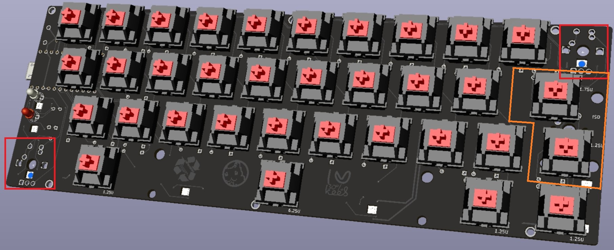  

### エンターキーキャップの選択

橙枠は1.75Uキーと1.25Uキーの2キーを配置するか、ISOエンターの1キーを配置するかを選択出来ます。  
ISOエンターを選択した場合、LキーとISOエンターの間が0.25U隙間が出来ます。また、2Uスタビライザーが必要となります。  

  

## promicroの準備

　promicroのコネクタ補強、コンスルーピンのはんだ付けを行ってください。  
　promicroは実装されている面がキーボード基板に向くようにコンスルーを取り付けてください。  
 - promicroのコネクタ補強：[ProMicroのモゲ防止ついでにQMK_Firmwareを書き込む](https://qiita.com/hdbx/items/2f3e4ddfcadda2a5578e)
 - コンスルーピンのはんだ付け：[Helixベータ ビルドガイド](https://github.com/MakotoKurauchi/helix/blob/master/Doc/buildguide_jp.md)

  
  

### QMKを準備する

　このキーボードはQMKというキーボード用のソフトウェアで動作するようにプログラミングしています。あらかじめ登録してあるdefaultキーマップは作者が実際に使用しているもので、ほぼ何不自由なく使えるように工夫しています。

1. 下記リンクのQMK Toolboxをインストールします
2. QMK Toolboxの「Keyboard from qmk.fm」の下のリストからleftover30を選びます
   1. （もし見つからなければ以下のリンクのデフォルトhexファイルをDLして、「Local File」で選択してください）
3. promicro(直付けの場合は基板)をPCに接続し、リセットボタンを押して書き込みます。
   1. （リセットボタンをダブルクリックしないと書き込めないパターンのものもあります）

書き込み方法などはサリチル酸さんの[（初心者編）自作キーボードにファームウェアを書き込む](https://salicylic-acid3.hatenablog.com/entry/qmk-toolbox)の記事が参考になります。  

[デフォルトhexファイル](https://qmk.fm/compiled/marksard_leftover30_default.hex)  
[QMK Toolbox](https://github.com/qmk/qmk_toolbox/releases)

#### キーマップを自分好みにする

　もしあなたがプログラミング未経験者なら、QMK Configuratorを使うのが早いでしょう。  

[QMK Configurator](https://docs.qmk.fm/#/ja/newbs_building_firmware_configurator)  

#### ビルド環境を作成する

　自分でソースからビルドが出来るようになるとキーを一つ一つ細かい動作まで自在にカスタムすることが出来ます。  

[QMK　ビルド環境を準備する](https://docs.qmk.fm/#/ja/newbs_getting_started)  

　leftover30のデフォルトキーマップは  
```qmk compile -kb marksard/leftover30 -km default```
で可能です。書き込む場合は
```qmk flash -kb marksard/leftover30 -km default```  
とすると、コンパイルが完了次第書き込み待ちになるので、その状態で基板にあるリセットボタンをクリック、もしくはダブルクリックで書き込みが始まります。  

## ダイオードのはんだ付け

赤枠の位置にダイオードを向きを合わせてはんだづけします。  
向きについては以下に従ってください。  
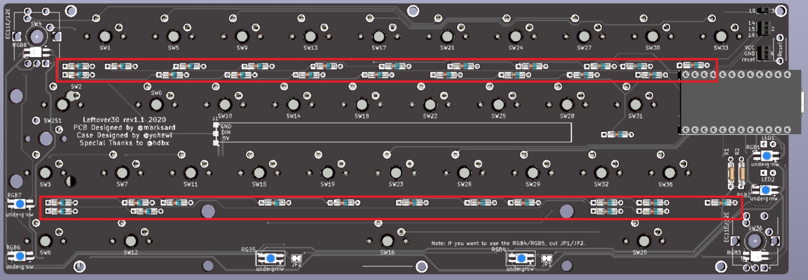  
  

## 抵抗のはんだ付け（オプション）

インジケータLEDを取り付ける場合は赤枠の位置に抵抗を取り付けてください。  

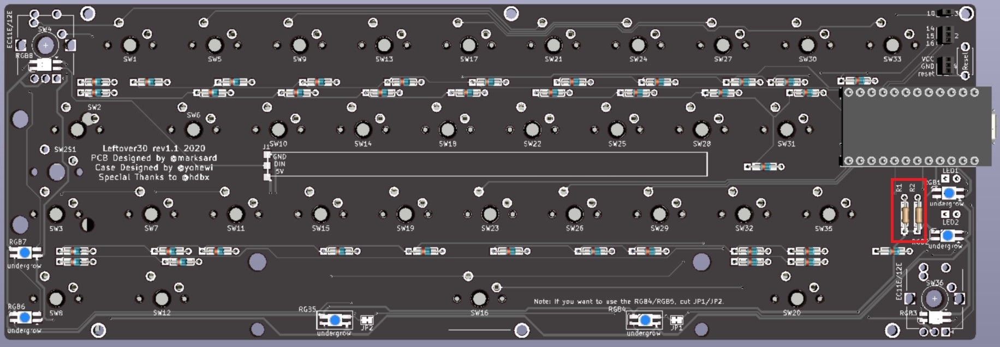  
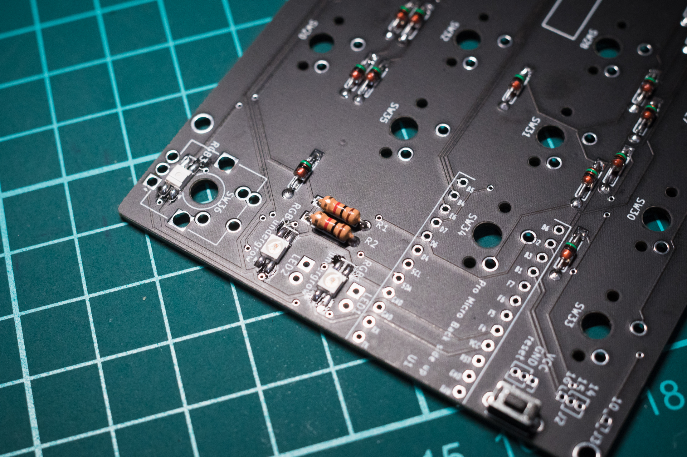  

## フルカラーLED(SK6812mini-E)のはんだ付け（オプション）

この基板は付属のチップLEDを標準で6個取り付けることが出来ます。  
赤枠部分はアンダーグローで、ケースサイドのアクリル点灯用です。  
橙枠部分はバックライトで、BackSpace位置、アルチザン置き場位置のキーキャップ点灯用です。  
薄青枠部分は取り付けません。  
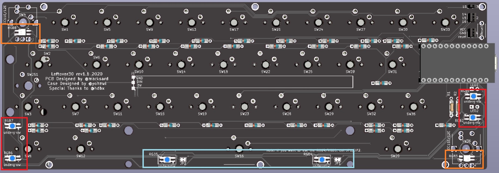  
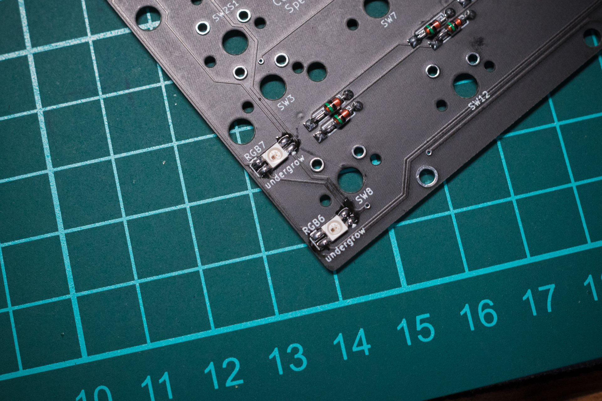  

### アンダーグロー側のはんだ付け

SK6812mini-Eは取り付ける向きがあります。点灯部分をこちらに向けて、基板に書かれた切り欠きあわせ表示（┏）にSK6812mini-Eの切り欠きを合わせてはんだ付けしてください。  
  

### バックライト側のはんだ付け

SK6812mini-Eは取り付ける向きがあります。点灯部分を反対側に向けて、基板に書かれた切り欠きあわせ表示（┏）にSK6812mini-Eの切り欠きを合わせてはんだ付けしてください。  
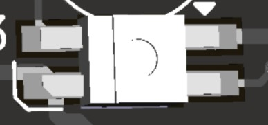  

### リセットボタンの取り付け

　リセットボタンは取り付けに向きはありません。写真のように取り付けてください。  
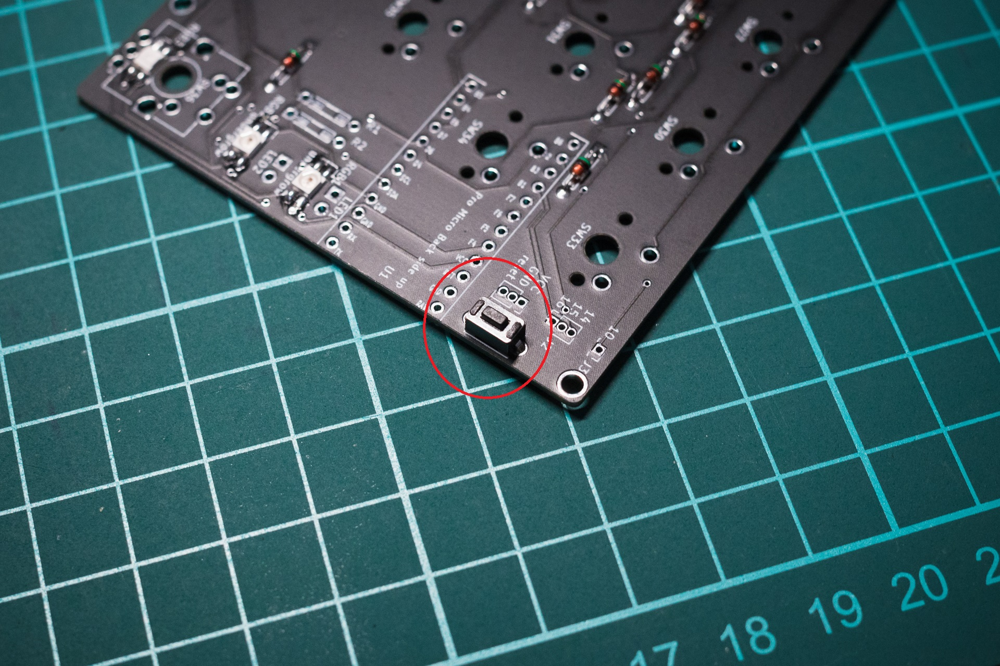  

## スイッチのはんだ付け

スイッチをはんだ付けしていきます。最初は四隅に近いところを先にはんだ付けすると作業がしやすいです。  
穴が大きめに開いている都合上はんだをドバドバ吸い込むのである程度で留めるのが吉です。  

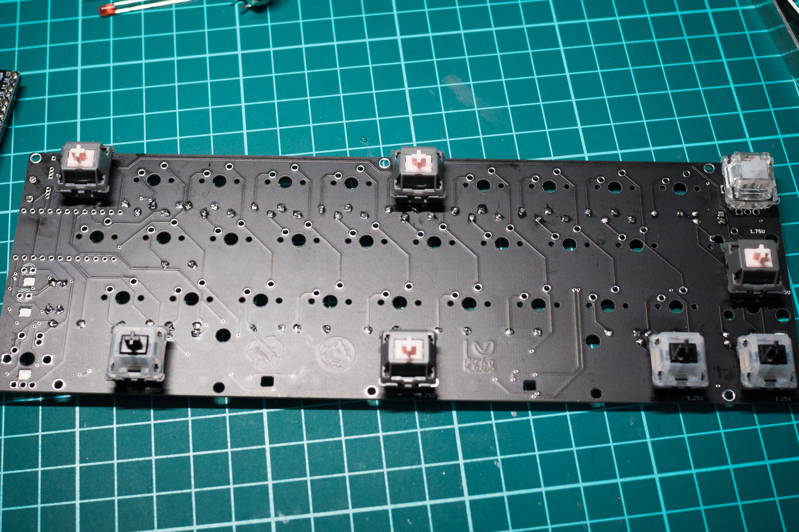  

### ロータリーエンコーダーとの選択部分にスイッチをはんだ付けする場合の注意点

ロータリーエンコーダーと選択可能な左下と右上は、基板の穴が大きいため5pinのスイッチを使っても斜めについてしまう場合があるかもしれません。  
まっすぐはんだ付け出来るように、マスキングテープなどでまっすぐな状態を維持して少量のはんだで仮固定、キャップを付けて隣同士が水平になっているか確認して大丈夫そうならスイッチをちゃんとハンダ付してください。  

### promicro上のスイッチのはんだ付けする場合の追加処理

赤枠はpromicroの上にスイッチが1キー被ります。スイッチのピンがpromicroにあたって動作が不安定になる可能性がありますので、はんだ付けした後に出っ張っているスイッチの金属ピンをカットしてください。  

  
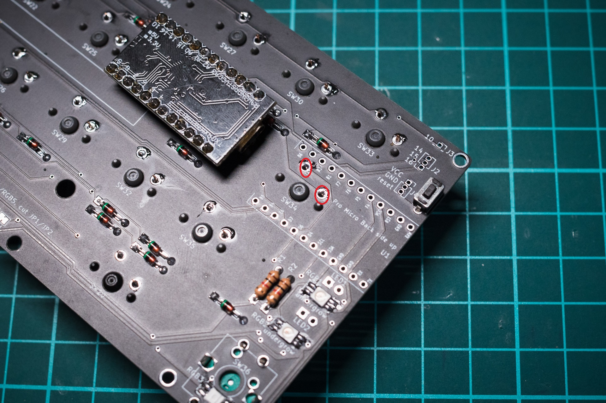  

## ロータリーエンコーダーのはんだ付け（オプション）

ロータリーエンコーダーを付けたい位置に合わせてはんだ付けしてください。  

## インジケータLED(3mm砲弾型LED)のはんだ付け（オプション）

赤色と青色（LEDプラ自体は透明ですが青く光ります）LEDを付属しています。デフォルトのファームウェアではLED1はNumLock、LED2はCapsLockで点灯するようになっています。好みのほうに好みの色で取り付けてください。ケースカラーによってLEDの色が判別しにくいため、どっちでもあまり変わらないかもしれません。  
LEDは取り付ける向きがあります。脚の長いほう（アノード、＋）を丸い銀枠の穴（基板端側）に差し込みます。  

基板から、LEDの発光部のプラスチック底面までを4mm程度浮かせてはんだ付けしてください（LEDのリード線の太さがちょっと違う所あたりで約4mm程度です）。  
はんだ付けが終わったら写真のように少し傾きを付けて、トップフレームのインジケータLEDが収まるくぼみの位置を合わせておきます。  
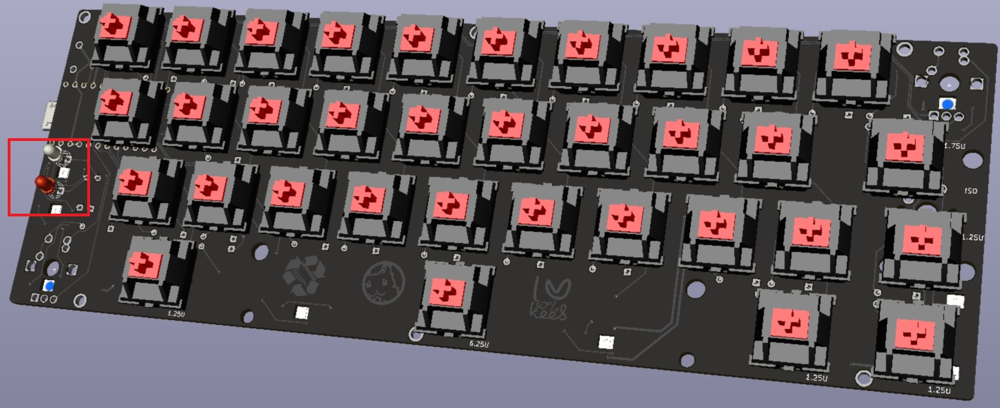  
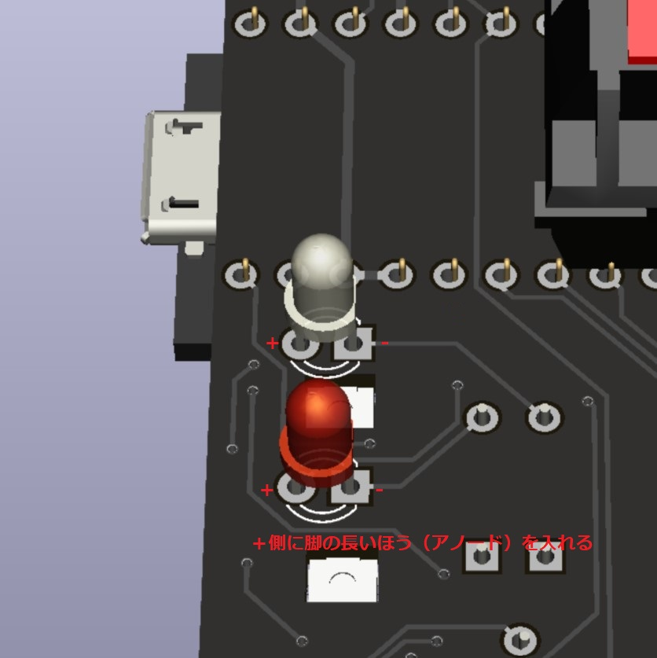  
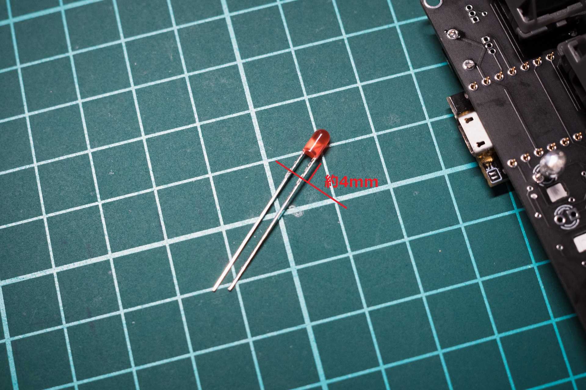  
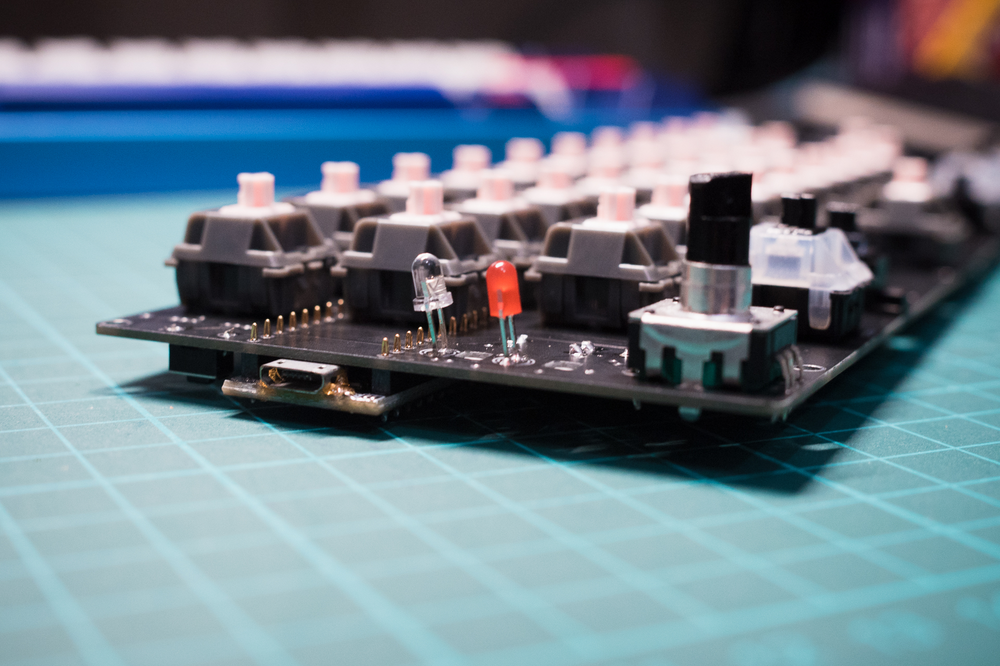  

## スタビライザーの取り付け

　赤枠の位置にスタビライザーを針金が黄色い線側になるように取り付けます。  
　ISOエンターのレイアウトを選択した場合は青枠内の位置に同様にスタビライザーを取り付けてください。  
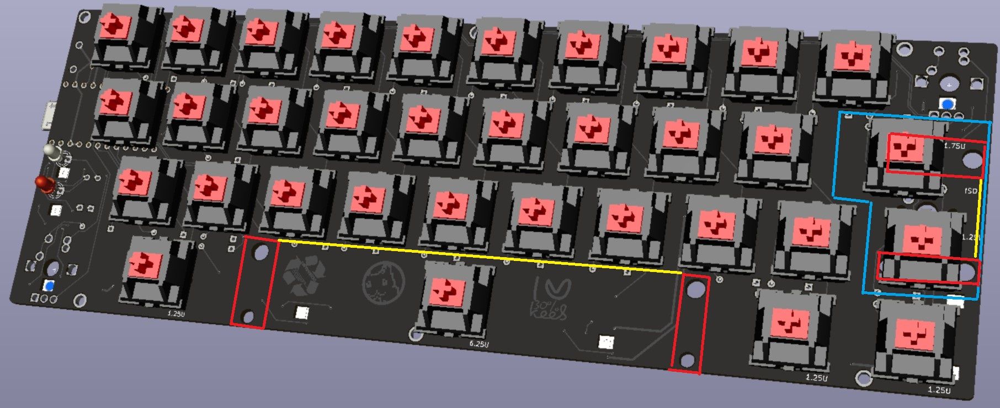  
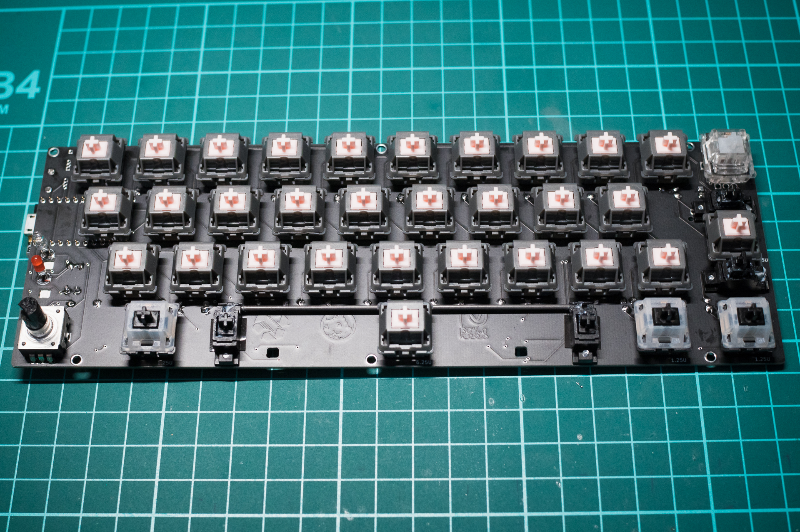  

## インサートナットの埋め込み

　はんだごての熱を利用して、ケースのビス留め位置にインサートナットを埋め込みます。取り付け位置は赤丸位置で10個所あります。  

- PCBとケースのネジ留め：6個所
- ケース同士のネジ留め：4個所
- (Round2ケースはケース同士のネジ止め箇所が中央手前と奥が増えて全部で6個所になっています)

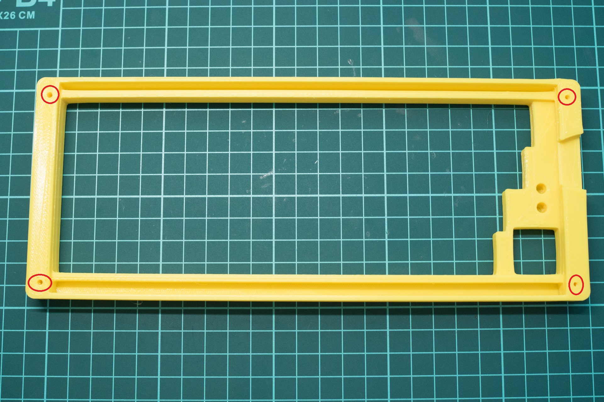  
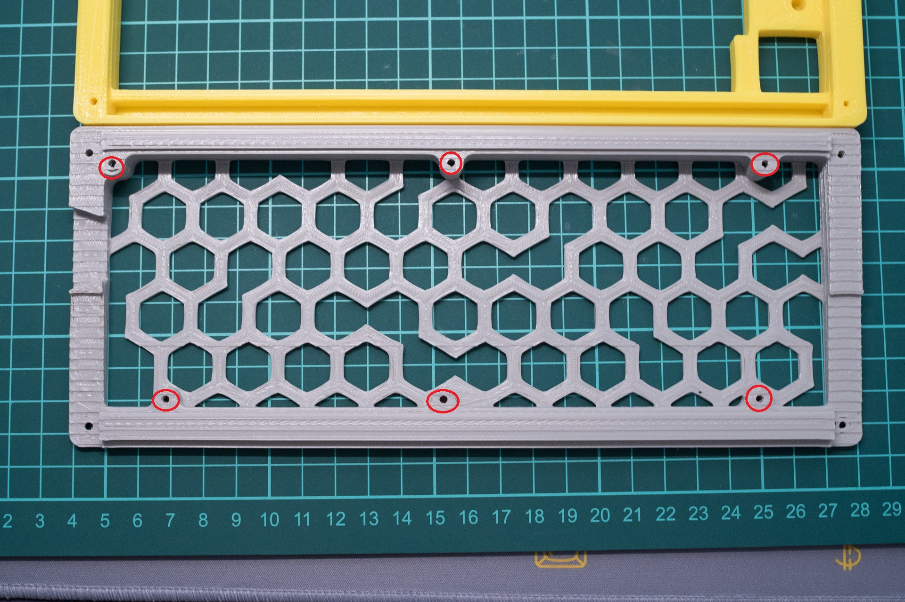  

　PCBとケースのネジ留めに使うインサートナットは、ケースの挿入面に対して垂直に。  
　ケース同士のネジ留めに使うインサートナットは下図を観てもわかるように少し傾いていますので、気持ちケース手前方向に傾けてインサートナットを挿入してください。  

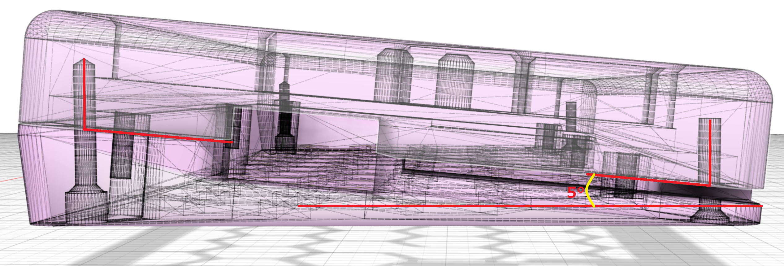  

　はんだごてのこて先ははんだごてを買うと付属してくる円錐状のものを利用します。もし温度調整可能なはんだごてを利用している場合は一番低い温度に設定してください。  
　インサートナットの向きは穴の広いほう（座グリされてるほう）からネジを入れるので、そちらがケースから顔をのぞかせる方向になるように注意してください。  
　ピンセットも必要ですのですぐに使えるように準備してください。

　やりかたは以下の通りです。頭でシミュレーションしてから実施してください。  

- あらかじめケースの穴にはんだごてを直接差し込んで、穴をほんの少し広げておく（ネジ穴にケース材が入るのを防ぐ）
- インサートナットの穴の狭い方に黄色いポリイミドテープを小さく切って穴をふさぐ（ネジ穴にケース材が入るのを防ぎますが、ポリイミドテープは400度付近で溶けますので温度設定には注意してください）
- 穴位置を確認して、インサートナットを穴の広いほう（座グリされてるほう）を上に向けて置く
- こて先をキレイにして、温度調節可能なら270度などの低い温度に設定して、インサートナットにはんだごてをあてる（3Dプリントケースは200度程度で溶けだします）
- 上からゆっくりとケースの穴の周りを溶かしながら入れる
- ケース面まで埋めたらはんだごてをはずす
- 冷えるまで30～60秒は待つ

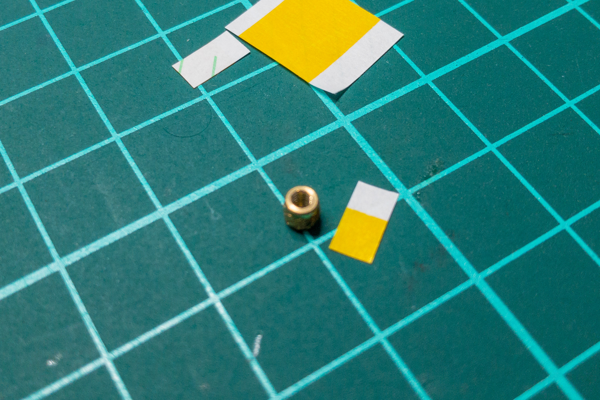  
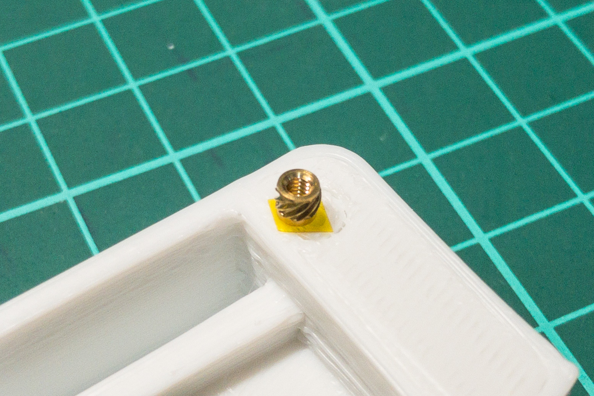  

[](http://www.youtube.com/watch?v=4Yi3AIbshDU)

　ケースの素材がナットの周辺に盛り上がってしまった場合、冷えてからニッパーなどで切り落としてください。  
　もし斜めだったり、穴位置がずれていたりする場合はもう一度はんだごてを当てて修正してください。  
　修正しすぎて穴が広がった場合、穴の周辺にはんだごてをあてて穴を少し狭めてからやりなおしてください。  

　インサートナットを取り付けたら一度トップケースとボトムケースを合わせてネジ留め出来るか仮組確認してください。ケース奥側は12mm、ケース手前側は6mmのネジで留めます。  

## ロータリーエンコーダーカバーの取り付け

　ロータリーエンコーダーを取り付けた場合はカバーを取り付けてください。  
　左下用はケースにハメ込めるようになっています。  
　右上用はロータリーエンコーダーの外装にハメ込めるようになっています。  

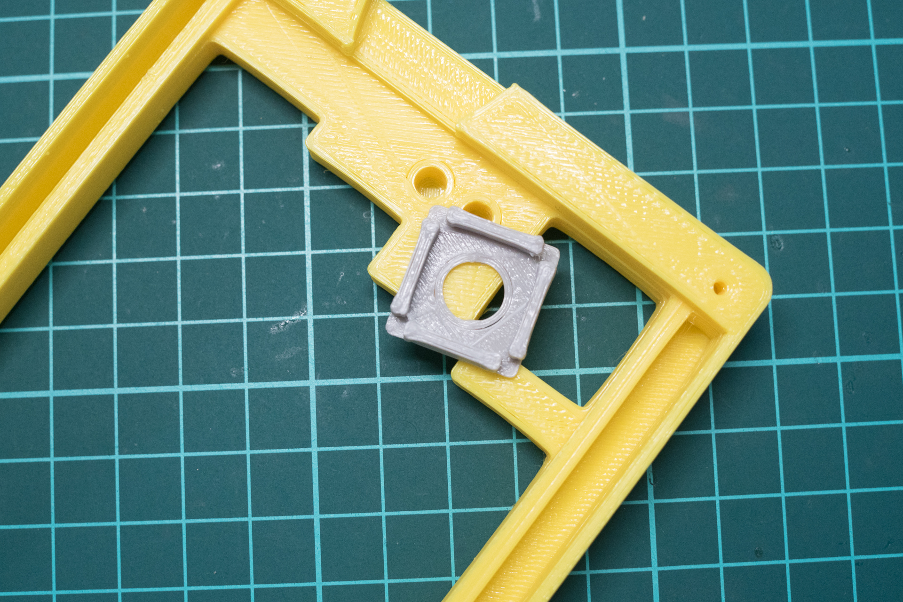  
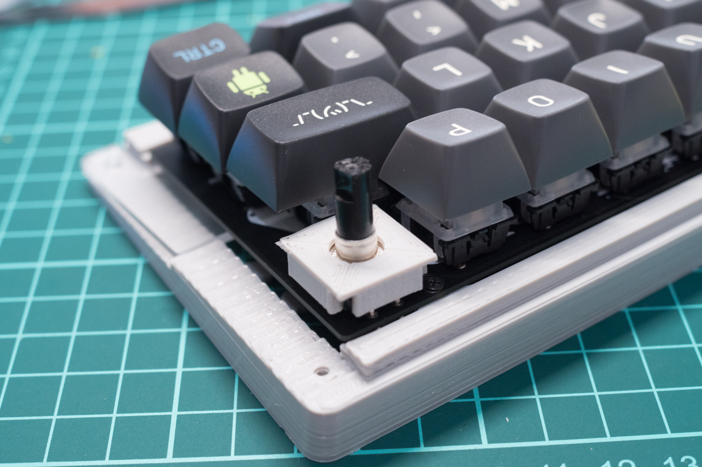  

## ケースの組み立て

### PCBをボトムケースに取り付ける

　PCBをボトムケースのネジ穴に合わせて置き、4mmのネジで留めてください。  

### トップケースをボトムケースに取り付ける

　トップケースをボトムに合わせます。ケース手前にはスリットが設けられており、ここにアクリルを挟みます。挟んだら6mmのネジで留めます。ケース奥側は12mmのネジで留めます。  

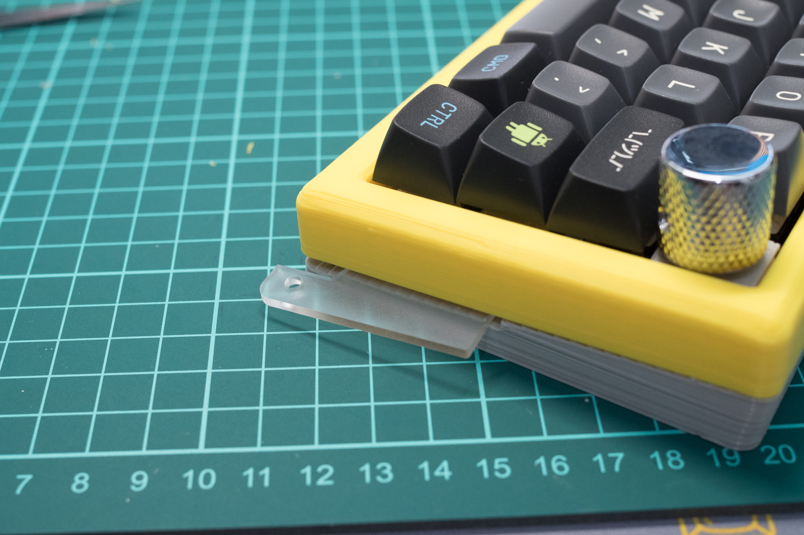  

### ゴム脚について

　このキーボードはソフトな打鍵感を意識して設計しています。ゴム脚を装着するとケースとデスクの間に空間が生まれさらに柔らかくなりますので、特にデスクマット上での使用を前提とする場合は取り付けないほうが良い打鍵感を得られる場合があります。ゴム脚を付ける前に打鍵感をチェックしてみてください。  

## キーキャップ、つまみを取り付けて完成です

　お好きなキーキャップと、ロータリーエンコーダーを取り付けている場合は好きなつまみを取り付ければ完成です！