# Rhymestone ビルドガイド

- [Rhymestone ビルドガイド](#rhymestone-%E3%83%93%E3%83%AB%E3%83%89%E3%82%AC%E3%82%A4%E3%83%89)
  - [パーツ一覧](#%E3%83%91%E3%83%BC%E3%83%84%E4%B8%80%E8%A6%A7)
    - [キット付属品](#%E3%82%AD%E3%83%83%E3%83%88%E4%BB%98%E5%B1%9E%E5%93%81)
    - [キット以外に必要なもの](#%E3%82%AD%E3%83%83%E3%83%88%E4%BB%A5%E5%A4%96%E3%81%AB%E5%BF%85%E8%A6%81%E3%81%AA%E3%82%82%E3%81%AE)
    - [補足](#%E8%A3%9C%E8%B6%B3)
      - [pro micro](#pro-micro)
      - [OLEDとOLED用ピンソケット](#oled%E3%81%A8oled%E7%94%A8%E3%83%94%E3%83%B3%E3%82%BD%E3%82%B1%E3%83%83%E3%83%88)
      - [SK6812mini](#sk6812mini)
  - [必要な道具](#%E5%BF%85%E8%A6%81%E3%81%AA%E9%81%93%E5%85%B7)
  - [組み立て](#%E7%B5%84%E3%81%BF%E7%AB%8B%E3%81%A6)
  - [Pro Microの準備](#pro-micro%E3%81%AE%E6%BA%96%E5%82%99)
    - [もげ対策！](#%E3%82%82%E3%81%92%E5%AF%BE%E7%AD%96)
    - [ファームウェアを書き込む](#%E3%83%95%E3%82%A1%E3%83%BC%E3%83%A0%E3%82%A6%E3%82%A7%E3%82%A2%E3%82%92%E6%9B%B8%E3%81%8D%E8%BE%BC%E3%82%80)
  - [Pro Microにピンヘッダをはんだ付けする](#pro-micro%E3%81%AB%E3%83%94%E3%83%B3%E3%83%98%E3%83%83%E3%83%80%E3%82%92%E3%81%AF%E3%82%93%E3%81%A0%E4%BB%98%E3%81%91%E3%81%99%E3%82%8B)
  - [基板の裏と表について](#%E5%9F%BA%E6%9D%BF%E3%81%AE%E8%A3%8F%E3%81%A8%E8%A1%A8%E3%81%AB%E3%81%A4%E3%81%84%E3%81%A6)
  - [基板の左右を決める](#%E5%9F%BA%E6%9D%BF%E3%81%AE%E5%B7%A6%E5%8F%B3%E3%82%92%E6%B1%BA%E3%82%81%E3%82%8B)
  - [ダイオードをはんだ付けする](#%E3%83%80%E3%82%A4%E3%82%AA%E3%83%BC%E3%83%89%E3%82%92%E3%81%AF%E3%82%93%E3%81%A0%E4%BB%98%E3%81%91%E3%81%99%E3%82%8B)
    - [ダイオードの脚を曲げる](#%E3%83%80%E3%82%A4%E3%82%AA%E3%83%BC%E3%83%89%E3%81%AE%E8%84%9A%E3%82%92%E6%9B%B2%E3%81%92%E3%82%8B)
    - [ダイオードのはんだ付け](#%E3%83%80%E3%82%A4%E3%82%AA%E3%83%BC%E3%83%89%E3%81%AE%E3%81%AF%E3%82%93%E3%81%A0%E4%BB%98%E3%81%91)
  - [*(オプション)LEDをはんだ付けする*](#%E3%82%AA%E3%83%97%E3%82%B7%E3%83%A7%E3%83%B3led%E3%82%92%E3%81%AF%E3%82%93%E3%81%A0%E4%BB%98%E3%81%91%E3%81%99%E3%82%8B)
    - [LEDの仕組みと接続順序](#led%E3%81%AE%E4%BB%95%E7%B5%84%E3%81%BF%E3%81%A8%E6%8E%A5%E7%B6%9A%E9%A0%86%E5%BA%8F)
    - [向きを合わせる](#%E5%90%91%E3%81%8D%E3%82%92%E5%90%88%E3%82%8F%E3%81%9B%E3%82%8B)
    - [左手でピンセットでチップLEDつまんでPCBの穴にはめ込んで位置合わせ](#%E5%B7%A6%E6%89%8B%E3%81%A7%E3%83%94%E3%83%B3%E3%82%BB%E3%83%83%E3%83%88%E3%81%A7%E3%83%81%E3%83%83%E3%83%97led%E3%81%A4%E3%81%BE%E3%82%93%E3%81%A7pcb%E3%81%AE%E7%A9%B4%E3%81%AB%E3%81%AF%E3%82%81%E8%BE%BC%E3%82%93%E3%81%A7%E4%BD%8D%E7%BD%AE%E5%90%88%E3%82%8F%E3%81%9B)
    - [つまんだまま右手でフラックスを塗る](#%E3%81%A4%E3%81%BE%E3%82%93%E3%81%A0%E3%81%BE%E3%81%BE%E5%8F%B3%E6%89%8B%E3%81%A7%E3%83%95%E3%83%A9%E3%83%83%E3%82%AF%E3%82%B9%E3%82%92%E5%A1%97%E3%82%8B)
    - [220度あたりに設定したハンダごてのこて先にハンダを少し付ける](#220%E5%BA%A6%E3%81%82%E3%81%9F%E3%82%8A%E3%81%AB%E8%A8%AD%E5%AE%9A%E3%81%97%E3%81%9F%E3%83%8F%E3%83%B3%E3%83%80%E3%81%94%E3%81%A6%E3%81%AE%E3%81%93%E3%81%A6%E5%85%88%E3%81%AB%E3%83%8F%E3%83%B3%E3%83%80%E3%82%92%E5%B0%91%E3%81%97%E4%BB%98%E3%81%91%E3%82%8B)
    - [LEDの点灯確認](#led%E3%81%AE%E7%82%B9%E7%81%AF%E7%A2%BA%E8%AA%8D)
    - [残りのランドに同じようにはんだする](#%E6%AE%8B%E3%82%8A%E3%81%AE%E3%83%A9%E3%83%B3%E3%83%89%E3%81%AB%E5%90%8C%E3%81%98%E3%82%88%E3%81%86%E3%81%AB%E3%81%AF%E3%82%93%E3%81%A0%E3%81%99%E3%82%8B)
  - [*(オプション)OLEDの取り付け*](#%E3%82%AA%E3%83%97%E3%82%B7%E3%83%A7%E3%83%B3oled%E3%81%AE%E5%8F%96%E3%82%8A%E4%BB%98%E3%81%91)
    - [OLED取り付けのためのPCBのランドショート](#oled%E5%8F%96%E3%82%8A%E4%BB%98%E3%81%91%E3%81%AE%E3%81%9F%E3%82%81%E3%81%AEpcb%E3%81%AE%E3%83%A9%E3%83%B3%E3%83%89%E3%82%B7%E3%83%A7%E3%83%BC%E3%83%88)
    - [OLED用のピンソケット・ピンヘッダをはんだ付けする](#oled%E7%94%A8%E3%81%AE%E3%83%94%E3%83%B3%E3%82%BD%E3%82%B1%E3%83%83%E3%83%88%E3%83%BB%E3%83%94%E3%83%B3%E3%83%98%E3%83%83%E3%83%80%E3%82%92%E3%81%AF%E3%82%93%E3%81%A0%E4%BB%98%E3%81%91%E3%81%99%E3%82%8B)
  - [TRRSコネクタ、タクトスイッチをはんだ付けする](#trrs%E3%82%B3%E3%83%8D%E3%82%AF%E3%82%BF%E3%82%BF%E3%82%AF%E3%83%88%E3%82%B9%E3%82%A4%E3%83%83%E3%83%81%E3%82%92%E3%81%AF%E3%82%93%E3%81%A0%E4%BB%98%E3%81%91%E3%81%99%E3%82%8B)
  - [トッププレートにスイッチをはめ込む](#%E3%83%88%E3%83%83%E3%83%97%E3%83%97%E3%83%AC%E3%83%BC%E3%83%88%E3%81%AB%E3%82%B9%E3%82%A4%E3%83%83%E3%83%81%E3%82%92%E3%81%AF%E3%82%81%E8%BE%BC%E3%82%80)
  - [MXソケットをはんだ付けする](#mx%E3%82%BD%E3%82%B1%E3%83%83%E3%83%88%E3%82%92%E3%81%AF%E3%82%93%E3%81%A0%E4%BB%98%E3%81%91%E3%81%99%E3%82%8B)
  - [スペーサーの取り付け](#%E3%82%B9%E3%83%9A%E3%83%BC%E3%82%B5%E3%83%BC%E3%81%AE%E5%8F%96%E3%82%8A%E4%BB%98%E3%81%91)
  - [保護パネルの取り付け](#%E4%BF%9D%E8%AD%B7%E3%83%91%E3%83%8D%E3%83%AB%E3%81%AE%E5%8F%96%E3%82%8A%E4%BB%98%E3%81%91)
  - [キーキャップの取り付け](#%E3%82%AD%E3%83%BC%E3%82%AD%E3%83%A3%E3%83%83%E3%83%97%E3%81%AE%E5%8F%96%E3%82%8A%E4%BB%98%E3%81%91)
  - [キーボードファームウェアの書き込み](#%E3%82%AD%E3%83%BC%E3%83%9C%E3%83%BC%E3%83%89%E3%83%95%E3%82%A1%E3%83%BC%E3%83%A0%E3%82%A6%E3%82%A7%E3%82%A2%E3%81%AE%E6%9B%B8%E3%81%8D%E8%BE%BC%E3%81%BF)
  - [テスト](#%E3%83%86%E3%82%B9%E3%83%88)
  - [完成！](#%E5%AE%8C%E6%88%90)

## パーツ一覧

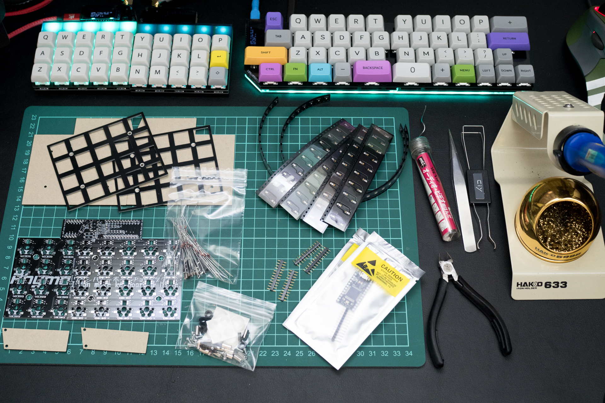  

### キット付属品

| 名前 | 数 | 備考 |
| ---- | ---- | --- |
| PCB | 2枚 | |
| トッププレート | 2枚 | 四角い穴がいっぱい空いたほうです |
| ボトムプレート | 2枚 | ビス穴しかあいてないほう |
| OLED・Pro Micro保護プレート | 2枚 | |
| *30キーチャレンジ用OLED・Pro Micro保護プレート* | *2枚* | *オプション* |
| M2スペーサー 8mm | 12個 | |
| プラスペーサー 3mm | 8個 | M2スペーサーと組み合わせて使います |
| M2ネジ 5mm | 20個 | |
| M2黒皿ネジ 4mm| 4個 | 保護プレートに取り付けるネジです |
| ゴム足 | 8個 | 大小4個ずつ |
| ダイオード | 40個 |  |
| TRRSジャック | 2個 | |
| タクトスイッチ | 2個 | |

### キット以外に必要なもの

| 名前 | 数 | 備考 |
| ---- | ---- | --- |
| 3.5mmステレオケーブル(3極) | 1本 | キーボード間接続用 |
| MicroUSBケーブル | 1本 | キーボードとPC接続用 |
| キースイッチ | 40個 | MX互換のもの |
| キーキャップ | 40個 | MX互換のもの |
| Pro Micro | 2個 | |
| スプリングピンヘッダ 12P | 4個 | 交換や確認にも便利なので必須と言っていいくらい推奨 |
| MXソケット | 40個 | MXスイッチ用ソケット |
| *SK6812mini* | *40個* | *バックライト用（オプション）* |
| *OLEDモジュール* | *1～2個* | *OLED用（オプション）* |
| *ピンソケット 4P* | *1～2個* | *OLED用（オプション）* |
| *ピンヘッダ 4P* | *1～2個* | *OLED用（オプション）* |

### 補足

#### pro micro

　大抵ProMicro買うとピンヘッダが付属しているから買わなくてもいいやって考えがちですが、ちょっとお高いコンスル―用スプリングピンヘッダにすると

- キーボード基板の裏表間違ってはんだ付けしてしまった時のリカバリ
- もげマイクロ対策
- Pro Microの文鎮化(異常なデータを書いた時)の交換、復元対策
- Pro Microを再利用可能

など、メリットしかないので超オススメします。どうしても直付けしたい玄人さんでOLEDを取り付ける場合は先に「OLED取り付けのためのPCBのランドショート」の項を先に済ませておいてください。  

#### OLEDとOLED用ピンソケット

　OLEDは両手に付けることが出来ます。左手側に各種動作確認用のステータスを表示しますので、片側だけの購入でも十分機能します。  

　AliExpressや遊舎工房でOLEDだけ買った場合はピンソケットが無いので別途秋月電子かヒロスギネットなどで別途購入してください。色々種類があるのですが、ソケットは

- 2.54mmピッチ  
- ロープロファイル（低背）基板取り付け高さ3.5mm  
- ピンソケット  
- 1x4(4P)  

　のものが必要です。

#### SK6812mini

　バックライト用SK6812miniはハンダ熱に弱く温度調節機能付きのハンダごてでないと失敗が多く時間がかかり部品をダメにしてしまいます。中華製の温度調節機能付きもモノによっては温度が正確でなく部品を壊す場合もありますので、可能な限りHAKKOなど日本のメーカーが出している温調ハンダごてを使ってください。またハンダのチップ（こて先）も標準で付いてくる鉛筆上のものではなく、斜めにカットされたタイプを別途購入するとめちゃくちゃ捗りますのでオススメです。  

## 必要な道具

| 名前 | 備考 |
| ---- | ---- |
| はんだごて | バックライトLEDを取り付ける場合は温度調整が出来るものが必須です<br/>(温度調整が出来ないとLED破損率がかなり高いです) |
| フラックス | バックライトLEDを取り付ける場合はあるとメッチャ捗るので必須です |
| 糸ハンダ | 0.8mm程度のものを推奨します |
| ハンダ吸い取り線 | 失敗したとき用 |
| ニッパー | ダイオードのリード線などの切断用です |
| ピンセット | ProMicroリセットしたりチップLEDのはんだづけで使用します |
| マスキングテープ | 柄入りで可。パーツの仮止めに使用します |
| フラックス除去剤 | 必須ではありませんがはんだ付け後のベタつきを除去出来、はんだによる黄色い変色も拭き取れてキレイな仕上がりになります |
| マスキングテープ | しるし付け、仮固定に使用。100均の柄付きでもOK |

　mteiさんの[Helix キーボードキットの製作に必要な工具メモ](https://gist.github.com/mtei/6957107a676ddfa85bde0ae41f8fa849)
やhdbxさんの[自作キーボードを始めるにあたって用意すべきツール](https://hdbx.hateblo.jp/entry/2018/06/01/215401)も参考になります。  

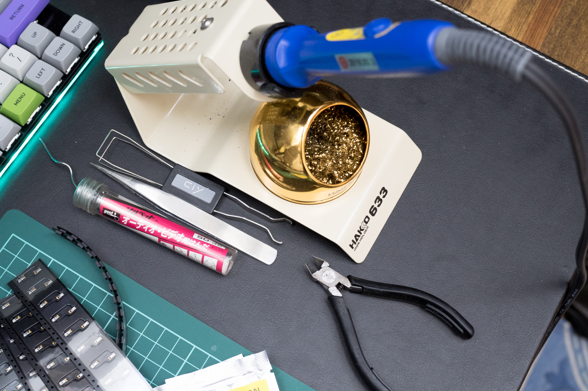  
  

## 組み立て

　組み立ての時間ですが、LEDありで6～12時間、LEDなしで2～4時間くらい（ファーム開発環境構築からだと別途+1～2時間程度）を目安にしてください。半田ごてもってると一時間あっという間に飛びますので時々休憩を入れましょう。あとハンダの煙は吸ったり目に入れたりしないように注意しましょう。  

## Pro Microの準備

　机にハンダごてを用意するその前に！Pro Microの準備を先にやってしまいましょう。  

### モゲ対策！

　Pro Microに使用されているUSBコネクタはmicro USBで、それがほぼハンダで保持されている状態のため、付け外しを繰り返すとモゲてしまいます（界隈ではそうなったpro microは「moge micro」と呼んでいます）。そうなると面倒くさいので最初に手を打っておきます。[英さん](https://twitter.com/hdbx)の[ProMicroのモゲ防止ついでにQMK_Firmwareを書き込む](https://qiita.com/hdbx/items/2f3e4ddfcadda2a5578e)を見てやってみてください。  
　エポキシ接着剤を使った場合1～2時間程度で（室温・気温によりますが）触っても大丈夫くらいになると思います。乾くまで時間が少しかかるのでファームウェアの書き込み準備をします。もし準備が出来ているなら先のダイオードのはんだ付けに進んでも良いと思います。  

### ファームウェアを書き込む

　Pro Microに先にファームを書き込んでしまいます。はやる気持ちを抑えて最初にソフトウェアの準備と書き込みをしてしまえば、完成後すぐ使用できます。  
　オプションのLEDバックライトを取り付ける方は、LEDの点灯確認に使いますので必須項目です。  

  Rhymestoneは本家QMKにマージしておりませんので、私のフォークリポジトリの**my_customize**ブランチにあるものをお使いください。  
  [marksard/qmk_firmware](https://github.com/marksard/qmk_firmware/tree/my_customize)
  
　Windowsの方はMSYS2を使うか、WSL(Windows Subsystem for Linux)を使う方法があります。MSYS2での書き込み方は[さぼてんさん](https://twitter.com/cactusman)作成の記事[プログラマーではない人向けのQMK Firmware入門](https://qiita.com/cactusman/items/ac41993d1682c6d8a12e)を、WSLは[qmk_firmwareをWindows上でmakeする方法](https://qiita.com/marksard/items/f381caf3ca981f307f64)を参照してファームウェアを書き込める環境を作ってください。  
　Macな方はDocker使うほうが確実かもしれません。[自作キーボードに手を出した](https://poyo.hatenablog.jp/entry/2018/10/08/003800) の後半に記述があります。  

　Rhymestoneのデフォルトキーマップのmakeは ```make rhymestone:default``` で可能です。（MSYS2環境上なら ```make rhymestone:default:avrdude``` で書き込みも出来ます）  

　LEDの動作確認にはHelixキーボードのテスト用のものが使えます。 ```make helix:led_test``` したものを使います（MSYS2環境上なら ```make helix:led_test:avrdude``` で書き込みも出来ます）  

　Pro Microにリセットボタンはないので、Pro MicroのGNDピンとRSTピン（隣同士ならんでいます）をピンセットなどでショートさせてください。

## Pro Microにピンヘッダをはんだ付けする

　ピンヘッダの取り付けは[Helixベータ ビルドガイド](https://github.com/MakotoKurauchi/helix/blob/master/Doc/buildguide_jp.md)
が丁寧なのでこちらを参照ください。  

## 基板の裏と表について

　キースイッチが乗り、通常使用する際上を向く面を表、逆を裏とします。  

## 基板の左右を決める

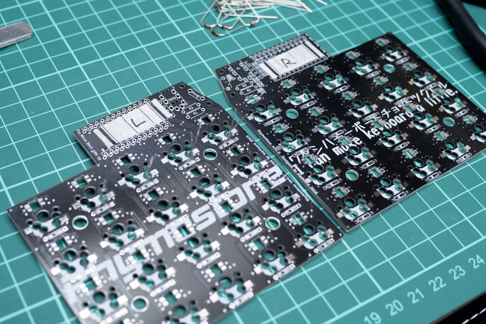  

　付属の基板は左右どちらでも使用できるリバーシブル基板になっています。作成途中で左右を忘れないようにマステに左右と書いて、貼ったがわをオモテ（キースイッチを付けるほう）と決めておくと迷いがなくて良いです。  

## ダイオードをはんだ付けする

### ダイオードの脚を曲げる

　基板に付ける前にダイオードの脚を全部曲げてしまいます。基板の穴の間隔を見極めて曲げるための冶具を探してみてください。  繋がったままの割りばしなどでも良いと思います。  

  

　私はUSB-C to USB-Aの変換コネクタが丁度いい感じに使えたので、ダイオードを2,3個いっぺんに曲げていきました。  

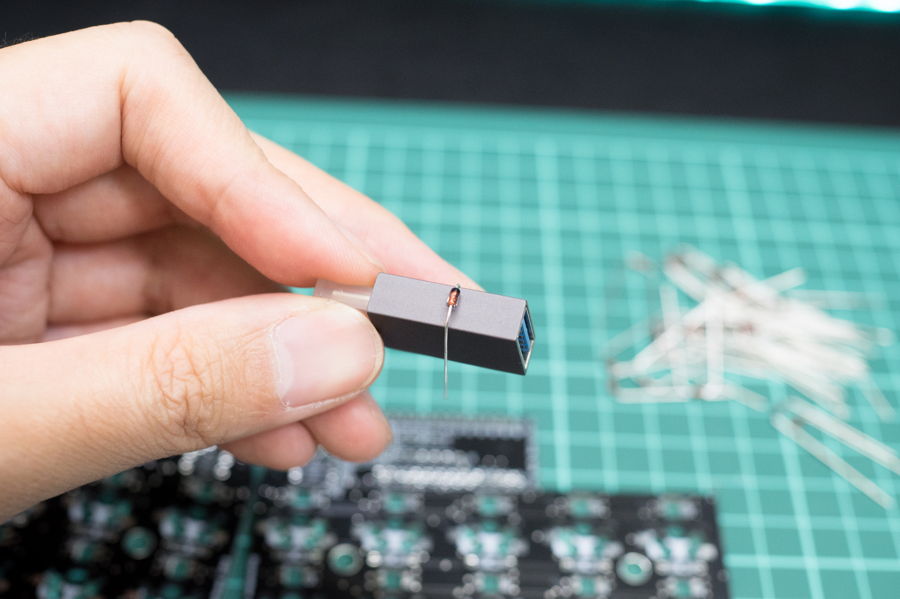  

### ダイオードのはんだ付け

　ダイオードの取り付け向きは基板ごとに同じ方向なので、一つ確認して取り付けたら残りはすべて同じ方向で取り付けられます。ダイオードの黒い帯側を基板のダイオード取り付け穴の四角いほうに向けて取り付けてください。  

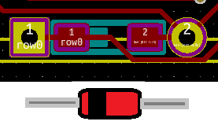  

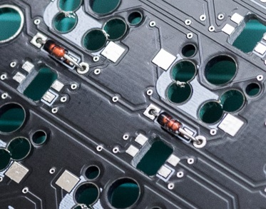  

　左手側基板のウラ面からダイオードを差し込んでいきます。差し込んだらダイオードの足同士をネジって仮留めします。横一列ずつ差し込んでまとめてハンダ付けするとラクに速く出来ます。ハンダ付けしたら足を根元からカットしてください。  

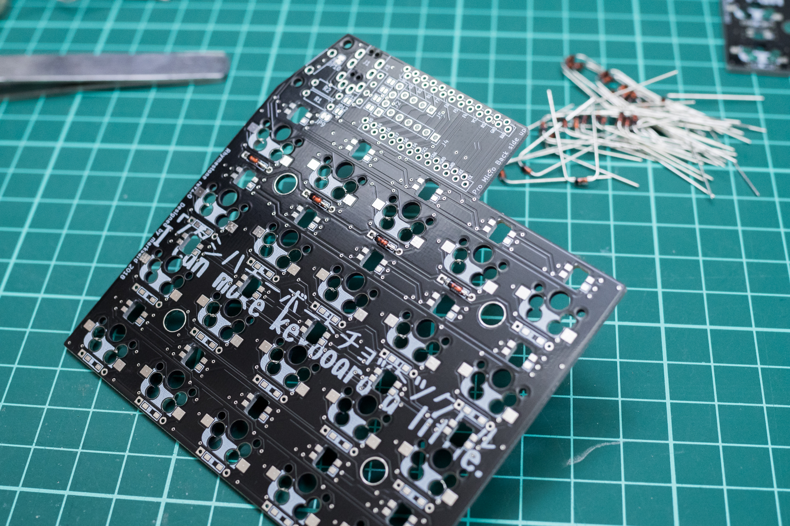  
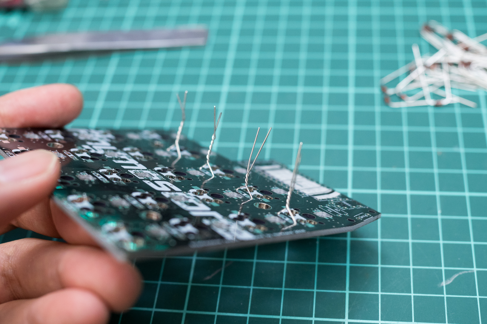  

　一列ずつ差し込み、ハンダ付け、カットを繰り返してください。右手側基板も同様に行ってください。  

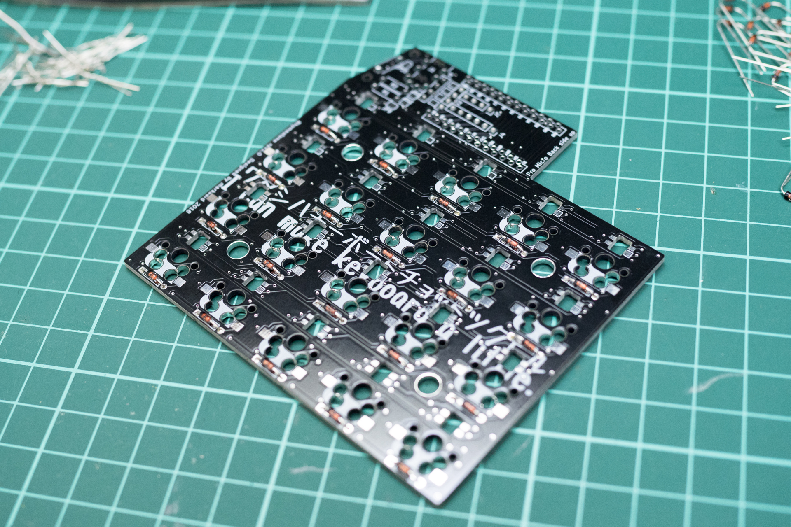  

## *(オプション)LEDをはんだ付けする*

　フルカラーのチップLEDをキースイッチ裏に取り付けていきます。

### LEDの仕組みと接続順序

　このチップLEDは4つの端子（ランド）があり、それぞれVCC,GND,DIN,DOUTです。VCCとGNDは中学でやりましたね？それぞれ電池＋とーという認識でも良いと思います。DINとDOUTはLEDの点灯パターンを制御する線で、DINが入力、DOUTが出力になっています。このDIN、DOUTを数珠繋ぎすることによって複数のLEDを制御するようになっています。  

　Rhymestoneの接続順ですが、リセットボタンの取り付け場所のある端を起点に外側から内側へぐるっと渦巻状に配線しています。数個取り付け→点灯確認→数個取り付け…としたほうが確実で速いので、この順番で取り付けてください。  

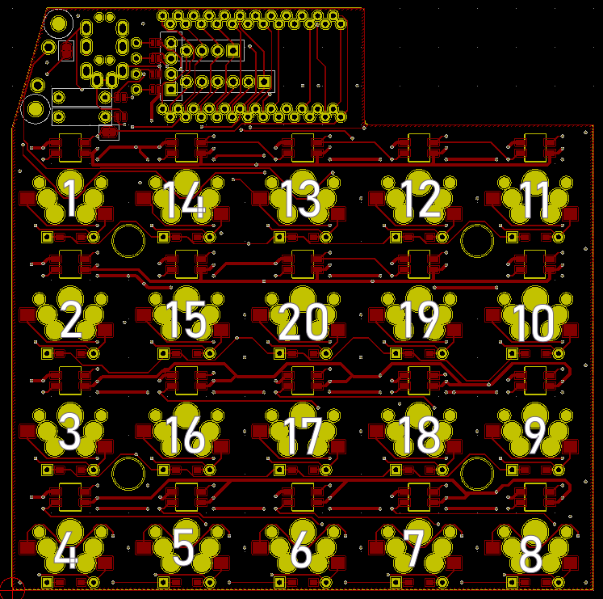  

### 向きを合わせる

　基板のオモテにLEDのオモテ面が向くように取り付けます。  
　取り付ける向きは基板ごとに一定ですので、最初の一つをちゃんと間違えずにつければあとはそれを真似すれば大丈夫です。  

左手側  
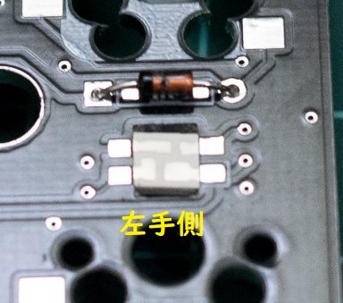  
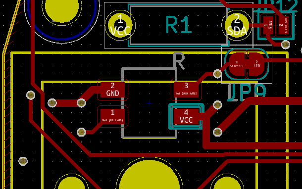  

右手側  
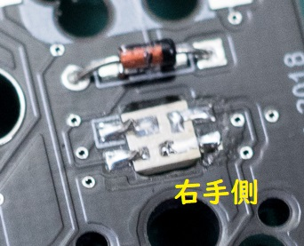  
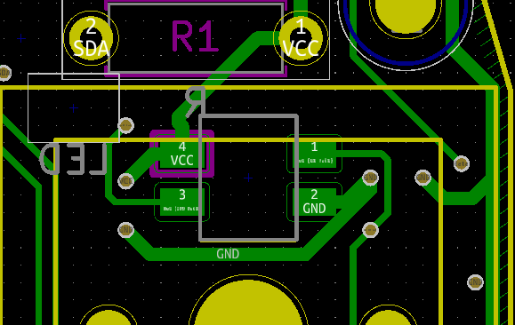  

### 左手でピンセットでチップLEDつまんでPCBの穴にはめ込んで位置合わせ

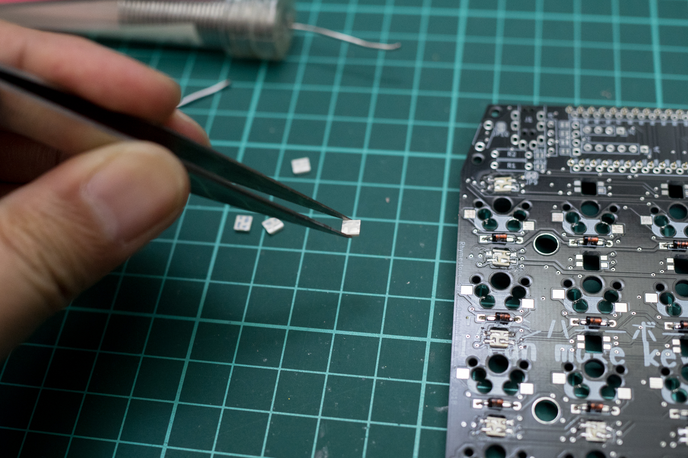  

### つまんだまま右手でフラックスを塗る

　写真は撮影上つまんでませんが、つまんだままフラックスを塗って、次の作業に向かってください。  

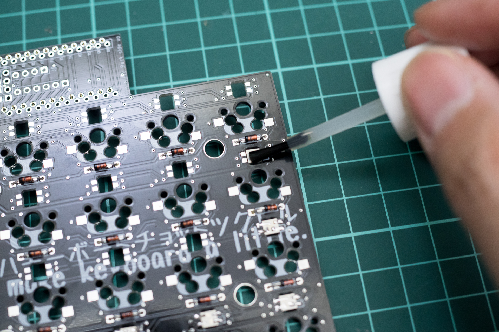  

### 220度あたりに設定したハンダごてのこて先にハンダを少し付ける

　コテ先は220度あたりにしてください。270度は高いです。  
　ハンダごてにはんだを少し乗せます。  
　ハンダを少し盛る感じでランドに擦り付けてランド同士を繋げます。  
　基板のランドとチップLEDのランドが出来るだけ水平になるように4つあるランドの一つをまず付けます。付けたらピンセットを離して残り3つを同じように取り付けます。  

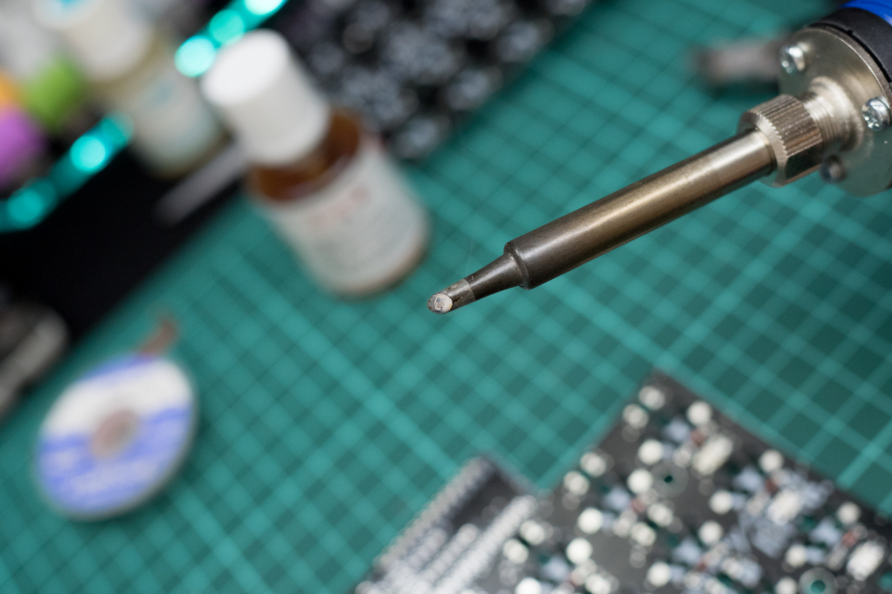  

### LEDの点灯確認

　事前にpro microにLED動作確認用ファームを書き込んでいると思いますので、pro microを基板のオモテ（マステを貼った方）の白い枠にピンを合わせて取り付けてください。  
　取り付ければLEDが光ると思います。光れば4つのピンのうち、VCC,GND,VINについてはキチンとはんだ付け出来ています。点灯していなければ、今付けたLEDのVCC,GND,VINのハンダがキチンとついてないか、一つ前に付けたVOUTのハンダがついていないのが主な原因です。

### 残りのランドに同じようにはんだする

　あとはこれを繰り返して片手20個、両手で合計40個を付けていきましょう。時々確認すると進捗が分かるので結構嬉しいですし、点灯しなかった時どこで何が起こったかが分かりやすいので地道にやってみてください。  

　全部取り付けた後、ハンダしたトコロがフラックスで汚れてベタ付きますので、気になるならフラックス除去剤で拭き取ってください。  

  
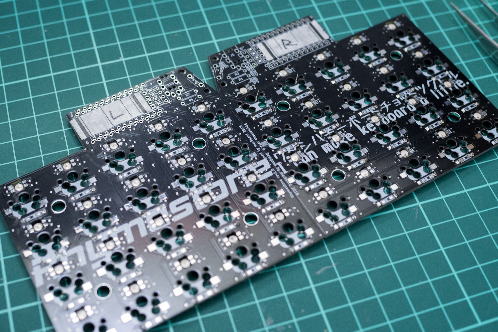  
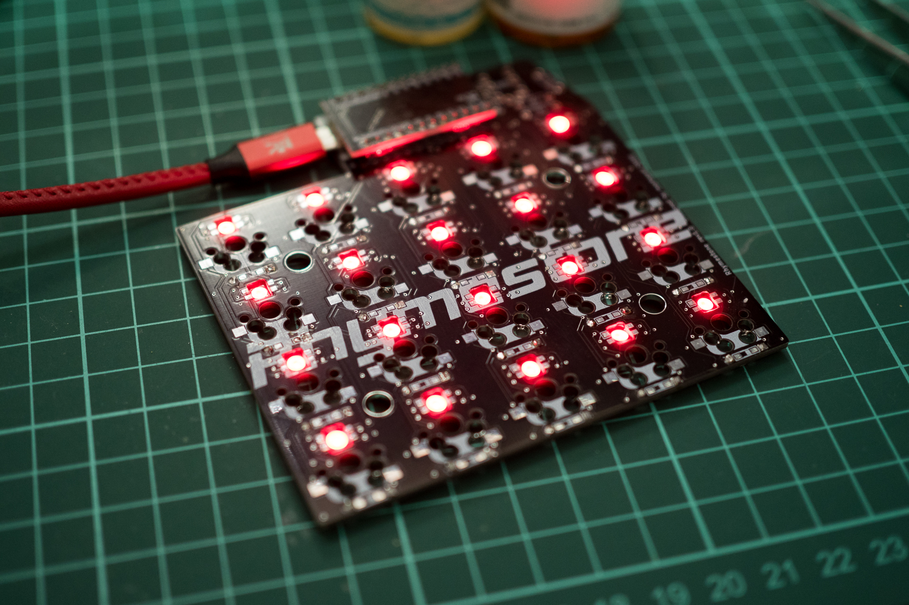  

## *(オプション)OLEDの取り付け*

### OLED取り付けのためのPCBのランドショート

　基板のオモテ側の、Pro Microを取り付ける下側に小さい■が8個4組あると思います。その1組みずつハンダでショートさせください。コツはフラックスを基板のハンダ面に塗って、ハンダごてにハンダを少量のせ基板に当て、4～7秒くらい当てたらスッと基板から離すこと。付かないなと思ったらハンダごてに乗ってるハンダを除去して再挑戦してください。  

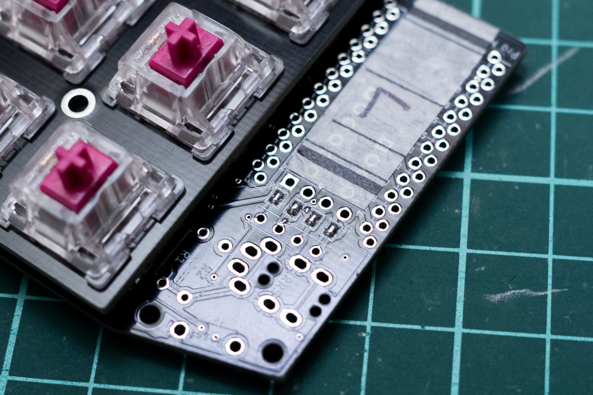  

### OLED用のピンソケット・ピンヘッダをはんだ付けする

　ラクにまっすぐ取り付けるため、マスキングテープでまっすぐつくように仮押さえしてから裏返してはんだ付けします。  

## TRRSコネクタ、タクトスイッチをはんだ付けする

　ラクにまっすぐ取り付けるため、マスキングテープでまっすぐつくように仮押さえしてから裏返してはんだ付けします。  
　タクトスイッチはパチッとはめ込んで裏返してはんだ付けします。  

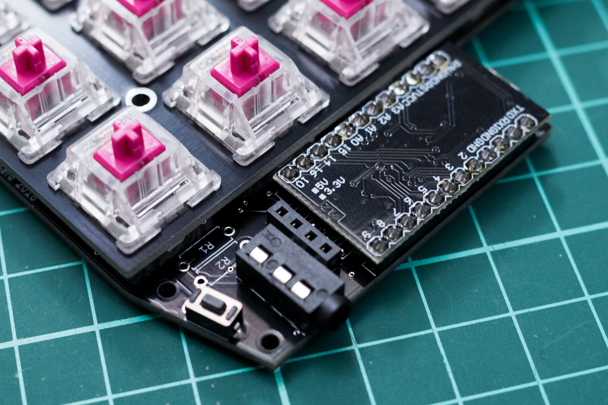  

## トッププレートにスイッチをはめ込む

　ソケットを先にはんだ付けしても良いのですが、先にトッププレートにスイッチを全部はめ込んで、ソケットを端子に差し込んだ後にハンダ付けしたほうが手早くキレイに取り付けられます。  
　お好みのスイッチをトッププレートにはめ込んでください。  

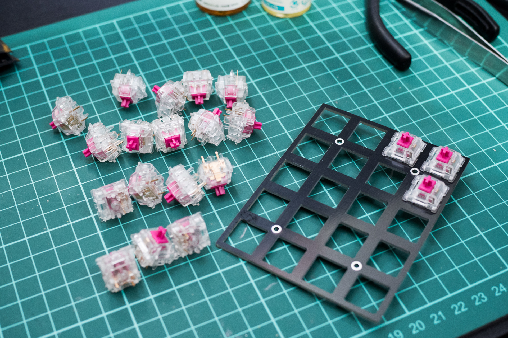  

## MXソケットをはんだ付けする

　まずトッププレートとPCBを合わせます。スイッチ裏の中央の出っ張りをPCBの穴に合わせて取り付けてください。  

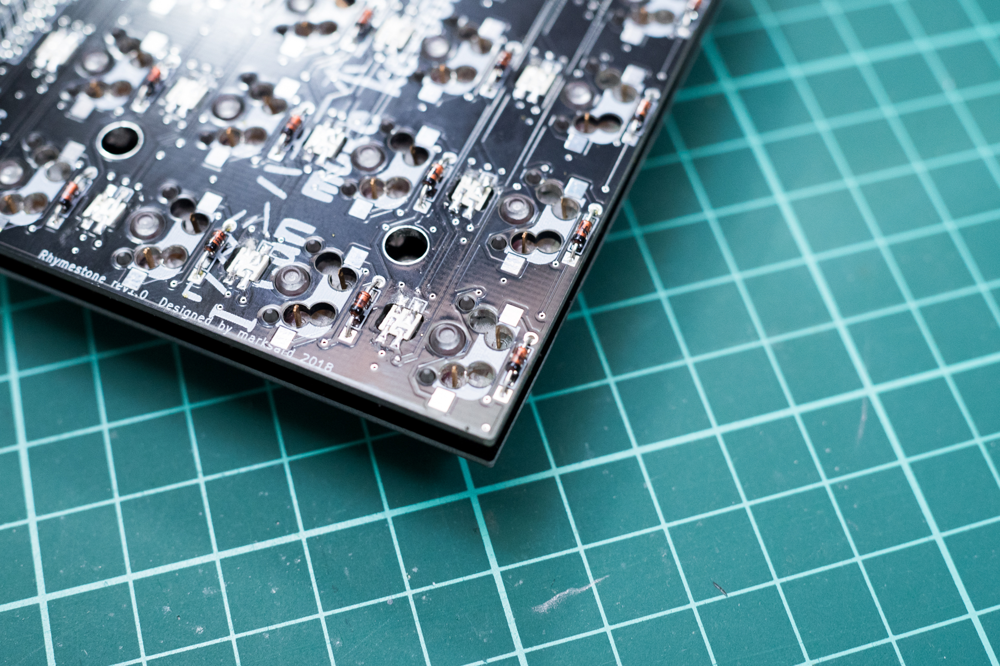  

　MXソケットをPCBのシルクの白いマークに合わせて取り付けます。スイッチのピンがMXソケットにちゃんと刺さっている事を確認しながらパチパチと全部付けてください。  

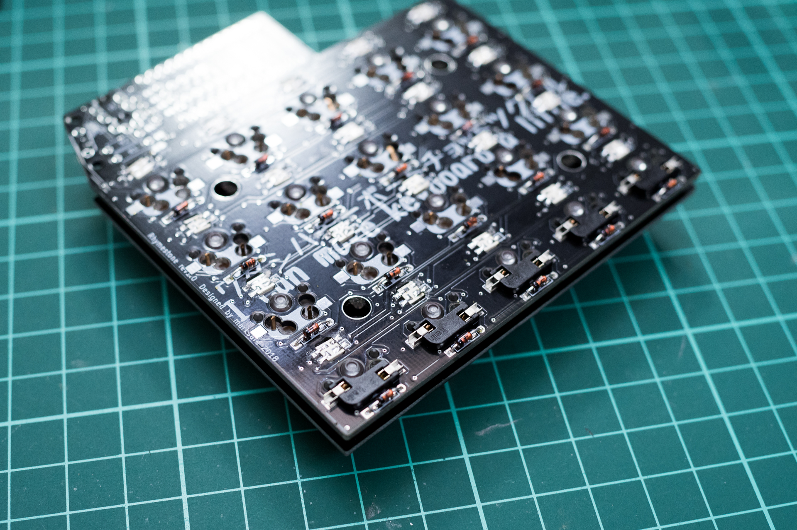  

　あとはハンダ付けです。MXソケットを取り付けると、スイッチの交換は可能になりますが、ソケットと基板の保持をハンダに頼っているため交換後スイッチが効かないなどのハンダ不良が発生する可能性があります。ただ厚く盛っても意味がないので、PCBとソケットの間にしっかりハンダを流します。  
　ハンダごてのこて先に気持ち多めにハンダを付けて、ソケットの金具の隙間に見えるPCBに付ける気持ちで、ソケットの隙間を少しこじ開ける感じで熱を与えながら流し込みます。  

## スペーサーの取り付け

　ボトムプレートの保護紙の片側を剥がし、剥がした方にゴム脚を取り付けてください。標準でチルトするように大きいものと小さいものが入っていますので、小さいほう二つを手前に、大きいほう二つを奥に貼り付けてください。  

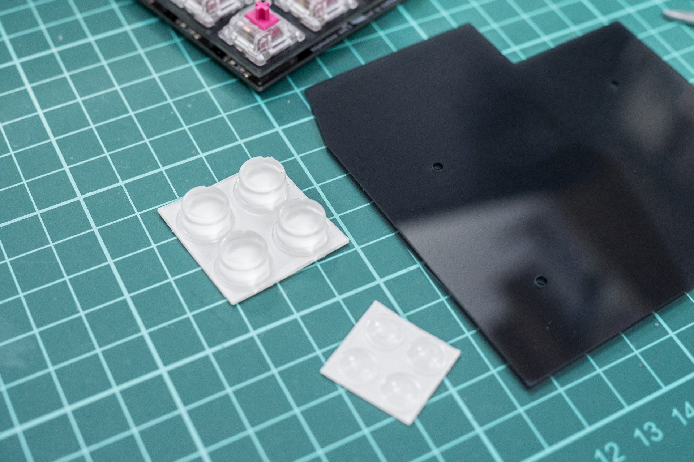  

　残りの保護紙も剥がして、8mmスペーサー4つと5mmネジを4つ使ってボトムプレートにねじ止めしてください。  
　ねじ止めしたら、3mmの樹脂スペーサーを8mmスペーサーに差し込んでおきます。この樹脂スペーサーはスイッチ交換時のPCB落ち込みを防止するために機能します。  

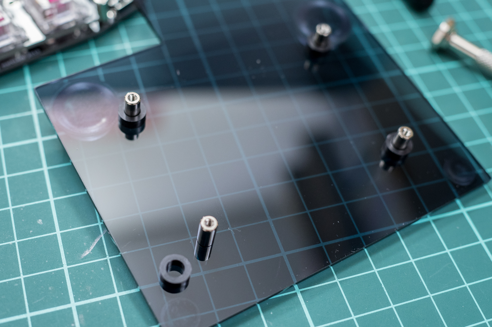  

## 保護パネルの取り付け

　Pro Micro周りの目隠しとOLEDを保護するためのプレートを取り付けます。8mmスペーサー二つを5mmのネジでPCB(写真の黄色〇の箇所)に取り付けます。  
　プレートの保護紙を両方剥がして、黒の4mmネジでPCBに付けたスペーサーに取り付けてください。  
　少し遊びがありますので、キーキャップを取り付けた時にキーキャップと干渉する場合は少しずらしてください。  

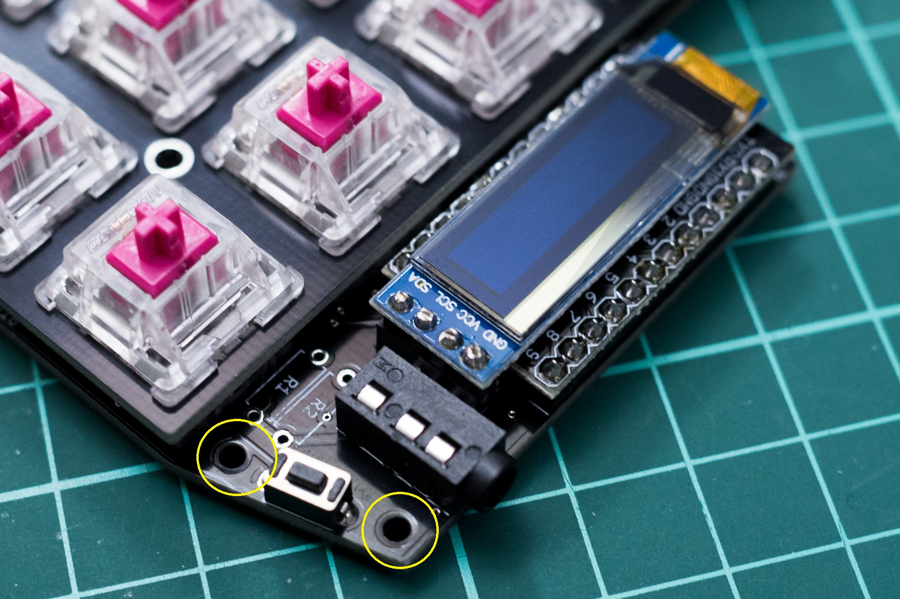  

## キーキャップの取り付け

　お好みのキーキャップを取り付けてください。  

## キーボードファームウェアの書き込み

　LEDバックライトのテストのためにled_testを書き込んでいた人は戻ってdefaultキーマップを書き込んでください。  

## テスト

　まず片方ずつPCに接続してテストしてください。片方づつ付けた場合は常に左手で認識するので、キーボードテスターアプリなどでキーが認識されているかチェックしてください。OLEDを取り付けている場合は、OLEDの四段目の表示がスイッチのステータスです。何かしら変化していればOKです。

　ProMicroとUSBを外しします。  
　左右をTRRSケーブルでつないで、左手側のProMicroとUSBを接続してPCに認識させます。  
　左右で通信が出来ているかチェックしてください。

## 完成！

　チェックして問題なさそうなら完成です！あなただけの一台に仕上げてください！

  
