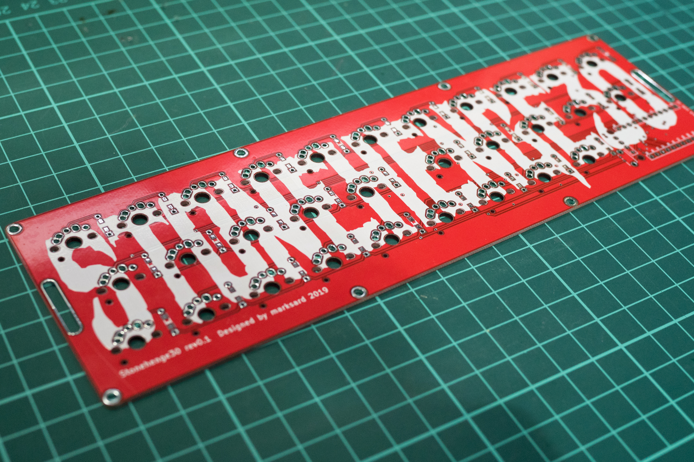
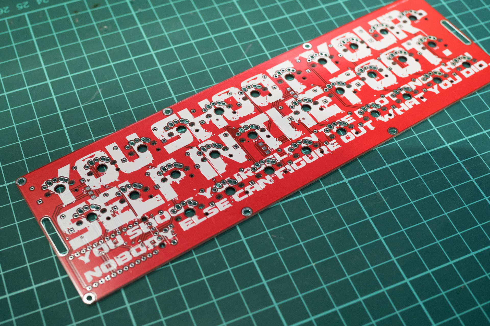
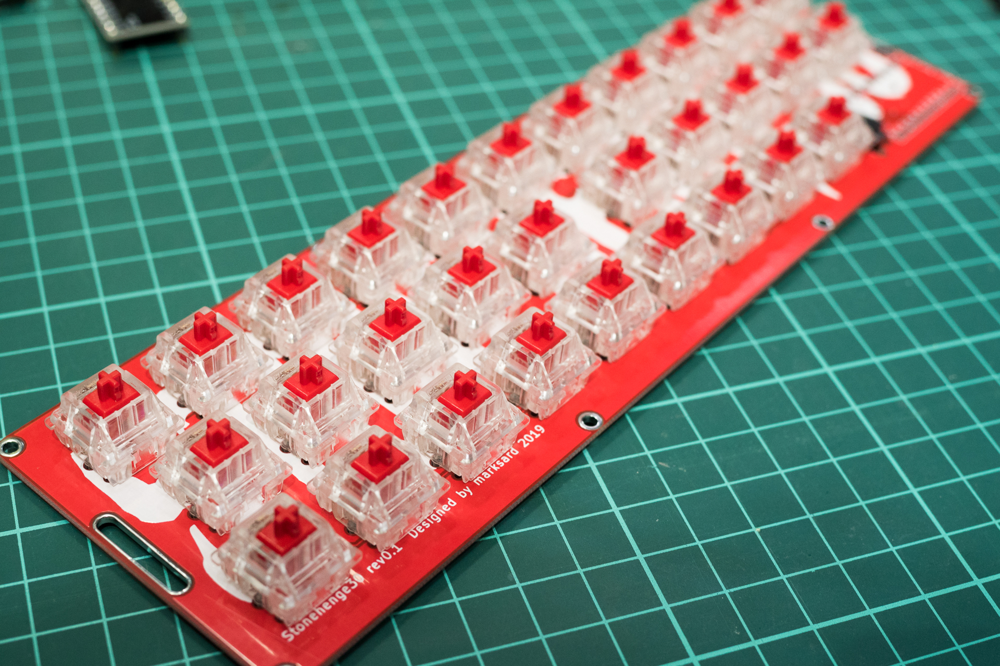
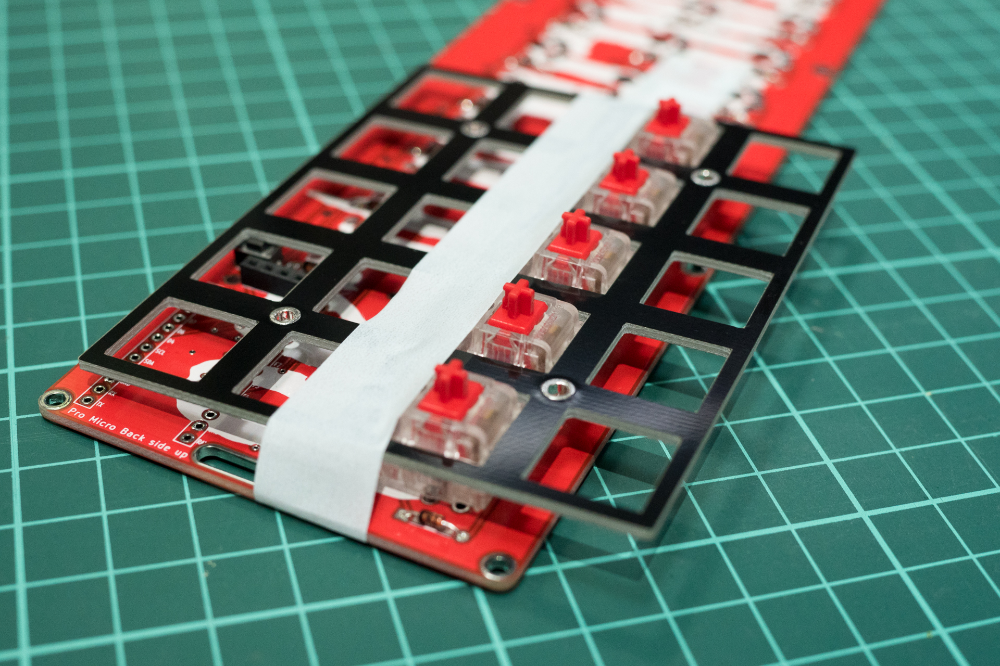
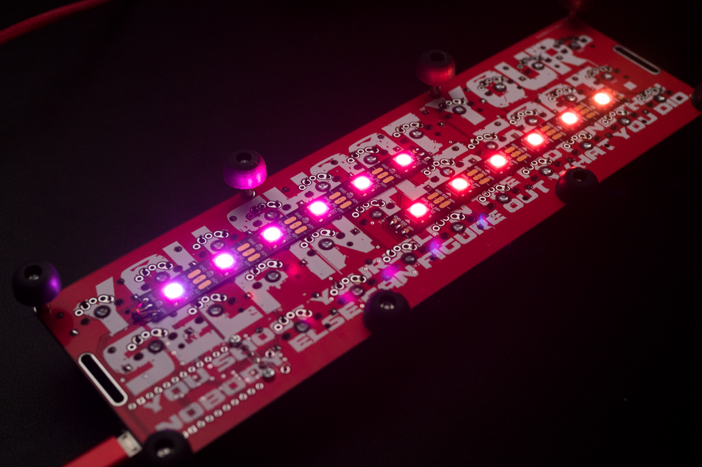
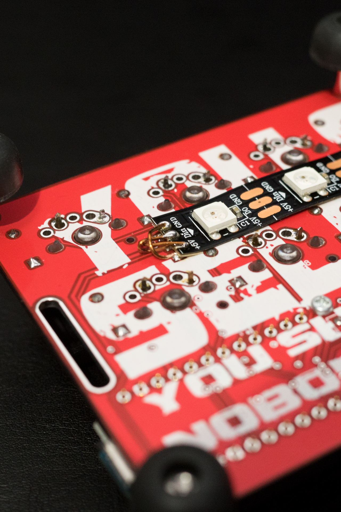
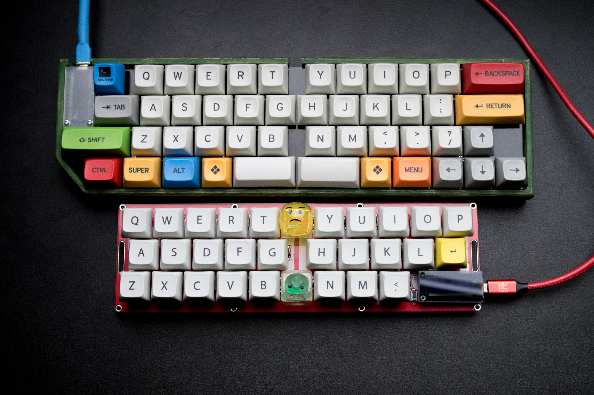
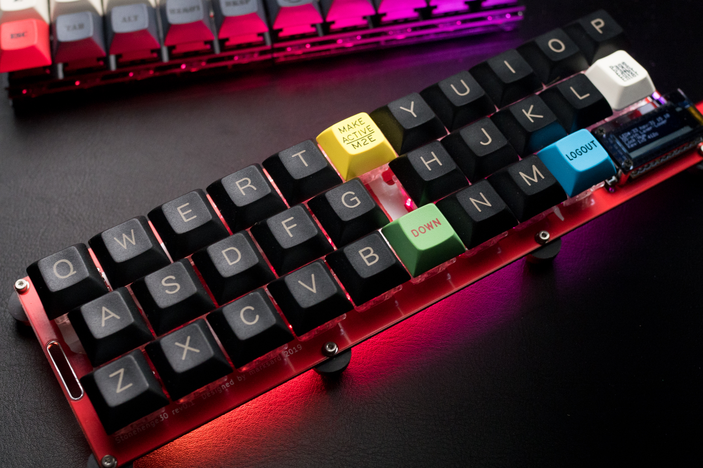
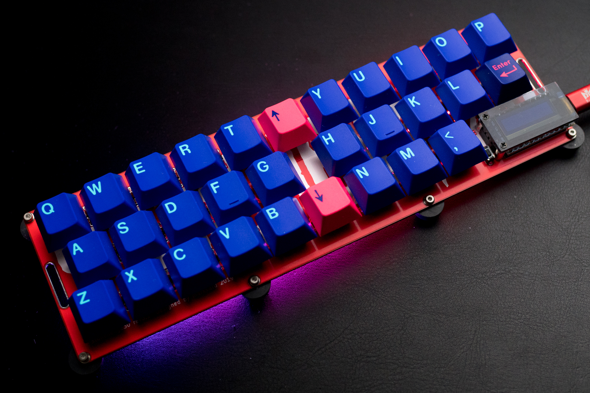

# Stonehenge30 ビルドガイド

## キット付属品

| 名前 | 数 | 備考 |
| ---- | ---- | --- |
| PCB | 1枚 | |

## キット以外に必要なもの

| 名前 | 数 | 備考 |
| ---- | ---- | --- |
| ダイオード | 30個 |  |
| タクトスイッチ | 1個 | |
| キースイッチ | 30個 | MX、LowProfile、Alps（未検証） |
| キーキャップ | 30個 | スイッチにあった規格のもの |
| Pro Micro | 1個 | |
| スプリングピンヘッダ 12P | 2個 | 交換や確認にも便利なので必須と言っていいくらい推奨 |
| *LEDストリップ（WS2812B 6個付き）* | *2個* | *Underglow用（オプション）* |
| MicroUSBケーブル | 1本 | キーボードとPC接続用 |

## promicroの準備

　promicroのコネクタ補強、コンスルーピンのはんだ付けを行ってください。  
　promicroは実装されている面がキーボード基板に向くようにコンスルーを取り付けてください。  
 - promicroのコネクタ補強：[ProMicroのモゲ防止ついでにQMK_Firmwareを書き込む](https://qiita.com/hdbx/items/2f3e4ddfcadda2a5578e)
 - コンスルーピンのはんだ付け：[Helixベータ ビルドガイド](https://github.com/MakotoKurauchi/helix/blob/master/Doc/buildguide_jp.md)

  
  

### QMKを準備する

　このキーボードはQMKというキーボード用のソフトウェアで動作するようにプログラミングしています。あらかじめ登録してあるdefaultキーマップは作者が実際に使用しているもので、ほぼ何不自由なく使えるように工夫しています。

　自分でソースからビルドが出来るようになるとキーを一つ一つ細かい動作まで自在にカスタムすることが出来ます。  

[QMK　ビルド環境を準備する](https://docs.qmk.fm/#/ja/newbs_getting_started)  

　stonehenge30のデフォルトキーマップは  
```qmk compile -kb marksard/stonehenge30 -km default```
で可能です。書き込む場合は
```qmk flash -kb marksard/stonehenge30 -km default```  
とすると、コンパイルが完了次第書き込み待ちになるので、その状態で基板にあるリセットボタンをクリック、もしくはダブルクリックで書き込みが始まります。  

## 基板の裏と表について

　キースイッチが乗り、通常使用する際上を向く面を表、逆を裏とします。  
　stonehenge30の場合、stonehenge30と印刷の入ったほうが表になります。  

  
  

## ダイオードをはんだ付けする

### ダイオードの脚を曲げる

　基板に付ける前にダイオードの脚を全部曲げてしまいます。基板の穴の間隔を見極めて曲げるための冶具を探してみてください。繋がったままの割りばしなどでも良いと思います。  
　私はUSB-C to USB-Aの変換コネクタが丁度いい感じに使えたので、ダイオードを2,3個いっぺんに曲げていきました。  

  

### ダイオードのはんだ付け

　ダイオードの実装はオモテ面をデフォルトにしています。  
　黒い帯を下側にしてはんだ付けしてください。シルク印刷がデザインでつぶれている箇所含めすべて同じ向きです。  

  
  

  

## タクトスイッチをはんだ付けする

　リセット用のタクトスイッチをオモテ面に取り付けてください。  

## スイッチをはんだ付けする

　プレートがないのでスイッチが斜めにつかないように注意して取り付けます。5ピンあるPCBマウント用スイッチを使用してください。

  

もしご家庭にマウントプレートが余っているならこんな感じでスイッチを整列させて何個か一気にやるという手も。  

  

## *(オプション)UnderglowLEDをはんだ付けする*

　ストリップLEDを付ける位置は、ウラ面の上段左側、下段右側の二か所あります。接続はpro micro→上段左→下段右の順になっていて、下段右側の取り付け位置のランドは、上段左側のLEDを取り付けないと通電しないようになっています。  

　テープLEDの剥離紙の両端数cmだけハサミなどでカットします。  

  

　上段左のLEDは左右端をはんだ付けします。下段右側は左端のみはんだします。  

  

### 頒布試作機版の注意点

　まずシルクがないです…LED側のGND、DIN、5Vを上段左のランドにはんだします…が、5VとGNDの配線パターンにミスがあり逆になっています。うまい具合に配線剤を使ってクロスして取り付けてください。このときストリップLEDのシール側の金色の部分にハンダが接触するとショートする可能性があるので、金色の部分は剥離紙を被せておくと良いです。  

  

## キーキャップの取り付け

　お好みのキーキャップを取り付けてください。  

## 脚の取り付け

　お好みの脚を付けてください。クッションゴムシートを直接取り付ける場合、ゴムの厚みが薄いと下面のハンダで机が傷付くため、ハンダした箇所をキレイに処理したうえで干渉しない厚さのゴムシートをお使いください。  
　角かそれに近い4箇所は必須で、PCB自体が結構柔らかいので打鍵感を見ながら追加で貼ると良いと思います。  

　参考までに、下の作例写真では戸当のネジ穴のあるゴムと、両端ネジ穴のある8mmスペーサーを使って8箇所脚を作っています。  

  

## 完成！

　チェックして問題なさそうなら完成です！あなただけの一台に仕上げてください！

  
  
  

## トラブルシューティング

[トラブルシューティング](../../troubleshooting.md)ページを参考にしてください。  
