# Treadstone32ビルドガイド

- [Treadstone32ビルドガイド](#treadstone32%e3%83%93%e3%83%ab%e3%83%89%e3%82%ac%e3%82%a4%e3%83%89)
  - [はじめに](#%e3%81%af%e3%81%98%e3%82%81%e3%81%ab)
  - [パーツ一覧](#%e3%83%91%e3%83%bc%e3%83%84%e4%b8%80%e8%a6%a7)
    - [キット以外に必要なもの](#%e3%82%ad%e3%83%83%e3%83%88%e4%bb%a5%e5%a4%96%e3%81%ab%e5%bf%85%e8%a6%81%e3%81%aa%e3%82%82%e3%81%ae)
  - [必要な道具](#%e5%bf%85%e8%a6%81%e3%81%aa%e9%81%93%e5%85%b7)
  - [ファームウェアの準備と書き方](#%e3%83%95%e3%82%a1%e3%83%bc%e3%83%a0%e3%82%a6%e3%82%a7%e3%82%a2%e3%81%ae%e6%ba%96%e5%82%99%e3%81%a8%e6%9b%b8%e3%81%8d%e6%96%b9)
  - [組み立て](#%e7%b5%84%e3%81%bf%e7%ab%8b%e3%81%a6)
  - [micro USBのはんだ付け](#micro-usb%e3%81%ae%e3%81%af%e3%82%93%e3%81%a0%e4%bb%98%e3%81%91)
  - [atmega32u4のはんだ付け](#atmega32u4%e3%81%ae%e3%81%af%e3%82%93%e3%81%a0%e4%bb%98%e3%81%91)
  - [水晶振動子のはんだ付け](#%e6%b0%b4%e6%99%b6%e6%8c%af%e5%8b%95%e5%ad%90%e3%81%ae%e3%81%af%e3%82%93%e3%81%a0%e4%bb%98%e3%81%91)
  - [コンデンサのはんだ付け](#%e3%82%b3%e3%83%b3%e3%83%87%e3%83%b3%e3%82%b5%e3%81%ae%e3%81%af%e3%82%93%e3%81%a0%e4%bb%98%e3%81%91)
  - [抵抗のはんだ付け](#%e6%8a%b5%e6%8a%97%e3%81%ae%e3%81%af%e3%82%93%e3%81%a0%e4%bb%98%e3%81%91)
  - [リセットボタンのはんだ付け](#%e3%83%aa%e3%82%bb%e3%83%83%e3%83%88%e3%83%9c%e3%82%bf%e3%83%b3%e3%81%ae%e3%81%af%e3%82%93%e3%81%a0%e4%bb%98%e3%81%91)
  - [リセッタブルヒューズのはんだ付け](#%e3%83%aa%e3%82%bb%e3%83%83%e3%82%bf%e3%83%96%e3%83%ab%e3%83%92%e3%83%a5%e3%83%bc%e3%82%ba%e3%81%ae%e3%81%af%e3%82%93%e3%81%a0%e4%bb%98%e3%81%91)
  - [ダイオードのはんだ付け](#%e3%83%80%e3%82%a4%e3%82%aa%e3%83%bc%e3%83%89%e3%81%ae%e3%81%af%e3%82%93%e3%81%a0%e4%bb%98%e3%81%91)
  - [MXソケットのはんだ付け](#mx%e3%82%bd%e3%82%b1%e3%83%83%e3%83%88%e3%81%ae%e3%81%af%e3%82%93%e3%81%a0%e4%bb%98%e3%81%91)
  - [ATm32U4DFUとして認識することを確認する](#atm32u4dfu%e3%81%a8%e3%81%97%e3%81%a6%e8%aa%8d%e8%ad%98%e3%81%99%e3%82%8b%e3%81%93%e3%81%a8%e3%82%92%e7%a2%ba%e8%aa%8d%e3%81%99%e3%82%8b)
  - [*(オプション)UnderglowLEDをはんだ付けする*](#%e3%82%aa%e3%83%97%e3%82%b7%e3%83%a7%e3%83%b3underglowled%e3%82%92%e3%81%af%e3%82%93%e3%81%a0%e4%bb%98%e3%81%91%e3%81%99%e3%82%8b)
  - [動作確認をこの時点で行う](#%e5%8b%95%e4%bd%9c%e7%a2%ba%e8%aa%8d%e3%82%92%e3%81%93%e3%81%ae%e6%99%82%e7%82%b9%e3%81%a7%e8%a1%8c%e3%81%86)
    - [動作確認](#%e5%8b%95%e4%bd%9c%e7%a2%ba%e8%aa%8d)
  - [キーキャップの取り付け](#%e3%82%ad%e3%83%bc%e3%82%ad%e3%83%a3%e3%83%83%e3%83%97%e3%81%ae%e5%8f%96%e3%82%8a%e4%bb%98%e3%81%91)
  - [ケースの組み立て](#%e3%82%b1%e3%83%bc%e3%82%b9%e3%81%ae%e7%b5%84%e3%81%bf%e7%ab%8b%e3%81%a6)
  - [完成](#%e5%ae%8c%e6%88%90)
  - [キースイッチの交換方法](#%e3%82%ad%e3%83%bc%e3%82%b9%e3%82%a4%e3%83%83%e3%83%81%e3%81%ae%e4%ba%a4%e6%8f%9b%e6%96%b9%e6%b3%95)

## はじめに

　Treadstone32はすべてチップ部品を使っており、ピッチの細かい部品のはんだ付けがあるため自作キーボードの中でも難易度は高いです。まず使用する道具はちゃんとそろえてくださいますようお願いいたします。  
　また特にmicroUSBのピンとMCUのピンはピッチが狭いため、慣れないとハンダで隣のピンをブリッジすることがあります。これを気づかずに電源を入れると最悪部品をを破損しますので重ねてご注意くださいますようお願いいたします。  

## パーツ一覧

細かいチップ部品は予備として1個多く入れています。  

| 基板番号 | 定数 | 数 | 名前 | 備考 |
| ---- | ---- | --- | --- | --- |
| C1 | 0.1uF | 2 | コンデンサ(1206size) | プラスチックのリールケースに入っていて1uFよりも色が薄く、一番厚みがある |
| C2-C3 | 1uF | 3 | コンデンサ(1206size) | 一番色が濃い |
| C4-C5 | 22pF | 3 | コンデンサ(1206size) | 一番色が薄く、厚みも薄い |
| R1-R2 | 22ohm | 3 | 抵抗(1206size) | 22R0と書いてある |
| R3-R4 | 10Kohm | 3 | 抵抗(1206size) | 1002と書いてある |
| F1 | 500mA | 1 | リセッタブルヒューズ(0805size) | 4て書いてるもの |
| X1 | 16MHz | 1 | 水晶振動子 EPSON FA-238 | 裏にパッドが4つあって、表に薄く1600とか書いてある |
| U1 | - | 1 | MCU atmel ATMEGA32U4-AU |  |
| J1 | - | 1 | micro USB MOLEX 47642-0001 |  |
| (D1-D32) | - | 33 | 1N4148 SOD-123 | うっすらとシルク印刷されている |
| (SW1-SW32) | - | 32 | Kailh MX ソケット |  |
| Reset1 | - | 1 | リセットスイッチ |  |
| - | M2 8mm | 6 | 低頭ネジ（黒または銀） |
| - | M2 4mm | 6 | 低頭ネジ（銀） |
| - | M2 スペーサー 7mm | 6 | 丸型 全ねじスペーサー |
| - | 2mm | 5 | ゴム脚 |  |
| - | 1 | PCB | 基板 |
| - | 1 | マウントプレート | スイッチをはめ込むプレート |
| - | 1式 | アクリルケースパーツ | </br>2mmボトムプレート</br>2mmボトムミドル</br>5mmボトムミドル</br>5mmトップカバー |

※以下はアーリーバード版に含まれるネジとボルトです

| 基板番号 | 定数 | 数 | 名前 | 備考 |
| ---- | ---- | --- | --- | --- |
| - | M2 1.6mm | 6 | ナット |  |
| - | M2 17mm- | 6 | ボルト |  |

### キット以外に必要なもの

| 名前 | 数 | 備考 |
| ---- | ---- | --- |
| キースイッチ | 32個 | MX互換のもの |
| キーキャップ | 32個 | MX互換のもの |
| MicroUSBケーブル | 1個 |  |
| *LEDストリップ（WS2812B 6個付き）* | *1個* | *Underglow用（オプション）* |

## 必要な道具

| 名前 | 備考 |
| ---- | ---- |
| 温調はんだごて | チップ部品は熱に弱いので温調はんだごてが必須です |
| 細めのこて先 | C型やD型で2φ以下のものを推奨。慣れている人ならなんでも |
| 糸ハンダ | 半田ブリッジを低減するため0.5mm程度の細いものを推奨します |
| フラックス | 必須です |
| フラックス除去剤 | フラックスを塗るのでそれの除去に使用します |
| ハンダ吸い取り線 | 失敗したとき、ハンダブリッジしたときに吸い取ります |
| ピンセット | 必須です |
| テスター | 接続確認、ブリッジしていないかの確認に必須です |
| キズミ、ルーペなど | MicroUSBやAtmega32U4のハンダブリッジを目視で確認する際に必要 |

## ファームウェアの準備と書き方

  Treadstone32はQMKを利用しています。ファームウェアは以下をクローンしてビルドしてください。 KeyboardディレクトリにTreadstone32があります。  
  [qmk/qmk_firmware](https://github.com/qmk/qmk_firmware)

　Treadstone32のキーマップのmakeは ```make treadstone32:like_jis``` で可能です。（Linux、Mac、MSYS2環境上なら ```make treadstone32:like_jis:dfu``` で書き込みも出来ます）  
　キーマップについての解説は[ここにあります](https://github.com/marksard/qmk_firmware/blob/my_customize/keyboards/treadstone32/keymaps/like_jis/readme_jp.md)。  

　QMKのmake環境から構築する場合、Windowsの方はMSYS2を使うか、WSL(Windows Subsystem for Linux)を使う方法があります。MSYS2での書き込み方は[さぼてんさん](https://twitter.com/cactusman)作成の記事[プログラマーではない人向けのQMK Firmware入門](https://qiita.com/cactusman/items/ac41993d1682c6d8a12e)を、WSLは[qmk_firmwareをWindows上でmakeする方法](https://qiita.com/marksard/items/f381caf3ca981f307f64)を参照してファームウェアを書き込める環境を作ってください。  
　Macな方はDocker使うほうが確実かもしれません。[自作キーボードに手を出した](https://poyo.hatenablog.jp/entry/2018/10/08/003800) の後半に記述があります。  

## 組み立て

　組み立ての時間ですが、2～6時間くらい（ファーム開発環境構築からだと別途+1～2時間程度）を目安にしてください。ハンダの煙は吸ったり目に入れたりしないように注意しましょう。  

　組み立ての順序は出来れば難しいパーツから取り掛かります（最後に難しいパーツを取り付けて失敗したときの徒労感が半端ないので）。ただ最初からは厳しいと思いますので、素振りとしてダイオードを数個付けて身体と半田ごてを慣らしてからでも良いかと思います。  

## micro USBのはんだ付け

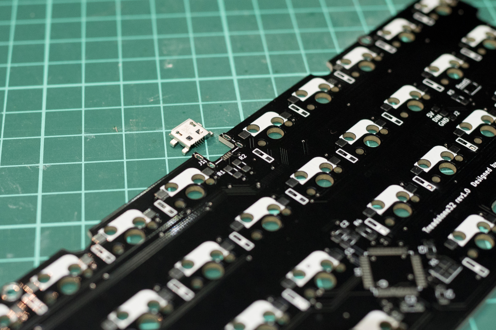  

　写真の向きで取り付けてください。  
　ハンダ付けするピンのピッチがかなり狭く、屋根の内側にピンがあるため難易度は高めです。  
　ここがショートしているとPCのUSBポートやUSBハブにダメージが出るおそれがあるので、ルーペやキズミでの目視確認し、テスターでの検査の両方で隣のピンと導通していないことを確認してください。（回路の設計上、隣同士のピンが導通しているのははんだをミスしています）  
　もし隣のピンと半田ブリッジている場合は半田吸い取り線などで除去してください。  

## atmega32u4のはんだ付け

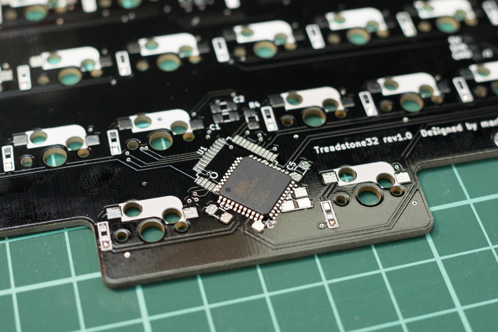  

　写真の向きのように、atmega32u4のくぼんだ丸印と基板のシルクの丸印を同じ位置にします。  
　次にatmega32u4のピンが綺麗に載るように調整します。このとき、基板の銀色のパッドのどこか一辺にフラックスを軽く塗布しておくとちょっと吸いつくようになるので位置決めがしやすいと思います。  
　ここでも電源ピン回りがショートしているとPCのUSBポートやUSBハブにダメージが出るおそれがあるので、ルーペやキズミでの目視確認し、テスターでの検査の両方で隣のピンと導通していないことを確認してください。（回路の設計上、隣同士のピンが導通しているのははんだをミスしています）  
　もし隣のピンと半田ブリッジている場合は半田吸い取り線などで除去してください。  

## 水晶振動子のはんだ付け

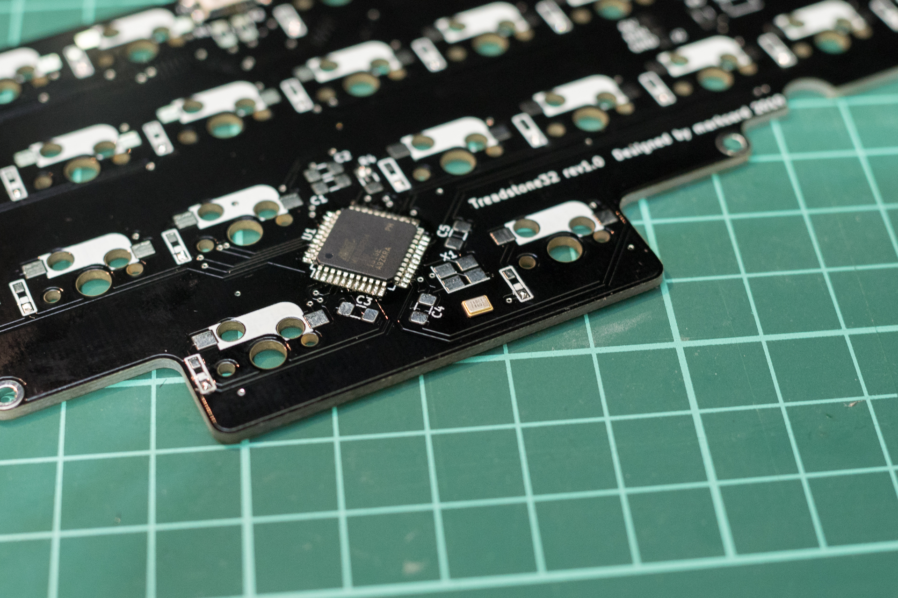  

　水晶振動子の印刷と、基板のX1が双方正しく読める位置にあわせてハンダ付けしてください。  

## コンデンサのはんだ付け

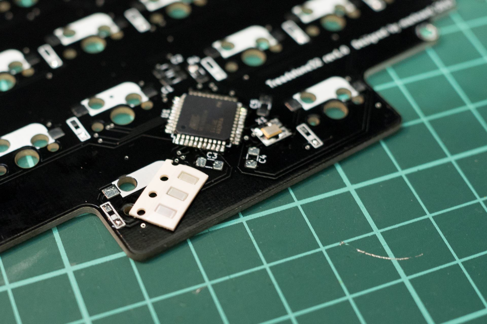  

　何も字が書いてなくて、グレーまたは茶色っぽい地味色をのがコンデンサです。  
　コンデンサはすべて積層セラミックで方向はありません。  

　22pFは色が薄く一番平たいものです。水晶振動子の両サイドC4,C5の二か所に取り付けます。  
　0.1uFはプラスチックケースに2個入っているものです。C1に取り付けます。
　残ったのは1uFです。C2,C3に取り付けます。  

## 抵抗のはんだ付け

　黒地に白で何か書いてあるのが抵抗です。これも方向はありません。  
　22R0(22Ω)はmicro USBの下にあるR1,R2に取り付けます。  
　1002(10kΩ)はリセットボタン付近とAtmega32U4付近にあるR3,R4に取り付けます。  

## リセットボタンのはんだ付け

　スイッチがシルク印刷に収まる方向にとりつけてください。  

## リセッタブルヒューズのはんだ付け

　方向はありません。  

## ダイオードのはんだ付け

　チップダイオードのシルクが薄く見えにくいですが、線が入っている方を基板の線が入っている方に向きを合わせて取り付けてください。  
　取り付け向きはすべて一定なので、一つ取り付けたら残りも同じ方向で取り付けていってください。  

## MXソケットのはんだ付け

　まずマウントプレートにキースイッチのピンの方向に注意しながらすべてハメ込んでください。  
　次にマウントプレートと基板を合わせます。  
　合わせるとキースイッチのピンが基板から少し飛び出るので、そこにMXソケットを向きに注意しつつすべてハメ込みます。  
　こうすることでMXソケットが浮かずに確実にはんだ付け出来ます。  

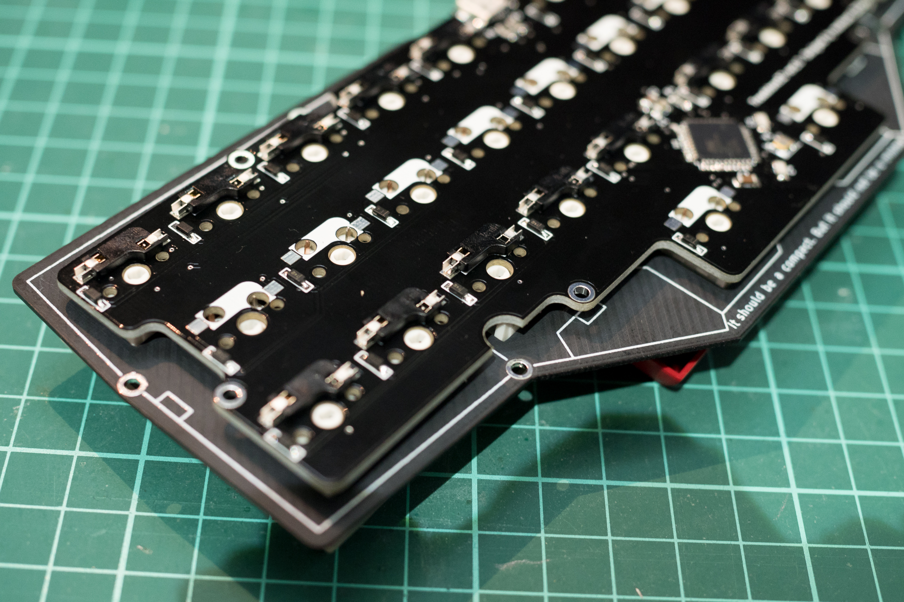  

　はんだごてを270℃程度に設定し、写真のようにMXソケットの端子に当てて3秒ほど温めます。  
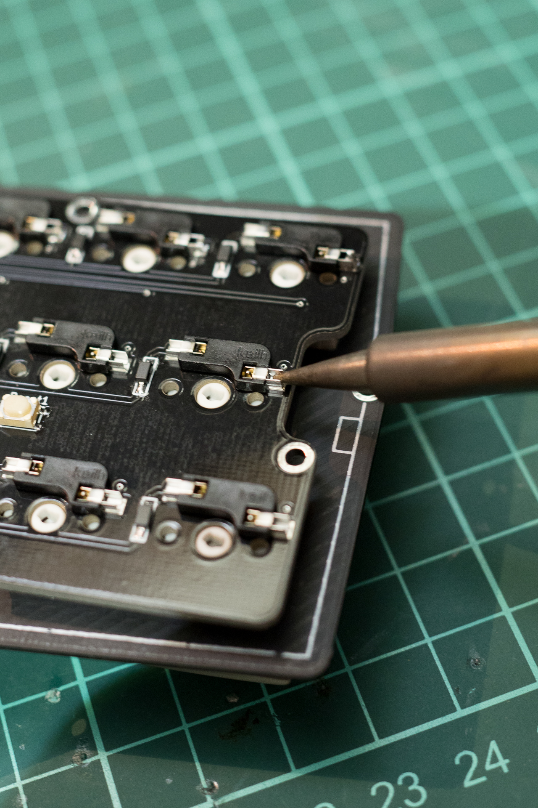  

　はんだを写真のように差し込んで、横から同じ温度ではんだごてを差し込んで、はんだを溶かします。はんだが基板とMXソケットの間にスーッと入ったらはんだごてを離します。

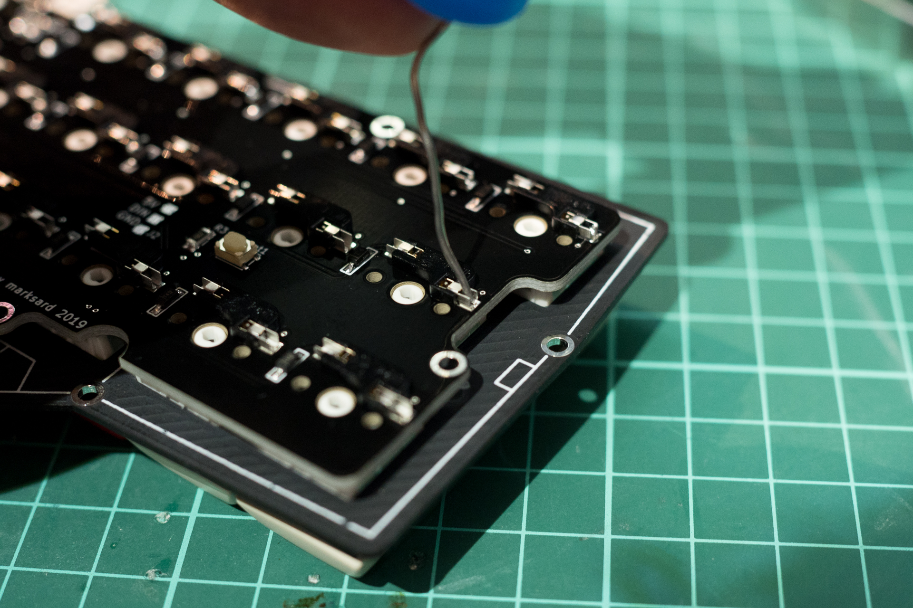  

## ATm32U4DFUとして認識することを確認する

　ここまで出来たらもう一度、ルーペやキズミでの目視確認、テスターでの検査の両方で隣のピンと導通していないことmicroUSBとATMEGA32U4を対象によく確認してください。  
　確認出来たらPCとUSBケーブルで接続します。接続すると最初は(PCのOS問わず)ATm32U4という名前で認識します。  

windows10 デバイスマネージャでの表示  
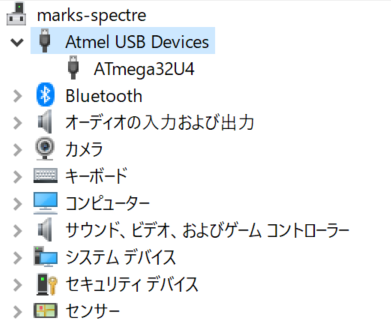  

windows10 設定→デバイス→Bluetoothとその他のデバイスでの表示  
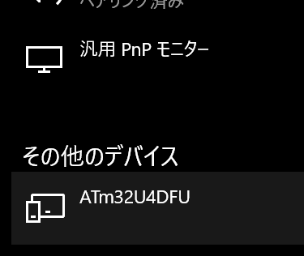  

　認識出来たらファームウェアを書き込むことが出来ます。  

　認識しない場合はどこかがハンダ不良で接続されていない可能性が高いです。以下を目視でチェックしてください。  

- 水晶振動子(X1)、コンデンサ(C1-C5)、抵抗(R1-R4)がキチンとはんだ付けされているか
- microUSBのピンがキチンとはんだ付けされているか
- ATMEGA32U4のピンがキチンとはんだ付けされているか

　付いていると思ってもいわゆるイモはんだっぽくなっていて接合されていないかもしれませんので、はんだを温めなおす、はんだを吸い取ってやり直してみてください。  

## *(オプション)UnderglowLEDをはんだ付けする*

　写真のようにテープLEDの剥離紙の両端数cmだけハサミなどでカットします。これはテープLEDの背面の端子と、キーボード基板のスルーホールなどの端子が接触して動作不良を起こすことを防ぐ意味合いがあります。  

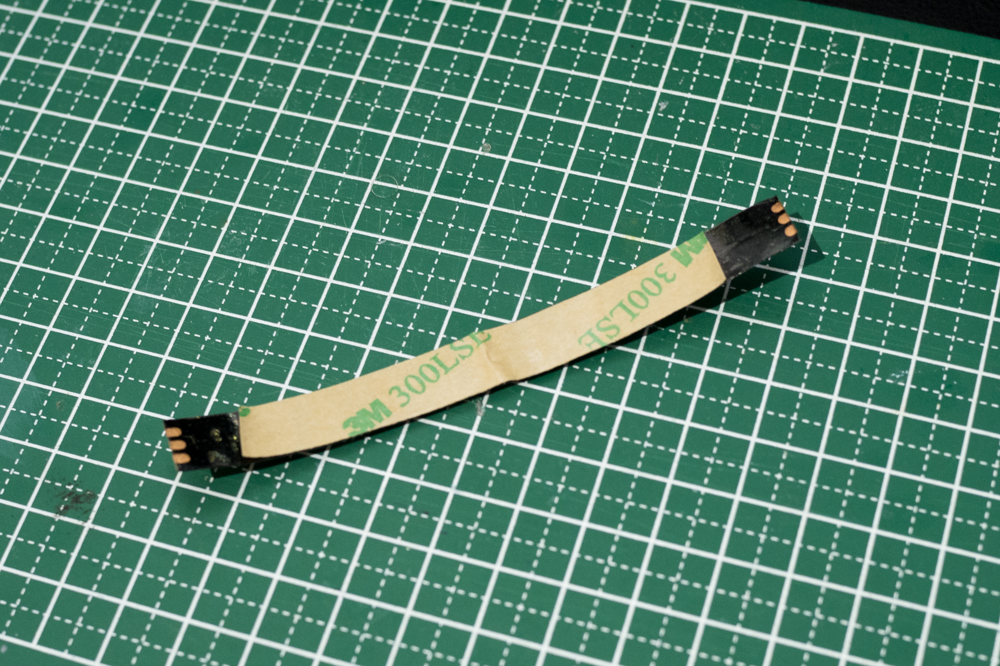  

　テープLEDは向きがありテープLEDの端子と基板の端子が合う向きにします。
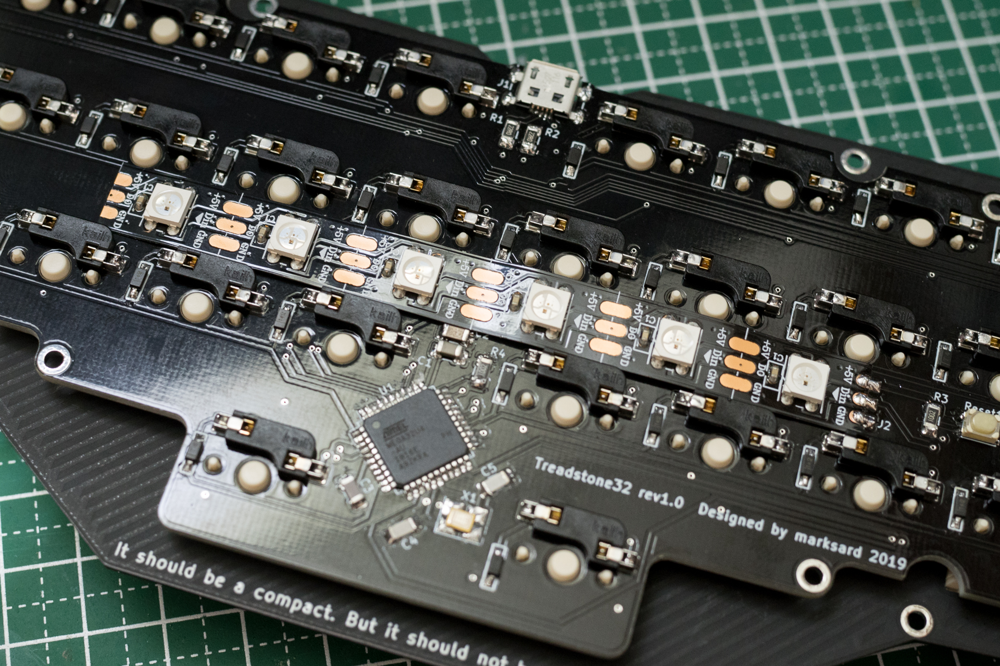  

　基板の両端のランドに少し被るくらいの位置にテープLEDを貼り付けてはんだ付けしてください。  

## 動作確認をこの時点で行う

　あとはケースを組み立ててキーキャップをつけるだけですが、ケースを組み立てるのと分解するのが若干面倒なのと、MXソケットやダイオードがキチンと半田付けされているかの動作確認を済ませておくとケース組み立てが一回で済むので「ファームウェアの準備と書き方」を見てファームウェアを書き込んで動作確認をしてください。  

### 動作確認

　Lower、Raise（左親指キー、右親指キー）の順で押下するとAdjustレイヤーになります。押下したまま、Aキーを押下するとLEDのON/OFFです。光らない場合はLEDの取り付け向きやはんだ箇所をチェックしてください。  

## キーキャップの取り付け

　ケースの組み立て時、トップレイヤーとキーキャップが干渉しないように取り付ける必要があるので、先にキーキャップをハメ込んでください。  

## ケースの組み立て

　ケースのパーツは2mm厚のものと、5mm厚のものがあります。  
　2mmボトムプレートと2mmボトムレイヤーを合わせてみて、ボトムレイヤーにスペーサーをはめ込む場所が6箇所あります。その位置にボトムプレートへM2 4mmのネジで取り付けてください。  

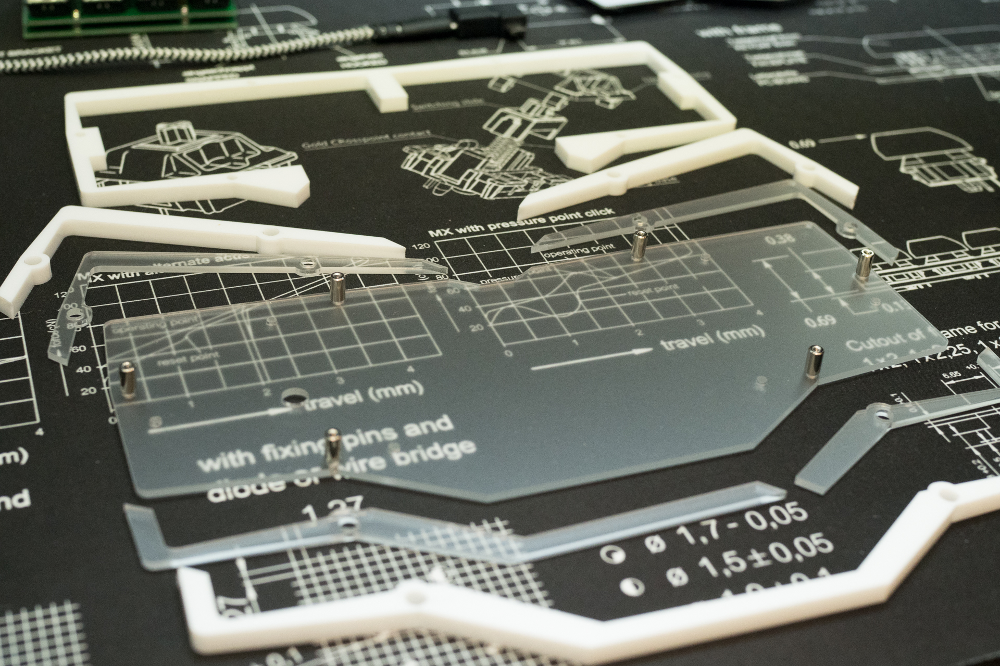  

以下の順番で乗せていきます。  

| 層名 | 厚み | 上 |
| --- | --- | --- |
| トップレイヤー | 5mm |  |
| マウントプレート(PCB付) | 1.2mm |  |
| ミドルレイヤー | 5mm |  |
| ボトムレイヤー | 2mm |  |
| ボトムプレート | 2mm | 下 |

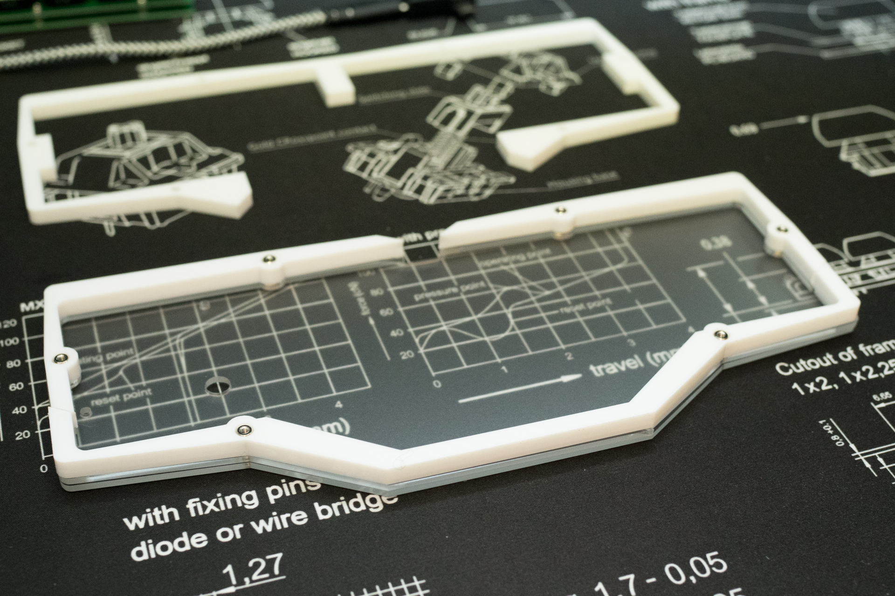  

　全部乗せたら、トップレイヤーの位置をキーキャップに干渉しないように位置を合わせながらM2 8mmネジで6箇所留めてください。
　ゴム脚は四隅と、2つの親指キーの間手前に一つ貼ってください。  
　添付のゴム脚の厚みは1.6mmのものです。気になるようでしたら追加でゴム脚を貼ってみてください。  

## 完成

　チェックして問題なさそうなら完成です！あなただけの一台に仕上げてください！  

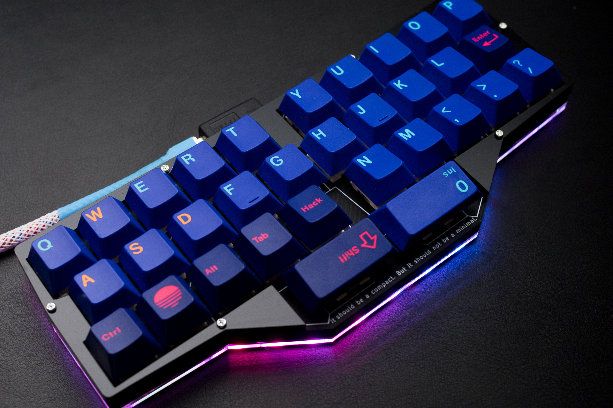  

## キースイッチの交換方法

　手では取り外しにくいため、amazonなどで販売されているキースイッチ引き抜き工具を使用して交換してください。  
