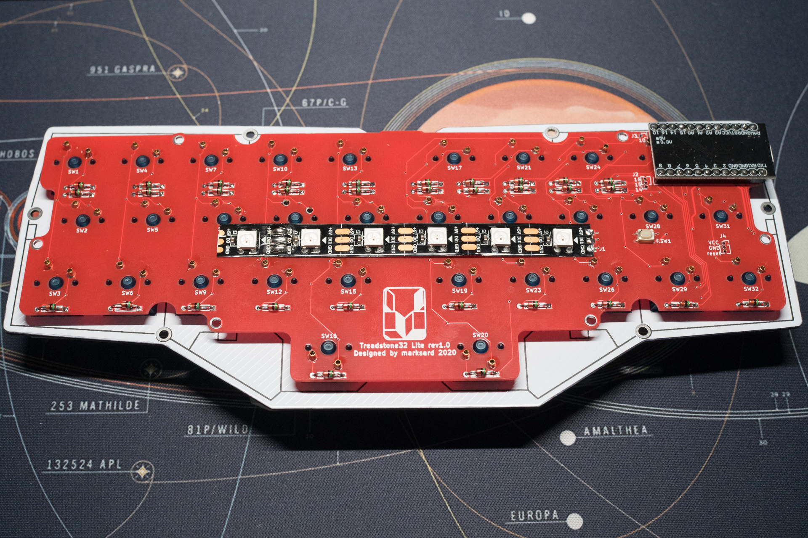
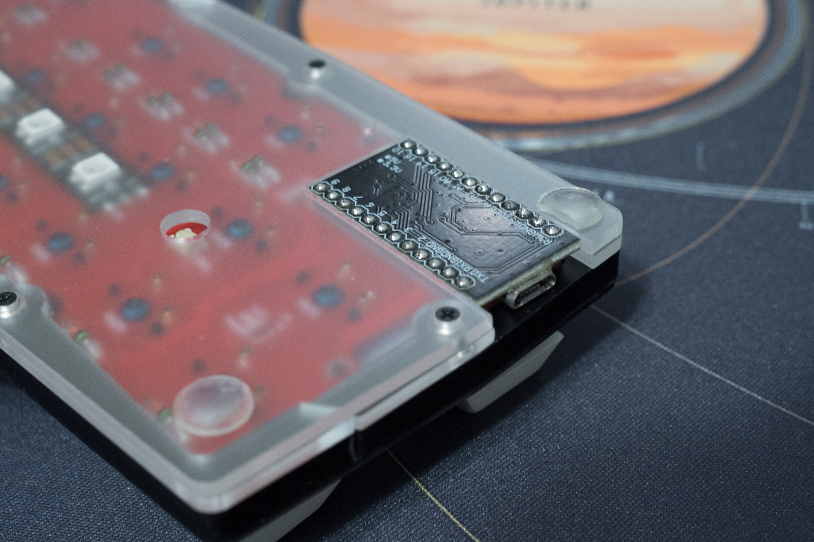
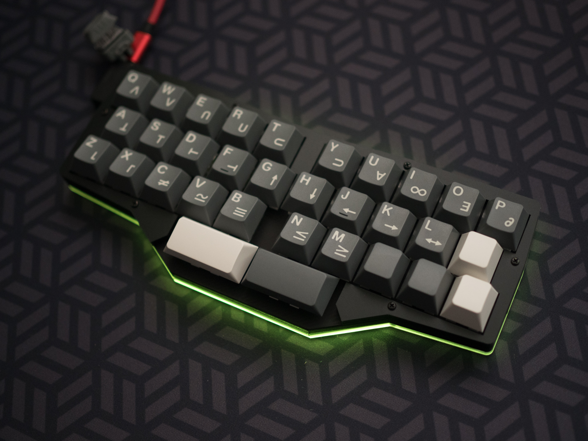

# Treadstone32 Liteビルドガイド

## キット付属品

| 基板番号 | 定数 | 数 | 名前 | 備考 |
| ---- | ---- | --- | --- | --- |
| - | - | 1 | PCB | 基板 |
| - | - | 32 | 1N4148 or 1SS178 | ロットにより1N4148（黒ライン）か1SS178（緑と黒のライン）どちらか |
| - | - | 1 | リセットスイッチ |  |
| - | - | 1 | マウントプレート | スイッチをはめ込むプレート |
| - | - | 1式 | アクリルケースパーツ | </br>2mmボトムプレート</br>2mmボトムミドル</br>5mmボトムミドル</br>5mmトップカバー |
| - | M2 8mm | 6 | 低頭ネジ |
| - | M2 4mm | 6 | 低頭ネジ |
| - | M2 スペーサー 7mm | 6 | 丸型 全ねじスペーサー |
| - | 2mm | 5 | ゴム脚 |  |

## キット以外に必要なもの

| 名前 | 数 | 備考 |
| ---- | ---- | --- |
| MicroUSBケーブル | 1本 | キーボードとPC接続用 |
| キースイッチ | 32個 | MX互換のもの |
| キーキャップ | 1U 30個、2U 2個 | MX互換のもの |
| ProMicro | 1個 | |
| コンスルー（スプリングピンヘッダ） 12P | 2個 | 推奨 |

### オプション

オプションでイルミネーション用LEDを取り付け可能です。  

| 名前 | 数 | 備考 |
| ---- | ---- | --- |
| LEDストリップ（WS2812B 6個付き） | 1個 | Underglow用（オプション） |

## 必要な道具

| 名前 | 備考 |
| ---- | ---- |
| はんだごて | |
| 糸ハンダ | 0.8mm程度のものを推奨します |
| ハンダ吸い取り線 | 失敗したとき用 |
| ニッパー | ダイオードのリード線などの切断用です |
| ピンセット | ProMicroリセットしたりチップLEDのはんだづけで使用します |
| フラックス除去剤 | 必須ではありませんがはんだ付け後のベタつきを除去出来、はんだによる黄色い変色も拭き取れてキレイな仕上がりになります |
| マスキングテープ | しるし付け、仮固定に使用。100均の柄付きでもOK |

　mteiさんの[Helix キーボードキットの製作に必要な工具メモ](https://gist.github.com/mtei/6957107a676ddfa85bde0ae41f8fa849)
やhdbxさんの[自作キーボードを始めるにあたって用意すべきツール](https://hdbx.hateblo.jp/entry/2018/06/01/215401)も参考になります。  

  
  

## promicroの準備

　promicroのコネクタ補強、コンスルーピンのはんだ付けを行ってください。  
　promicroは実装されている面がキーボード基板に向くようにコンスルーを取り付けてください。  
 - promicroのコネクタ補強：[ProMicroのモゲ防止ついでにQMK_Firmwareを書き込む](https://qiita.com/hdbx/items/2f3e4ddfcadda2a5578e)
 - コンスルーピンのはんだ付け：[Helixベータ ビルドガイド](https://github.com/MakotoKurauchi/helix/blob/master/Doc/buildguide_jp.md)

  
  


### キーボード用ソフトウェアをpromicroに書き込む

　このキーボードはQMKというキーボード用のソフトウェアで動作するようにプログラミングしています。あらかじめ登録してあるdefaultキーマップは作者が実際に使用しているもので不自由なく使えるように工夫しています。

1. [QMK Toolbox](https://github.com/qmk/qmk_toolbox/releases)をダウンロードし、インストールします
2. [marksard/qmk_firmware_hex](https://github.com/marksard/qmk_firmware_hex/releases)にある最新のhexファイルからtreadstone32_lite_via.zipをダウンロード、zipを展開します
3. QMK Toolboxの「open」ボタンをクリックして、先程展開しhexファイルを選択します
4. QMK Toolboxの「Auto-Flash」チェックボックスにチェックを入れてpromicro(直付けの場合は基板)をPCに接続し、リセットボタンを押して書き込みます。
   1. （リセットボタンをダブルクリックしないと書き込めないパターン、初回のみリセットボタンを押下しなくても書き込みが始まるのものもあります）

書き込み方法などはサリチル酸さんの[（初心者編）自作キーボードにファームウェアを書き込む](https://salicylic-acid3.hatenablog.com/entry/qmk-toolbox)の記事が参考になります。  

#### REMAPを使用する

　上記で書き込んだファイルはVIA対応ファームウェアで、ファームウェアを書き直さなくてもアプリケーション上からキー設定を変更することが出来ます。  
　ここでは国産のVIA対応キーマップ変更アプリケーションとして、WEB上からキーボードの設定が出来る[REMAP](https://remap-keys.app/)を紹介します。  
対応したキーボードを接続した状態で、「START REMAP FOR YOUR KEYBOARD」→「+KEYBOARD」ボタンを押下するとキーボード名が出ます。それを押下することでカスタマイズ画面が出てきます。  

詳しい操作方法などについてはサリチル酸さんの[（初心者編）Remapを使ってキーマップを書き換えよう](https://salicylic-acid3.hatenablog.com/entry/remap-manual)の記事が参考になります。  

#### ビルド環境を作成する

　現状、以下のようなカスタムはソースファイルからビルドする必要があります。  

- ロータリエンコーダーの動作のカスタマイズ
- タップと長押しの判定タイミングを調整する
- OLED表示の内容を変更

　ソースからビルドが出来るようになると他の多彩な機能を扱え、細かい動作まで自在にカスタムすることが出来ます。  

[QMK　ビルド環境を準備する](https://docs.qmk.fm/#/ja/newbs_getting_started)  

　treadstone32liteのデフォルトキーマップは  
```qmk compile -kb treadstone32/lite -km default```
で可能です。書き込む場合は
```qmk flash -kb treadstone32/lite -km default```  
とすると、コンパイルが完了次第書き込み待ちになるので、その状態で基板にあるリセットボタンをクリック、もしくはダブルクリックで書き込みが始まります。  

## 基板の裏と表について

　キースイッチが乗り、通常使用する際上を向く面を表、逆を裏とします。  
　Treadstone32Liteはロゴマークがシルク印刷されているほうが裏面です。  

## ダイオードをはんだ付けする

### ダイオードの脚を曲げる

　基板に付ける前にダイオードの脚を全部曲げてしまいます。基板の穴の間隔を見極めて曲げるための冶具を探してみてください。繋がったままの割りばしなどでも良いと思います。  

  

### ダイオードのはんだ付け

　ダイオードの取り付け向きは同じ方向なので、一つ確認して取り付けたら残りはすべて同じ方向で取り付けられます。ダイオードの黒や緑の帯側を基板のダイオード取り付け穴の四角いほうに向けて取り付けてください。  

  

　基板のウラ面からダイオードを差し込んでいきます。差し込んだらダイオードの足同士をネジって仮留めします。横一列ずつ差し込んでまとめてハンダ付けするとラクに速く出来ます。ハンダ付けしたら足を根元からカットしてください。  

## リセットボタンのはんだ付け

　スイッチがシルク印刷に収まる方向にはんだ付けしてください。  

  

## スイッチのはんだ付け

　スイッチの向きに注意してマウントプレートにはめこみます。そのあと、写真のように合わせてはんだ付けしてください。  
※写真は動作検証のためソケット化するカスタムをしています。

  

## *(オプション)UnderglowLEDをはんだ付けする*

　テープLEDの剥離紙の両端数cmだけハサミなどでカットします。これはテープLEDの背面の端子と、キーボード基板のスルーホールなどの端子が接触して動作不良を起こすことを防ぐ意味合いがあります。  

  

　テープLEDは向きがありテープLEDの端子と基板の端子が合う向きにします。
  

## 動作確認をこの時点で行う

　あとはケースを組み立ててキーキャップをつけるだけですが、ケースを組み立てるのと分解するのが若干面倒なのと、ダイオードがキチンと半田付けされているかの動作確認を済ませておくとケース組み立てが一回で済むので「ファームウェアの準備と書き方」を見てファームウェアを書き込んで動作確認をしてください。  

### 動作確認

　デフォルトキーマップの場合、Lower、Raise（左親指キー、右親指キー）の順で押下するとAdjustレイヤーになります。押下したまま、Aキーを押下するとLEDのON/OFFです。光らない場合はLEDの取り付け向きやはんだ箇所をチェックしてください。  

## キーキャップの取り付け

　ケースの組み立て時、トップレイヤーとキーキャップが干渉しないように取り付ける必要があるので、先にキーキャップをハメ込んでください。  

## ケースの組み立て

　ケースのパーツは2mm厚のものと、5mm厚のものがあります。  
　2mmボトムプレートと2mmボトムレイヤーを合わせてみて、ボトムレイヤーにスペーサーをはめ込む場所が6箇所あります。その位置にボトムプレートへM2 4mmのネジで取り付けてください。  
　ProMicro用の切り欠きがあるので、写真のように2mmのフレームを合うように組み合わせてください。  

  

以下の順番で乗せていきます。  

| 層名 | 厚み | 上 |
| --- | --- | --- |
| トップレイヤー | 5mm |  |
| マウントプレート(PCB付) | 1.2mm |  |
| ミドルレイヤー | 5mm |  |
| ボトムレイヤー | 2mm |  |
| ボトムプレート | 2mm | 下 |

　全部乗せたら、トップレイヤーの位置をキーキャップに干渉しないように位置を合わせながらM2 8mmネジで6箇所留めてください。  
　ゴム脚は四隅と、2つの親指キーの間手前に一つ貼ってください。  
　添付のゴム脚の厚みは1.6mmのものです。気になるようでしたら追加でゴム脚を貼ってみてください。  
　左奥側はProMicroに干渉するので、ゴム脚をカットして貼り付けてください。  
　また、ProMicroのピン部分が机に干渉する場合があるので、ニッパーでキレイにカットしておいてください。  

  

## 完成

　チェックして問題なさそうなら完成です！あなただけの一台に仕上げてください！  

  

## キースイッチの交換方法

　手では取り外しにくいため、amazonなどで販売されているキースイッチ引き抜き工具を使用して交換してください。  
