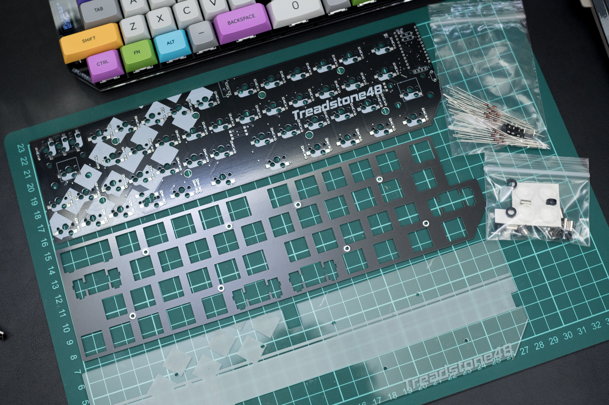
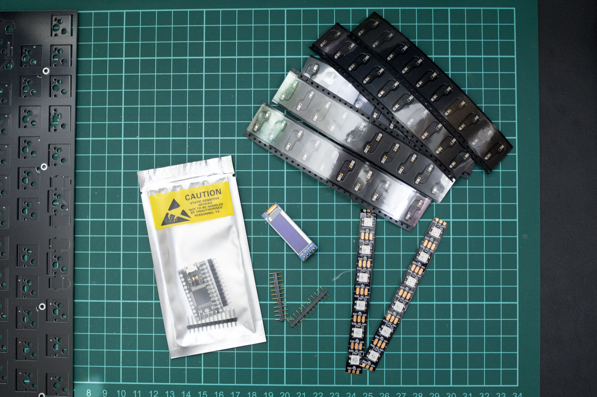
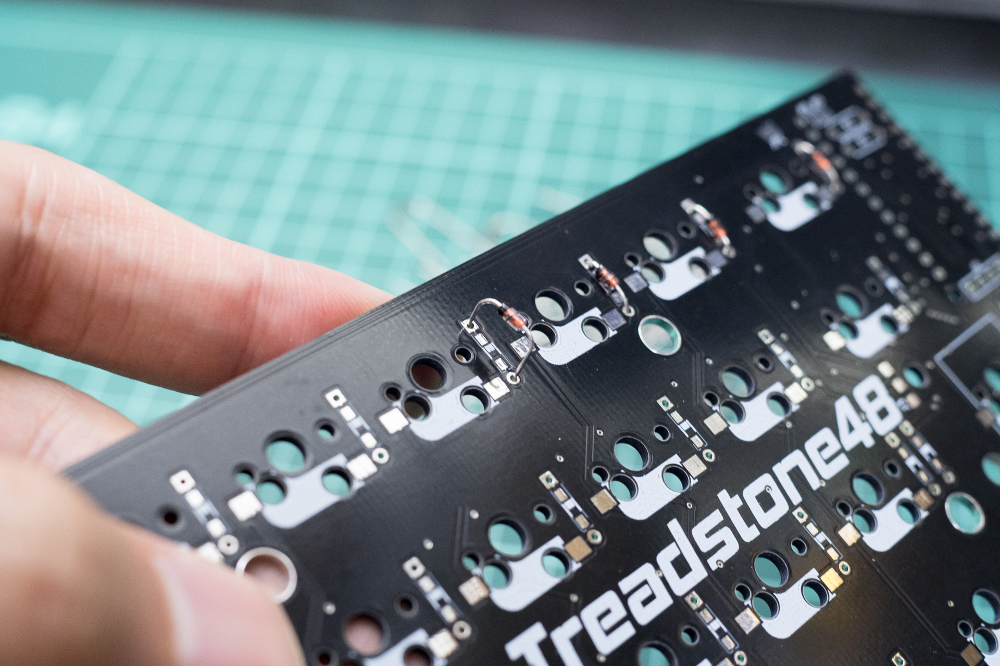
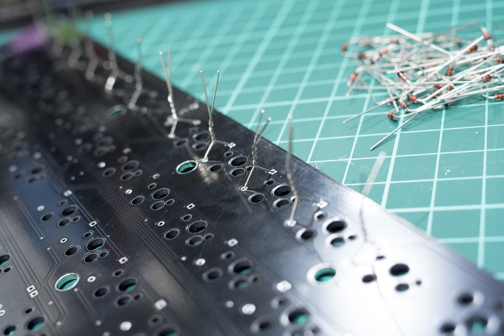
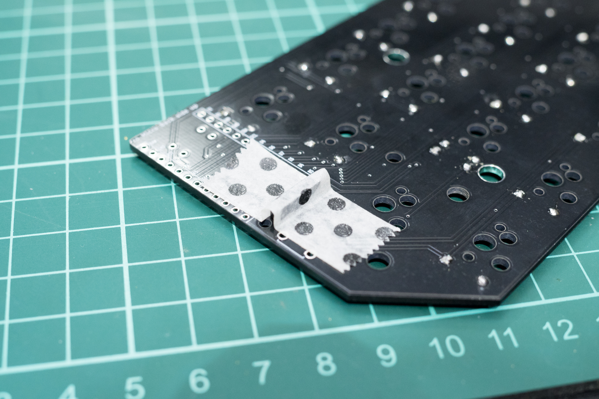
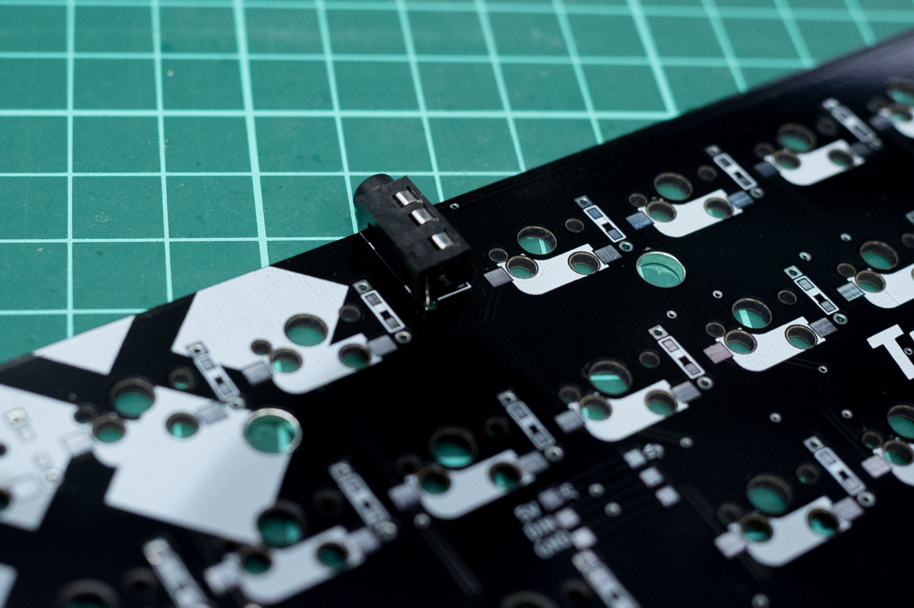

# Treadstone48 ビルドガイド

- [Treadstone48 ビルドガイド](#treadstone48-%E3%83%93%E3%83%AB%E3%83%89%E3%82%AC%E3%82%A4%E3%83%89)
  - [パーツ一覧](#%E3%83%91%E3%83%BC%E3%83%84%E4%B8%80%E8%A6%A7)
    - [キット付属品](#%E3%82%AD%E3%83%83%E3%83%88%E4%BB%98%E5%B1%9E%E5%93%81)
    - [キット以外に必要なもの](#%E3%82%AD%E3%83%83%E3%83%88%E4%BB%A5%E5%A4%96%E3%81%AB%E5%BF%85%E8%A6%81%E3%81%AA%E3%82%82%E3%81%AE)
    - [補足](#%E8%A3%9C%E8%B6%B3)
      - [pro micro](#pro-micro)
      - [OLEDとOLED用ピンソケット](#oled%E3%81%A8oled%E7%94%A8%E3%83%94%E3%83%B3%E3%82%BD%E3%82%B1%E3%83%83%E3%83%88)
      - [OLEDの取り付け](#oled%E3%81%AE%E5%8F%96%E3%82%8A%E4%BB%98%E3%81%91)
      - [スタビライザー](#%E3%82%B9%E3%82%BF%E3%83%93%E3%83%A9%E3%82%A4%E3%82%B6%E3%83%BC)
  - [必要な道具](#%E5%BF%85%E8%A6%81%E3%81%AA%E9%81%93%E5%85%B7)
  - [組み立て](#%E7%B5%84%E3%81%BF%E7%AB%8B%E3%81%A6)
  - [Pro Microの準備](#pro-micro%E3%81%AE%E6%BA%96%E5%82%99)
    - [モゲ対策！](#%E3%83%A2%E3%82%B2%E5%AF%BE%E7%AD%96)
    - [ファームウェアを書き込む](#%E3%83%95%E3%82%A1%E3%83%BC%E3%83%A0%E3%82%A6%E3%82%A7%E3%82%A2%E3%82%92%E6%9B%B8%E3%81%8D%E8%BE%BC%E3%82%80)
  - [Pro Microにピンヘッダをはんだ付けする](#pro-micro%E3%81%AB%E3%83%94%E3%83%B3%E3%83%98%E3%83%83%E3%83%80%E3%82%92%E3%81%AF%E3%82%93%E3%81%A0%E4%BB%98%E3%81%91%E3%81%99%E3%82%8B)
  - [ダイオードをはんだ付けする](#%E3%83%80%E3%82%A4%E3%82%AA%E3%83%BC%E3%83%89%E3%82%92%E3%81%AF%E3%82%93%E3%81%A0%E4%BB%98%E3%81%91%E3%81%99%E3%82%8B)
  - [基板の裏と表について](#%E5%9F%BA%E6%9D%BF%E3%81%AE%E8%A3%8F%E3%81%A8%E8%A1%A8%E3%81%AB%E3%81%A4%E3%81%84%E3%81%A6)
    - [ダイオードの脚を曲げる](#%E3%83%80%E3%82%A4%E3%82%AA%E3%83%BC%E3%83%89%E3%81%AE%E8%84%9A%E3%82%92%E6%9B%B2%E3%81%92%E3%82%8B)
    - [ダイオードのはんだ付け](#%E3%83%80%E3%82%A4%E3%82%AA%E3%83%BC%E3%83%89%E3%81%AE%E3%81%AF%E3%82%93%E3%81%A0%E4%BB%98%E3%81%91)
  - [*(オプション)OLED用のピンソケット・ピンヘッダをはんだ付けする*](#%E3%82%AA%E3%83%97%E3%82%B7%E3%83%A7%E3%83%B3oled%E7%94%A8%E3%81%AE%E3%83%94%E3%83%B3%E3%82%BD%E3%82%B1%E3%83%83%E3%83%88%E3%83%BB%E3%83%94%E3%83%B3%E3%83%98%E3%83%83%E3%83%80%E3%82%92%E3%81%AF%E3%82%93%E3%81%A0%E4%BB%98%E3%81%91%E3%81%99%E3%82%8B)
  - [TRRSコネクタ、タクトスイッチをはんだ付けする](#trrs%E3%82%B3%E3%83%8D%E3%82%AF%E3%82%BF%E3%82%BF%E3%82%AF%E3%83%88%E3%82%B9%E3%82%A4%E3%83%83%E3%83%81%E3%82%92%E3%81%AF%E3%82%93%E3%81%A0%E4%BB%98%E3%81%91%E3%81%99%E3%82%8B)
  - [トッププレートにスイッチをはめ込む](#%E3%83%88%E3%83%83%E3%83%97%E3%83%97%E3%83%AC%E3%83%BC%E3%83%88%E3%81%AB%E3%82%B9%E3%82%A4%E3%83%83%E3%83%81%E3%82%92%E3%81%AF%E3%82%81%E8%BE%BC%E3%82%80)
  - [MXソケットをはんだ付けする](#mx%E3%82%BD%E3%82%B1%E3%83%83%E3%83%88%E3%82%92%E3%81%AF%E3%82%93%E3%81%A0%E4%BB%98%E3%81%91%E3%81%99%E3%82%8B)
  - [*(オプション)UnderglowLEDをはんだ付けする*](#%E3%82%AA%E3%83%97%E3%82%B7%E3%83%A7%E3%83%B3underglowled%E3%82%92%E3%81%AF%E3%82%93%E3%81%A0%E4%BB%98%E3%81%91%E3%81%99%E3%82%8B)
  - [保護パネルの取り付け](#%E4%BF%9D%E8%AD%B7%E3%83%91%E3%83%8D%E3%83%AB%E3%81%AE%E5%8F%96%E3%82%8A%E4%BB%98%E3%81%91)
  - [*(オプション)OLEDの取り付け*](#%E3%82%AA%E3%83%97%E3%82%B7%E3%83%A7%E3%83%B3oled%E3%81%AE%E5%8F%96%E3%82%8A%E4%BB%98%E3%81%91)
    - [OLED基板のカット](#oled%E5%9F%BA%E6%9D%BF%E3%81%AE%E3%82%AB%E3%83%83%E3%83%88)
  - [スペーサーの取り付け](#%E3%82%B9%E3%83%9A%E3%83%BC%E3%82%B5%E3%83%BC%E3%81%AE%E5%8F%96%E3%82%8A%E4%BB%98%E3%81%91)
  - [キーキャップの取り付け](#%E3%82%AD%E3%83%BC%E3%82%AD%E3%83%A3%E3%83%83%E3%83%97%E3%81%AE%E5%8F%96%E3%82%8A%E4%BB%98%E3%81%91)
  - [テスト](#%E3%83%86%E3%82%B9%E3%83%88)
  - [完成！](#%E5%AE%8C%E6%88%90)
  - [キースイッチの交換方法](#%E3%82%AD%E3%83%BC%E3%82%B9%E3%82%A4%E3%83%83%E3%83%81%E3%81%AE%E4%BA%A4%E6%8F%9B%E6%96%B9%E6%B3%95)

## パーツ一覧

  
  

### キット付属品

| 名前 | 数 | 備考 |
| ---- | ---- | --- |
| PCB | 1枚 | |
| トッププレート | 1枚| 四角い穴がいっぱい空いたほうです |
| ボトムプレート | 1枚| ビス穴しかあいてないほう |
| OLED・Pro Micro保護プレート | 1枚 | |
| M2スペーサー 8mm | 2個 | 基板・保護プレート接続用です |
| M2スペーサー 7mm | 8個 | トップ・ボトムプレート接続用です |
| プラスペーサー 2mm | 8個 | M2スペーサー7mm と組み合わせて使います |
| M2ネジ 5mm | 18個 | |
| M2黒皿ネジ 4mm| 2個 | 保護プレートに取り付けるネジです |
| ゴム足 | 8個 | 大小4個ずつ |
| ダイオード | 48個 |  |
| TRRSジャック | 1個 | オプションのRhymestone接続用。繋がないなら取り付け不要 |
| タクトスイッチ | 1個 | |

### キット以外に必要なもの

| 名前 | 数 | 備考 |
| ---- | ---- | --- |
| MicroUSBケーブル | 1本 | キーボードとPC接続用 |
| キースイッチ | 47～48個 | MX互換のもの |
| キーキャップ | 47～48個 | MX互換のもの |
| Pro Micro | 1個 | |
| スプリングピンヘッダ 12P | 2個 | 交換や確認にも便利なので必須と言っていいくらい推奨 |
| MXソケット | 47〜50 | MXスイッチ用ソケット |
| *LEDストリップ（WS2812B 6個付き）* | *2個* | *Underglow用（オプション）* |
| *OLEDモジュール* | *1個* | *OLED用（オプション）取り付け高難易度のため非推奨* |
| *ピンソケット 4P* | *1個* | *OLED用（オプション）取り付け高難易度のため非推奨* |
| *ピンヘッダ 4P* | *1個* | *OLED用（オプション）取り付け高難易度のため非推奨* |
| *3.5mmステレオケーブル(3極)* | *1本* | *Rhymestoneとの接続用（オプション）* |
| *スタビライザー* | *1～2個* | *Shiftキー位置(プレート、PCBマウント対応)<br/>Enter位置(プレート、PCBマウント対応)（オプション）* |

### 補足

#### pro micro

　大抵ProMicro買うとピンヘッダが付属しているから買わなくてもいいやって考えがちですが、ちょっとお高いコンスル―用スプリングピンヘッダにすると

- キーボード基板の裏表間違ってはんだ付けしてしまった時のリカバリ
- もげマイクロ対策
- Pro Microの文鎮化(異常なデータを書いた時)の交換、復元対策
- Pro Microを再利用可能

など、メリットしかないので超オススメします。

#### OLEDとOLED用ピンソケット

#### OLEDの取り付け

　Treadstone48ではPro microの周辺に余裕がなく、OLEDの基板の一部をカットして取り付ける必要があるため非推奨です。が、もし取り付けたい場合はニッパー、デザインナイフやカッターを使えば取り付ける事が出来ます。  

　AliExpressや遊舎工房でOLEDだけ買った場合はピンソケットが無いので別途秋月電子かヒロスギネットなどで別途購入してください。色々種類があるのですが、ソケットは

- 2.54mmピッチ  
- ロープロファイル（低背）基板取り付け高さ3.5mm  
- ピンソケット  
- 1x4(4P)  

　のものが必要です。

#### スタビライザー

　2Uキー以上の位置にはスタビライザーを取り付けられるようにしています。  

- Shift位置キー：PCB、プレートマウント両対応
- スペース位置キー：プレートマウント対応
- Enter位置キー：PCB、プレートマウント両対応
- BackSpace位置キー：プレートマウント対応※

*※どうも機能しないようです…*

　手の大きさや、クセによってキースイッチを斜めに押す形になってて違和感がある場合は取り付けたほうが良い場合があります。  
ただし、安いスタビライザーを取り付けると逆に違和感が増したりガサガサするようになるのでルーブしたほうが良いです。  

## 必要な道具

| 名前 | 備考 |
| ---- | ---- |
| はんだごて | |
| 糸ハンダ | 0.8mm程度のものを推奨します |
| ハンダ吸い取り線 | 失敗したとき用 |
| ニッパー | ダイオードのリード線などの切断用です |
| ピンセット | ProMicroリセットしたりチップLEDのはんだづけで使用します |
| マスキングテープ | 柄入りで可。パーツの仮止めに使用します |
| フラックス除去剤 | 必須ではありませんがはんだ付け後のベタつきを除去出来、はんだによる黄色い変色も拭き取れてキレイな仕上がりになります |
| マスキングテープ | しるし付け、仮固定に使用。100均の柄付きでもOK |

　mteiさんの[Helix キーボードキットの製作に必要な工具メモ](https://gist.github.com/mtei/6957107a676ddfa85bde0ae41f8fa849)
やhdbxさんの[自作キーボードを始めるにあたって用意すべきツール](https://hdbx.hateblo.jp/entry/2018/06/01/215401)も参考になります。  

  
  

## 組み立て

　組み立ての時間ですが、2～6時間くらい（ファーム開発環境構築からだと別途+1～2時間程度）を目安にしてください。半田ごてもってると一時間あっという間に飛びますので時々休憩を入れましょう。あとハンダの煙は吸ったり目に入れたりしないように注意しましょう。  

## Pro Microの準備

　机にハンダごてを用意するその前に！Pro Microの準備を先にやってしまいましょう。  

### モゲ対策！

　Pro Microに使用されているUSBコネクタはmicro USBで、それがほぼハンダで保持されている状態のため、付け外しを繰り返すとモゲてしまいます（界隈ではそうなったpro microは「moge micro」と呼んでいます）。そうなると面倒くさいので最初に手を打っておきます。[英さん](https://twitter.com/hdbx)の[ProMicroのモゲ防止ついでにQMK_Firmwareを書き込む](https://qiita.com/hdbx/items/2f3e4ddfcadda2a5578e)を見てやってみてください。  
　エポキシ接着剤を使った場合1～2時間程度で（室温・気温によりますが）触っても大丈夫くらいになると思います。乾くまで時間が少しかかるのでファームウェアの書き込み準備をします。もし準備が出来ているなら先のダイオードのはんだ付けに進んでも良いと思います。  

### ファームウェアを書き込む

　Pro Microに先にファームを書き込んでしまいます。はやる気持ちを抑えて最初にソフトウェアの準備と書き込みをしてしまえば、完成後すぐ使用できます。  

  Treadstone48は本家QMKにマージしておりませんので、私のフォークリポジトリの**my_customize**ブランチにあるものをお使いください。  
  [marksard/qmk_firmware](https://github.com/marksard/qmk_firmware/tree/my_customize)

　Windowsの方はMSYS2を使うか、WSL(Windows Subsystem for Linux)を使う方法があります。MSYS2での書き込み方は[さぼてんさん](https://twitter.com/cactusman)作成の記事[プログラマーではない人向けのQMK Firmware入門](https://qiita.com/cactusman/items/ac41993d1682c6d8a12e)を、WSLは[qmk_firmwareをWindows上でmakeする方法](https://qiita.com/marksard/items/f381caf3ca981f307f64)を参照してファームウェアを書き込める環境を作ってください。  
　Macな方はDocker使うほうが確実かもしれません。[自作キーボードに手を出した](https://poyo.hatenablog.jp/entry/2018/10/08/003800) の後半に記述があります。  

　Treadstone48のデフォルトキーマップのmakeは ```make treadstone48:default``` で可能です。（Linux、Mac、MSYS2環境上なら ```make treadstone48:default:avrdude``` で書き込みも出来ます）  
　キーマップについての解説は[ここにあります](https://github.com/marksard/qmk_firmware/blob/my_customize/keyboards/treadstone48/keymaps/default/readme_jp.md)。  
　Pro Microにリセットボタンはないので、Pro MicroのGNDピンとRSTピン（隣同士ならんでいます）をピンセットなどでショートさせてください。  

## Pro Microにピンヘッダをはんだ付けする

　ピンヘッダの取り付けは[Helixベータ ビルドガイド](https://github.com/MakotoKurauchi/helix/blob/master/Doc/buildguide_jp.md)
が丁寧なのでこちらを参照ください。  

## ダイオードをはんだ付けする

## 基板の裏と表について

　キースイッチが乗り、通常使用する際上を向く面を表、逆を裏とします。  
　Treadstone48の場合、ロゴとデザインの印刷の入ったほうが裏になります。  

### ダイオードの脚を曲げる

　基板に付ける前にダイオードの脚を全部曲げてしまいます。基板の穴の間隔を見極めて曲げるための冶具を探してみてください。繋がったままの割りばしなどでも良いと思います。  
　私はUSB-C to USB-Aの変換コネクタが丁度いい感じに使えたので、ダイオードを2,3個いっぺんに曲げていきました。  

  

### ダイオードのはんだ付け

　ダイオードの取り付け向きは基板ごとに同じ方向なので、一つ確認して取り付けたら残りはすべて同じ方向で取り付けられます。ダイオードの黒い帯側を基板のダイオード取り付け穴の四角いほうに向けて取り付けてください。  

  

　基板のウラ面からダイオードを差し込んでいきます。差し込んだらダイオードの足同士をネジって仮留めします。横一列ずつ差し込んでまとめてハンダ付けするとラクに速く出来ます。ハンダ付けしたら足を根元からカットしてください。  

  
  

## *(オプション)OLED用のピンソケット・ピンヘッダをはんだ付けする*

　オモテ面に取り付けます。ラクにまっすぐ取り付けるため、マスキングテープでまっすぐつくように仮押さえしてから裏返してはんだ付けします。  

  

## TRRSコネクタ、タクトスイッチをはんだ付けする

　rhymestoneと接続する場合はTRRSをウラ面に取り付けます。ラクにまっすぐ取り付けるため、マスキングテープでまっすぐつくように仮押さえしてから裏返してはんだ付けします。  
　タクトスイッチもウラ面に取り付けます。パチッとはめ込んで裏返してはんだ付けします。  

  
  

## トッププレートにスイッチをはめ込む

　ソケットを先にはんだ付けしても良いのですが、先にトッププレートにスイッチを全部はめ込んで、ソケットを端子に差し込んだ後にハンダ付けしたほうが手早くキレイに取り付けられます。  

  

　以下の写真の左側のスイッチを取り付けてない個所は1.25Uのキーキャップを取り付けるか、1Uのキーキャップを取り付けるかの選択が出来ます。デフォルトキーマップには「プロパティメニュー」キーが割り当てられています。  
　右側のスイッチを取り付けていない個所は2Uを1個か、1Uを2個取り付けるかの選択が出来ます。デフォルトキーマップには2Uが1個の時は「-」キー、1Uが2個の時は「-」キーと「Delete」キーが割り当てられています。  
　2Uを1個にする場合、スイッチによってはトッププレートの保持力が足らず、キーを押したときにぐにゃっとなる場合がありますので、その場合はスイッチを変更してください（KailhBoxは少し小さいようです）

  

## MXソケットをはんだ付けする

　まずトッププレートとPCBを合わせます。スイッチ裏の中央の出っ張りをPCBの穴に合わせて取り付けてください。  
　MXソケットをPCBのシルクの白いマークに合わせて取り付けます。スイッチのピンがMXソケットにちゃんと刺さっている事を確認しながらパチパチと全部付けてください。  

　あとはハンダ付けです。MXソケットを取り付けると、スイッチの交換は可能になりますが、ソケットと基板の保持をハンダに頼っているため交換後スイッチが効かないなどのハンダ不良が発生する可能性があります。ただ厚く盛っても意味がないので、PCBとソケットの間にしっかりハンダを流します。  
　ハンダごてのこて先に気持ち多めにハンダを付けて、ソケットの金具の隙間に見えるPCBに付ける気持ちで、ソケットの隙間を少しこじ開ける感じで熱を与えながら流し込みます。  

## *(オプション)UnderglowLEDをはんだ付けする*

　テープLEDの剥離紙の両端数cmだけハサミなどでカットします。  

  

　テープLEDは向きがありテープLEDの端子と基板の端子が合う向きにします。
  

　Pro Microに近い一枚目はテープLED両端をはんだ付けする必要があるので、基板の両端のランドに少し被るくらいの位置にテープLEDを貼り付けてはんだ付けしてください。  

  

　二枚目は片側だけですが、同じように向きに注意して貼り付けてはんだ付けしてください。  

## 保護パネルの取り付け

　Pro Micro周りの目隠しとOLEDを保護するためのプレートを取り付けます。8mmスペーサー2つを5mmのネジでPro Microの下にある穴に取り付けます。  
　プレートの保護紙を両方剥がして、黒の4mmネジでPCBに付けたスペーサーに取り付けてください。  
　少し遊びがありますので、キーキャップを取り付けた時にキーキャップと干渉する場合は少しずらしてください。  

## *(オプション)OLEDの取り付け*

### OLED基板のカット

　Pro Micro直下に取り付けるスペーサーと、OLEDの基板が左右1mm x 3mmくらい干渉しますので、写真のようにカットしてください。左が加工後です。
  

　スペーサーをゆるく仮止めしつつ現物合わせで削り込んでいってください。  
  

## スペーサーの取り付け

　ボトムプレートの彫刻の入ってるの保護紙を剥がします。彫刻の細かい部分の保護紙はピンセットなどで剥がします。剥がした方にゴム脚を取り付けてください。標準でチルトするように大きいものと小さいものが入っていますので、小さいほう４つを手前に、大きいほう４つを奥に貼り付けてください。  

　残りの保護紙も剥がして、**7mm**スペーサー8つと5mmネジを8つ使ってボトムプレートにねじ止めしてください。  
　ねじ止めしたら、2mmの樹脂スペーサーを7mmスペーサーに差し込んでおきます。この樹脂スペーサーはスイッチ交換時のPCB落ち込みを防止するために機能します。  

## キーキャップの取り付け

　お好みのキーキャップを取り付けてください。  

## テスト

　まず片方ずつPCに接続してテストしてください。片方づつ付けた場合は常に左手で認識するので、キーボードテスターアプリなどでキーが認識されているかチェックしてください。OLEDを取り付けている場合は、OLEDの四段目の表示がスイッチのステータスです。何かしら変化していればOKです。

## 完成！

　チェックして問題なさそうなら完成です！あなただけの一台に仕上げてください！

  

## キースイッチの交換方法

　手では取り外しにくいため、amazonなどで販売されているキースイッチ引き抜き工具を使用して交換してください。  
