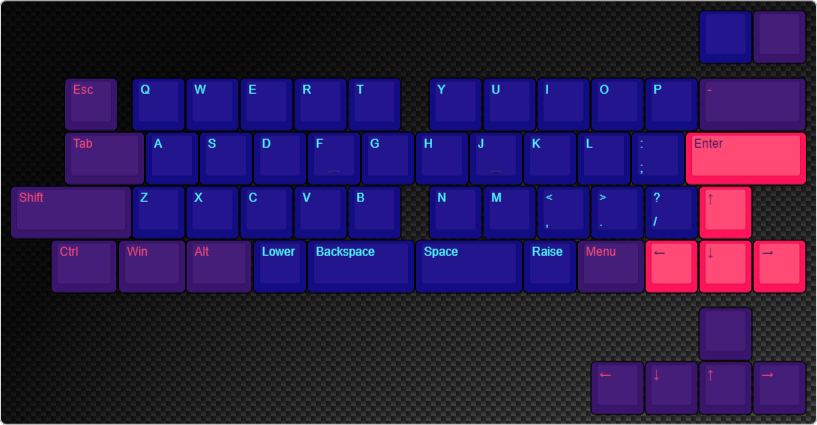
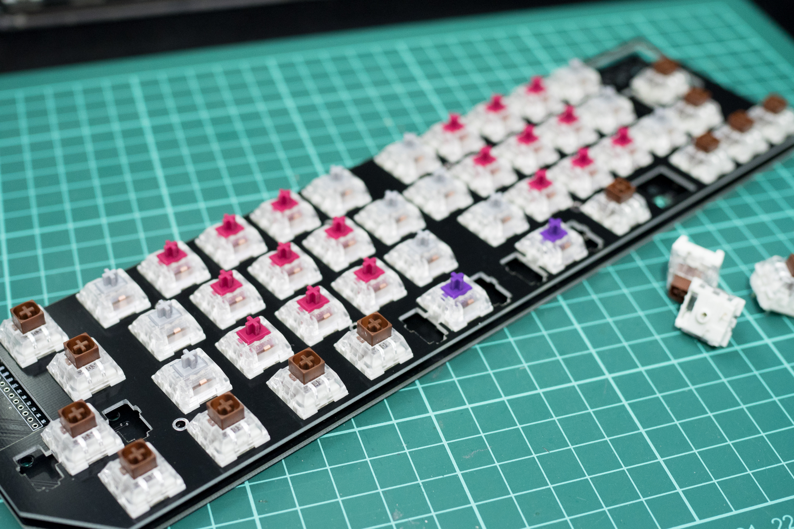
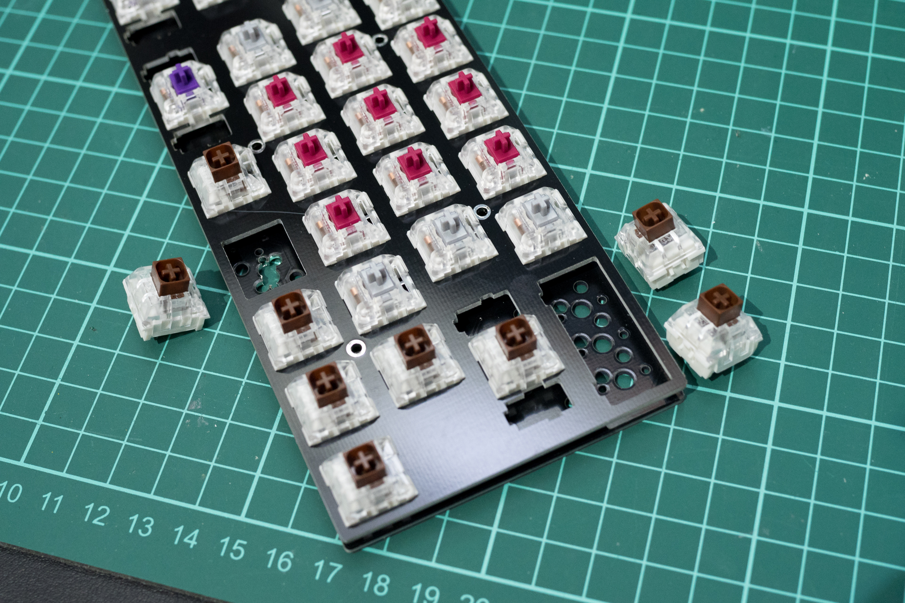
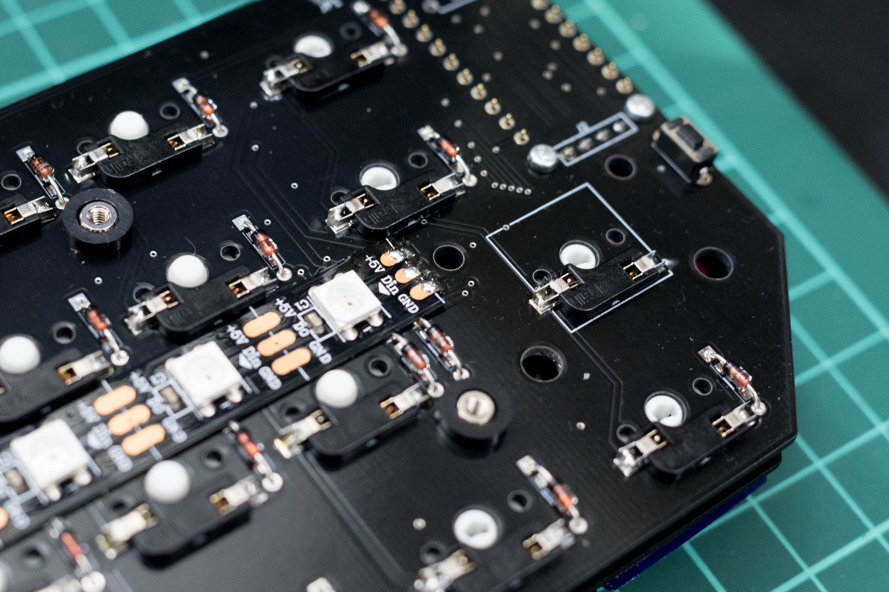
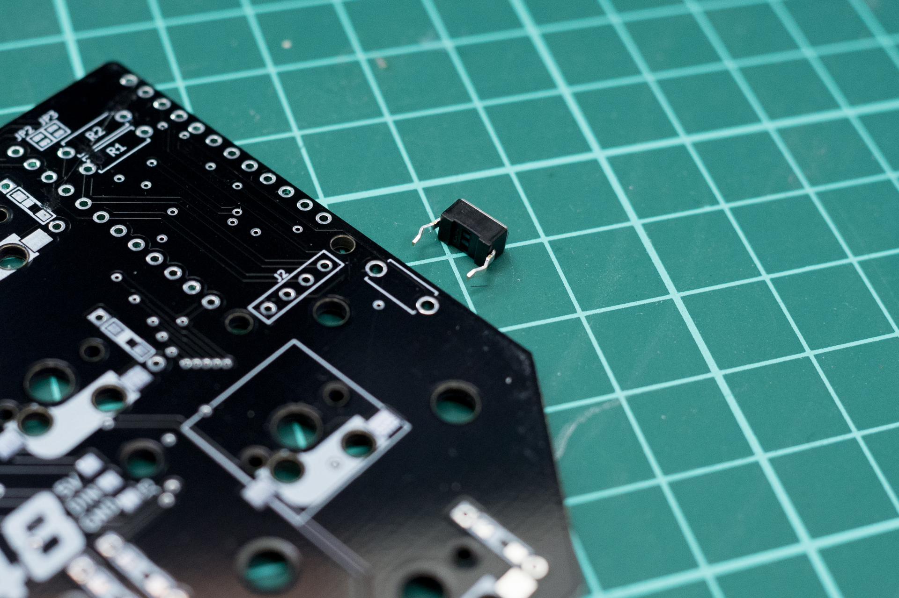
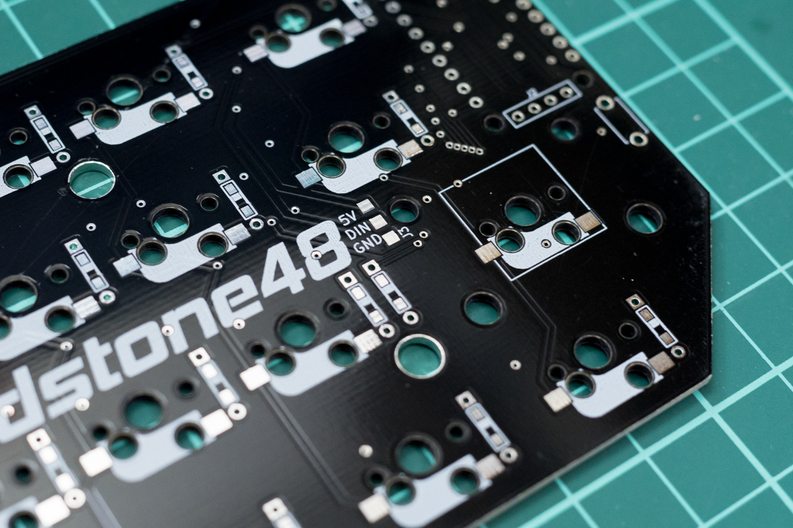
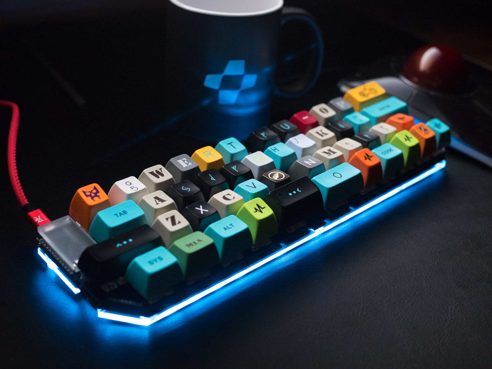

# Treadstone48 Build Guide

## List of parts

### Parts included when buying the TS48 kit

| Name | Quantity | Note |
| ---- | ---- | --- |
| PCB | 1 | |
| Mount Plate | 1 | FR4(PCB plate) |
| Acrylic Bottom Plate | 1 | |
| Acrylic Pro Micro Cover | 1 | |
| M2 spacer 8mm | 2 | use with Acrylic Pro Micro Cover |
| M2 spacer 7mm | 8 | use with Acrylic Bottom Plate |
| Plastic spacer 2mm | 8 | use with Acrylic Bottom Plate |
| M2 Screw 4mm | 18 | |
| M2 Black Screw 4mm| 2 | Top use with Acrylic Pro Micro Cover |
| Rubber Feet | 8 |  |
| 1N4148 diode | 48 |  |
| TRRS Jack | 1 | not use |
| Reset Switch | 1 | |

### Please purchase separately (not included)

| Name | Quantity | Note |
| ---- | ---- | --- |
| MicroUSB cable | 1 | |
| Key Switches | 47～48 | Compatible for MX |
| Key Caps | 47～48 | compatible for MX stem, Better than ANSI104 keysets |
| Pro Micro | 1 | |
| Pin  12P | 2 | For use with Pro micro |
| Kailh MX Socket | 47〜48 | Kailh socket |
| *Stabilizer* | *1～2* | *PlateMount* |
| *LED strip（WS2812B x6）* | *2* | *Underglow* |

### Firmware

[Treastone48 QMK Directory](https://github.com/qmk/qmk_firmware/tree/master/keyboards/treadstone48)

Make example for this keyboard (after setting up your build environment):

    make treadstone48:default

See the [build environment setup](https://docs.qmk.fm/#/getting_started_build_tools) and the [make instructions](https://docs.qmk.fm/#/getting_started_make_guide) for more information. Brand new to QMK? Start with our [Complete Newbs Guide](https://docs.qmk.fm/#/newbs).

## Soldering of Diodes

Steps.  

 - Lead Forming
 - Insert in the through hole (Be careful of the direction of the diode)
 - Soldering

  
  

## Insert key switches to Mount Plate

The parts of the picture can be installed according to your preference.  

  
  
  

## Soldering of Sockets

 A first, Combine the PCB and the mounting plate.  
 And then Insert the socket into the pin of the switch protruding from the PCB. (be careful with the orientation)  
 Solder the terminal and PCB of both ends of the socket.  

  

### Soldering of Pro micro

　Be careful with the orientation.  

  
  

### Soldering of Reset Switch

  

### SOldering of LED Strip

　Be careful with the orientation.  

  
  
  

## Attach the Acrylic Cover

Use an 8 mm spacer, 2 4 mm screws and 2 4 mm black screws. Attach the cover to the PCB.

## Install Acrylic Bottom Plate

　Use 8 spacers of 7 mm, 8 spacers of plastic and 16 screws of 4 mm. Remove the bottom plate protective paper and attach the PCB.

  
