# Treadstone48 rev2 ビルドガイド

## パーツ一覧

## キット付属品

| 名前 | 数 | 備考 |
| ---- | ---- | --- |
| PCB | 1枚 | 基板 |
| マウントプレート | 1枚| スイッチをはめ込むプレート |
| ボトムプレート | 1枚| アクリル製 |
| OLED・ProMicro保護プレート | 1枚 | アクリル製 |
| M2スペーサー 8mm | 2個 | 基板・保護プレート接続用 |
| M2スペーサー 7mm | 8個 | トップ・ボトムプレート接続用 |
| M2ネジ 4mm| 20個 |  |
| ゴム足 | 8個 | 小8個 |
| ダイオード | 48個 | ロットにより1N4148（黒ライン）か1SS178（緑と黒のライン）どちらか |
| タクトスイッチ | 1個 | リセットスイッチ用 |

## キット以外に必要なもの

| 名前 | 数 | 備考 |
| ---- | ---- | --- |
| MicroUSBケーブル | 1本 | キーボードとPC接続用 |
| キースイッチ | 48個 | MX互換のもの |
| キーキャップ | 48個 | MX互換のもの |
| MXソケット | 48個 | MXスイッチ用ソケット |
| ProMicro | 1個 | |
| コンスルー（スプリングピンヘッダ） 12P | 2個 | 推奨 |
| スタビライザー | 5個 | PCBマウント用のもの。シフト、分割スペースx2、エンター、バックスペース用 |

### オプション

オプションでイルミネーション用LEDと情報表示用のOLEDが取り付け可能です。  

| 名前 | 数 | 備考 |
| ---- | ---- | --- |
| LEDストリップ（WS2812B 6個付き） | 2個 | Underglow用（オプション） |
| OLEDモジュール | 1個 | OLED用（オプション）取り付け高難易度のため非推奨 |
| ピンソケット 4P | 1個 | OLED用（オプション）取り付け高難易度のため非推奨<br/>2.54mmピッチ、ロープロファイル（低背）基板取り付け高さ3.5mm、1x4のもの<br/>秋月電子かヒロスギネットで購入可能 |
| ピンヘッダ 4P | 1個 | OLED用（オプション）取り付け高難易度のため非推奨 |

## 必要な道具

| 名前 | 備考 |
| ---- | ---- |
| はんだごて | |
| 糸ハンダ | 0.8mm程度のものを推奨します |
| ハンダ吸い取り線 | 失敗したとき用 |
| ニッパー | ダイオードのリード線などの切断用です |
| ピンセット | ProMicroリセットしたりチップLEDのはんだづけで使用します |
| フラックス除去剤 | 必須ではありませんがはんだ付け後のベタつきを除去出来、はんだによる黄色い変色も拭き取れてキレイな仕上がりになります |
| マスキングテープ | しるし付け、仮固定に使用。100均の柄付きでもOK |

　mteiさんの[Helix キーボードキットの製作に必要な工具メモ](https://gist.github.com/mtei/6957107a676ddfa85bde0ae41f8fa849)
やhdbxさんの[自作キーボードを始めるにあたって用意すべきツール](https://hdbx.hateblo.jp/entry/2018/06/01/215401)も参考になります。  

  
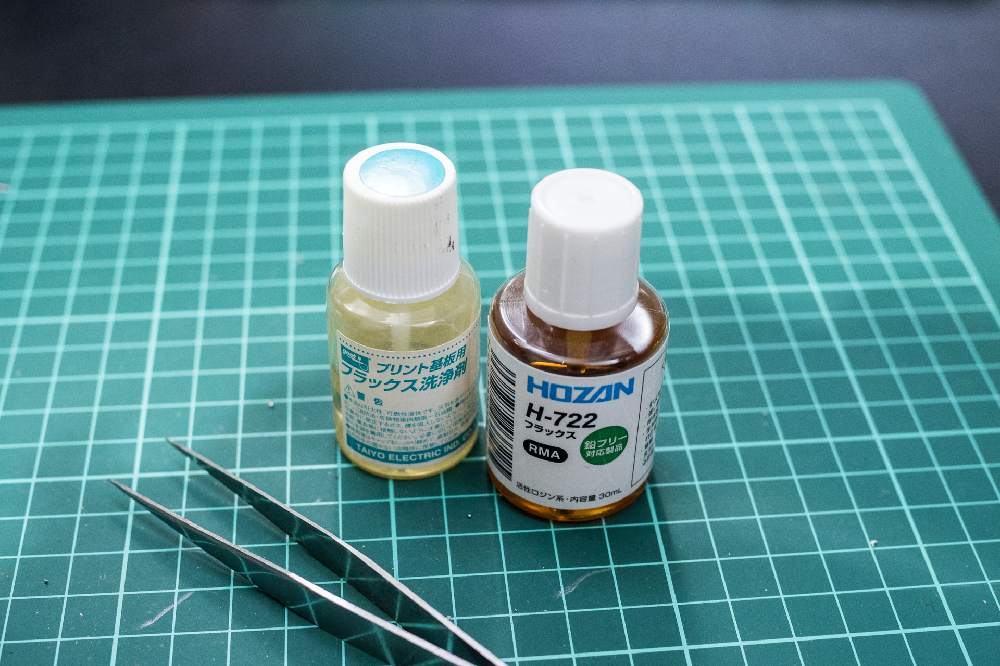  

## promicroの準備

　promicroのコネクタ補強、コンスルーピンのはんだ付けを行ってください。  
　promicroは実装されている面がキーボード基板に向くようにコンスルーを取り付けてください。  
 - promicroのコネクタ補強：[ProMicroのモゲ防止ついでにQMK_Firmwareを書き込む](https://qiita.com/hdbx/items/2f3e4ddfcadda2a5578e)
 - コンスルーピンのはんだ付け：[Helixベータ ビルドガイド](https://github.com/MakotoKurauchi/helix/blob/master/Doc/buildguide_jp.md)

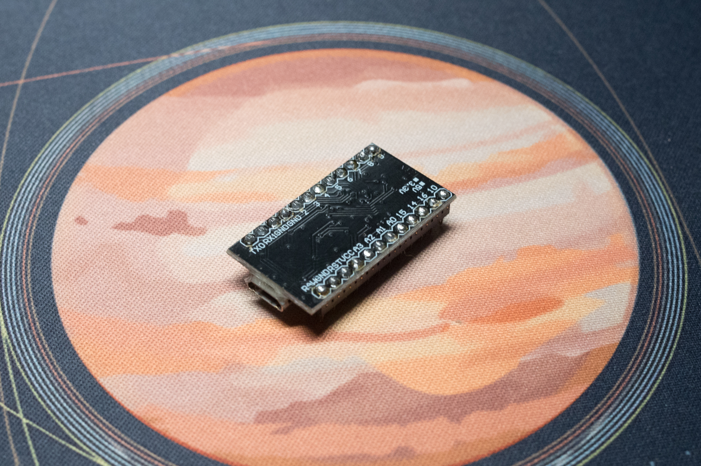  
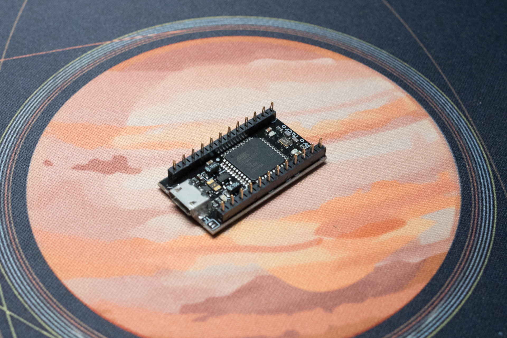  

### キーボード用ソフトウェアをpromicroに書き込む

　このキーボードはQMKというキーボード用のソフトウェアで動作するようにプログラミングしています。あらかじめ登録してあるdefaultキーマップは作者が実際に使用しているもので不自由なく使えるように工夫しています。

1. [QMK Toolbox](https://github.com/qmk/qmk_toolbox/releases)をダウンロードし、インストールします
2. [marksard/qmk_firmware_hex](https://github.com/marksard/qmk_firmware_hex/releases)にある最新のhexファイルからtreadstone48_rev2_via.zipをダウンロード、zipを展開します
3. QMK Toolboxの「open」ボタンをクリックして、先程展開しhexファイルを選択します
4. QMK Toolboxの「Auto-Flash」チェックボックスにチェックを入れてpromicro(直付けの場合は基板)をPCに接続し、リセットボタンを押して書き込みます。
   1. （リセットボタンをダブルクリックしないと書き込めないパターン、初回のみリセットボタンを押下しなくても書き込みが始まるのものもあります）

書き込み方法などはサリチル酸さんの[（初心者編）自作キーボードにファームウェアを書き込む](https://salicylic-acid3.hatenablog.com/entry/qmk-toolbox)の記事が参考になります。  

#### REMAPを使用する

　上記で書き込んだファイルはVIA対応ファームウェアで、ファームウェアを書き直さなくてもアプリケーション上からキー設定を変更することが出来ます。  
　ここでは国産のVIA対応キーマップ変更アプリケーションとして、WEB上からキーボードの設定が出来る[REMAP](https://remap-keys.app/)を紹介します。  
対応したキーボードを接続した状態で、「START REMAP FOR YOUR KEYBOARD」→「+KEYBOARD」ボタンを押下するとキーボード名が出ます。それを押下することでカスタマイズ画面が出てきます。  

詳しい操作方法などについてはサリチル酸さんの[（初心者編）Remapを使ってキーマップを書き換えよう](https://salicylic-acid3.hatenablog.com/entry/remap-manual)の記事が参考になります。  

#### ビルド環境を作成する

　現状、以下のようなカスタムはソースファイルからビルドする必要があります。  

- ロータリエンコーダーの動作のカスタマイズ
- タップと長押しの判定タイミングを調整する
- OLED表示の内容を変更

　ソースからビルドが出来るようになると他の多彩な機能を扱え、細かい動作まで自在にカスタムすることが出来ます。  

[QMK　ビルド環境を準備する](https://docs.qmk.fm/#/ja/newbs_getting_started)  

　treadstone48のデフォルトキーマップは  
```qmk compile -kb treadstone48/rev2 -km default```
で可能です。書き込む場合は
```qmk flash -kb treadstone48/rev2 -km default```  
とすると、コンパイルが完了次第書き込み待ちになるので、その状態で基板にあるリセットボタンをクリック、もしくはダブルクリックで書き込みが始まります。  

## 基板の裏と表について

　キースイッチが乗り、通常使用する際上を向く面を表、逆を裏とします。  
　Treadstone48は基板中心付近に横長に四角くシルクが刷られているほうが裏面です。  

## ダイオードをはんだ付けする

### ダイオードの脚を曲げる

　基板に付ける前にダイオードの脚を全部曲げてしまいます。基板の穴の間隔を見極めて曲げるための冶具を探してみてください。繋がったままの割りばしなどでも良いと思います。  

  

### ダイオードのはんだ付け

　ダイオードの取り付け向きは同じ方向なので、一つ確認して取り付けたら残りはすべて同じ方向で取り付けられます。ダイオードの黒や緑の帯側を基板のダイオード取り付け穴の四角いほうに向けて取り付けてください。  

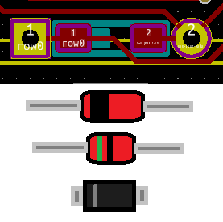  

　基板のウラ面からダイオードを差し込んでいきます。差し込んだらダイオードの足同士をネジって仮留めします。横一列ずつ差し込んでまとめてハンダ付けするとラクに速く出来ます。ハンダ付けしたら足を根元からカットしてください。  

## リセットスイッチをはんだ付けする

　リセットスイッチをウラ面に取り付けます。パチッとはめ込んで裏返してはんだ付けします。  

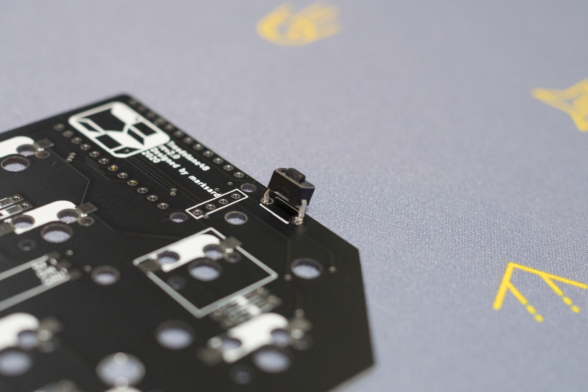  

## スタビライザーの取り付け

　スタビライザーを写真の向きに取り付けてください。  
※写真はバンドエイドMODというスタビ下面にテーピングを貼るカスタムをしています。  

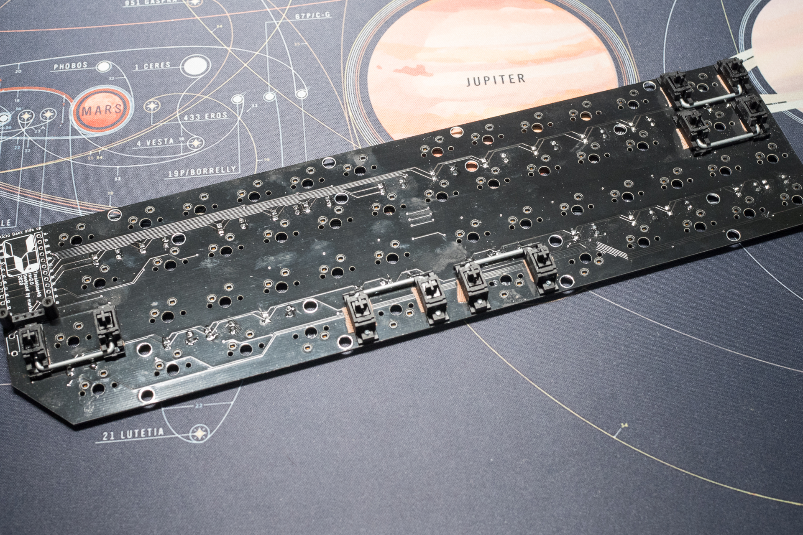  

## MXソケットをはんだ付けする

　先にトッププレートにスイッチをすべてはめこみます。つぎにトッププレートとPCBを合わせます。スイッチ裏の中央の出っ張りをPCBの穴に合わせて取り付けてください。  
　MXソケットをPCBのシルクの白いマークに合わせて取り付けます。スイッチのピンがMXソケットにちゃんと刺さっている事を確認しながらパチパチと全部付けてください。  
　こうすることでMXソケットが浮かずに確実にはんだ付け出来ます。  

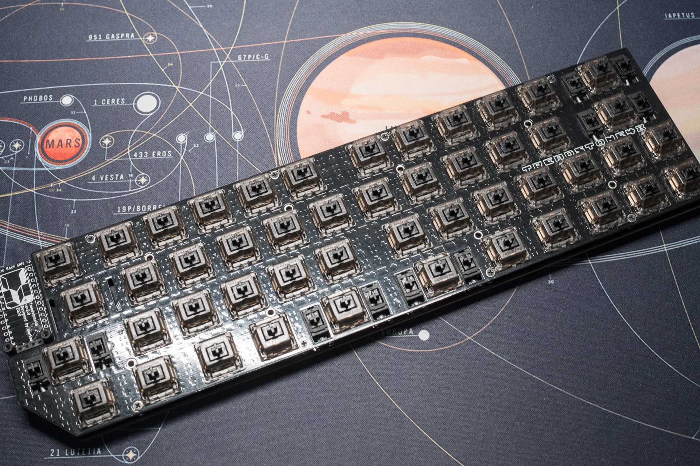  

　さいごにハンダ付けです。MXソケットを取り付けるとスイッチの交換は可能になりますが、ソケットと基板の保持をハンダに頼っているため交換後スイッチが効かないなどのハンダ不良が発生する可能性があります。ただ厚く盛っても意味がないので、基板のパッドとソケットの間にしっかりハンダを流します。  
　コツは、ソケットの脚と基板の境目にコテを3～5秒程度あてて温めて、半田を上部からMXソケットの脚に開いているスリットに押し当てて溶かします。そうすると溶けたハンダがスリットから基板のパッドに流れます。溶けたなと思ったらハンダごてと半田をはなして1～3秒程度で固着します。良し悪しの目安はソケットのハンダ部分を側面から観て、基板のパッドとソケットが接合されていることです。  

## *(オプション)UnderglowLEDをはんだ付けする*

　テープLEDの剥離紙の両端数cmだけハサミなどでカットします。これはテープLEDの背面の端子と、キーボード基板のスルーホールなどの端子が接触して動作不良を起こすことを防ぐ意味合いがあります。  

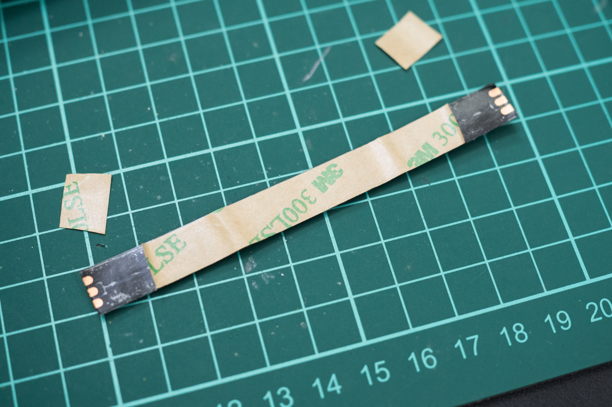  

　テープLEDは向きがありテープLEDの端子と基板の端子が合う向きにします。
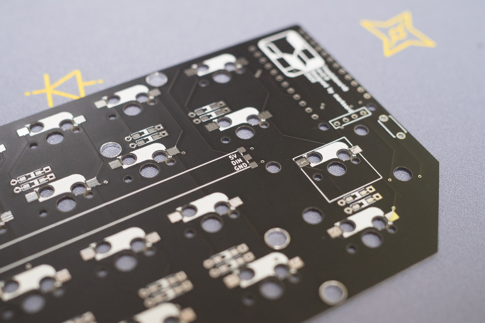  
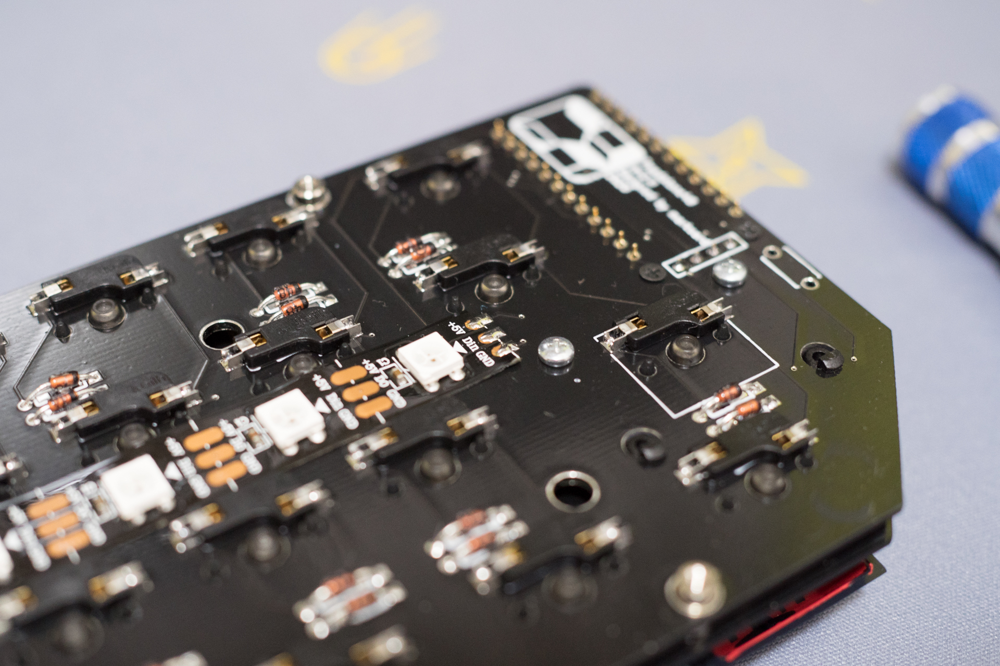  

　ProMicroに近い一枚目はテープLED両端をはんだ付けする必要があるので、基板の両端のランドに少し被るくらいの位置にテープLEDを貼り付けてはんだ付けしてください。  

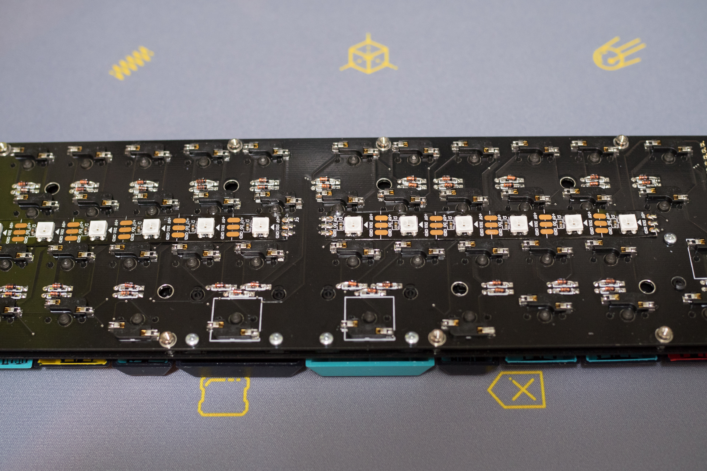  

　二枚目は片側だけですが、同じように向きに注意して貼り付けてはんだ付けしてください。  

## *(オプション)OLED用のピンソケット・ピンヘッダをはんだ付けする*

　オモテ面に取り付けます。ラクにまっすぐ取り付けるため、マスキングテープでまっすぐつくように仮押さえしてから裏返してはんだ付けします。  

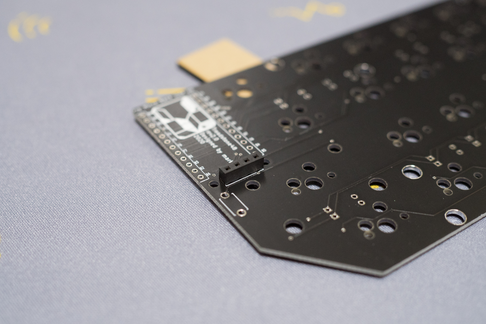  

## *(オプション)OLEDの取り付け*

　Treadstone48ではProMicro取り付け部周辺に余裕がなく、OLEDの基板の一部をカットして取り付ける必要があります。  

### OLED基板のカット

　ProMicro直下に取り付けるスペーサーと、OLEDの基板が左右1mm x 3mmくらい干渉しますので、写真のようにカットしてください。左が加工後です。
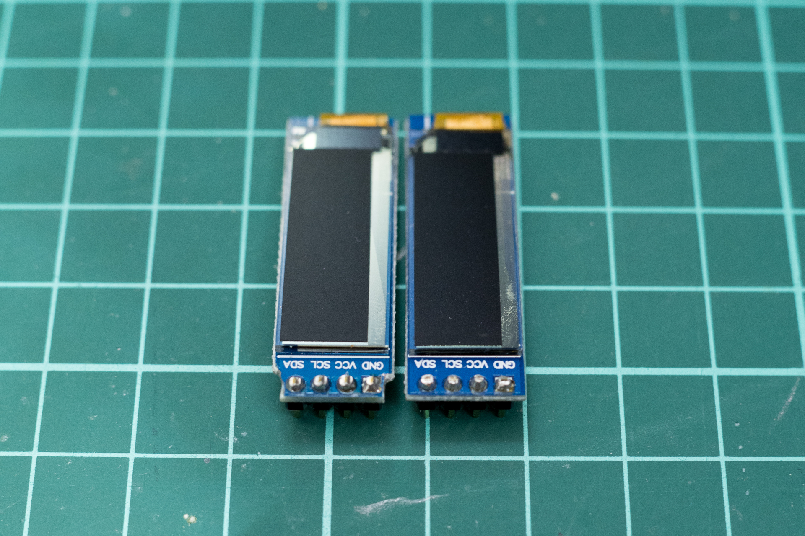  

　スペーサーをゆるく仮止めしつつ現物合わせで削り込んでいってください。  
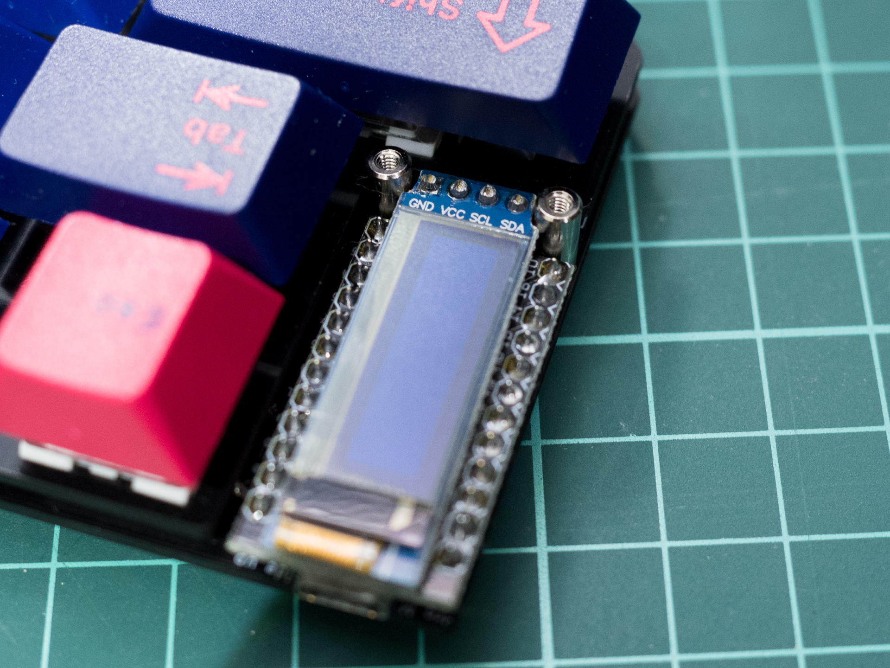  

## 保護パネルの取り付け

　ProMicro周りの目隠しとOLEDを保護するためのプレートを取り付けます。8mmスペーサー2つをネジでProMicroの下にある穴に取り付けます。  
　プレートの保護紙を両方剥がして、ネジでPCBに付けたスペーサーに取り付けてください。  
　少し遊びがありますので、キーキャップを取り付けた時にキーキャップと干渉する場合は少しずらしてください。  

## スペーサーの取り付け

　ボトムプレートの彫刻の入ってるの保護紙を剥がします。彫刻の細かい部分の保護紙はピンセットなどで剥がします。剥がした方にゴム脚を取り付けてください。標準でチルトするように大きいものと小さいものが入っていますので、小さいほう４つを手前に、大きいほう４つを奥に貼り付けてください。  

　残りの保護紙も剥がして、**7mm**スペーサー8つとネジを8つ使ってボトムプレートにねじ止めしてください。次にPCBの付いたマウントプレートを載せてネジ留めしてください。  

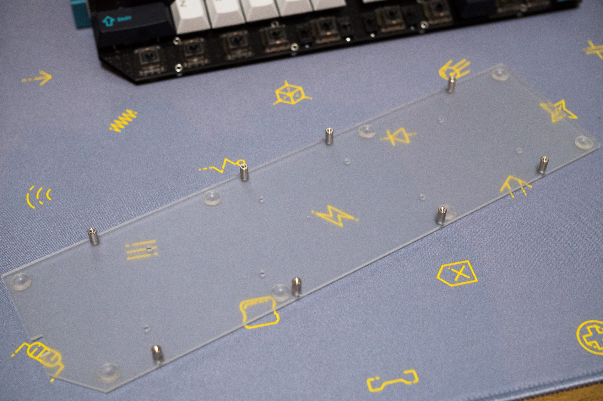  

## キーキャップの取り付け

　お好みのキーキャップを取り付けてください。  

## テスト

　PCに接続して動作チェックしてください。[QMK Keytest](https://config.qmk.fm/#/test)やキーボードテスターアプリでキーが認識されているかチェックしてください。OLEDを取り付けている場合は、OLEDの四段目の表示がスイッチのステータスです。何かしら変化していればOKです。  

## 完成

　チェックして問題なさそうなら完成です！あなただけの一台に仕上げてください！

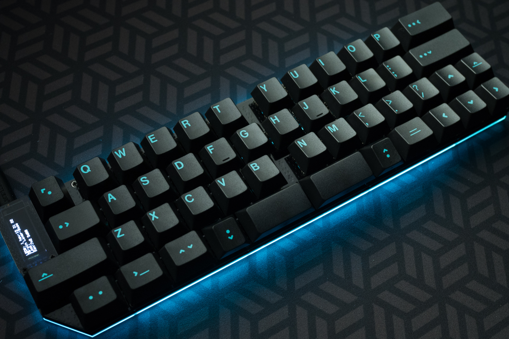  

## キースイッチの交換方法

　手では取り外しにくいため、amazonなどで販売されているキースイッチ引き抜き工具を使用して交換してください。  

## トラブルシューティング

[トラブルシューティング](../../troubleshooting.md)ページを参考にしてください。  
