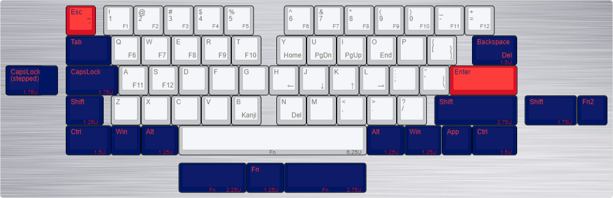
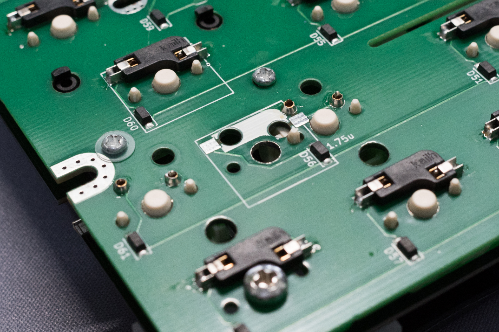
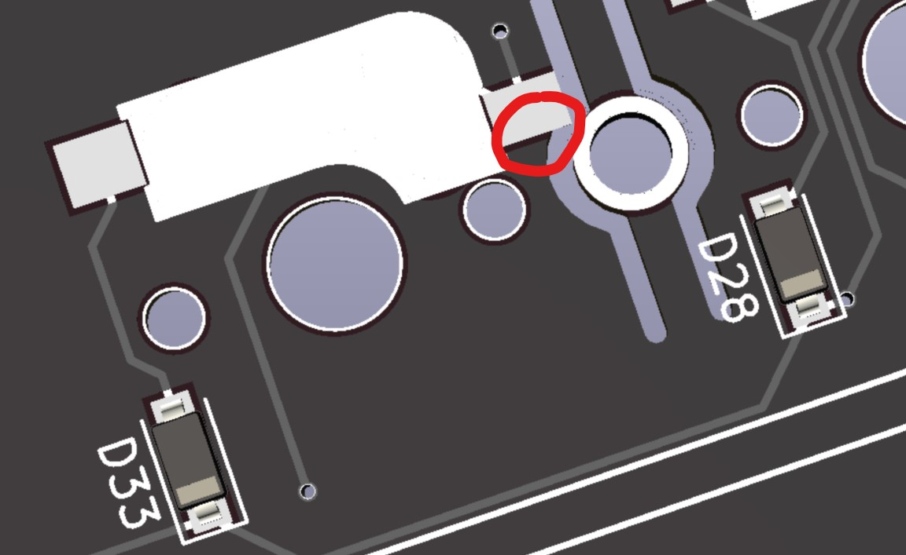
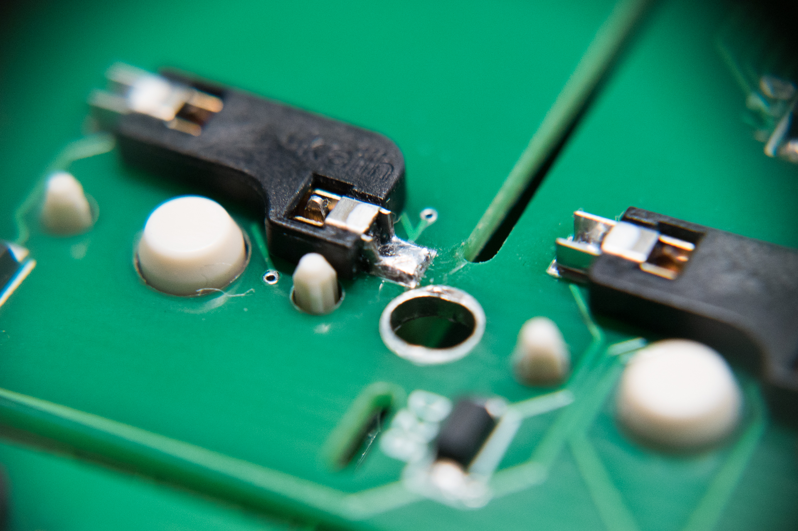

# Treadstone60 ビルドガイド(γ版)

## パーツ一覧

### キット付属品

| 名前 | 数 | 備考 |
| ---- | ---- | --- |
| PCB | 1枚 | いわゆる基板です |
| トッププレート | 1枚 | スイッチを取り付ける穴があいてます |
| MXソケット | 59～62個 | MXスイッチ用ソケット |

### キット以外に必要なもの

| 名前 | 数 | 備考 |
| ---- | ---- | --- |
| 60%トレイケース | 1台 | GH60系の60%キーボードケース |
| キースイッチ | 59～62個 | MX互換のもの |
| キーキャップ | 59～62個 | MX互換のもの |
| USB-Cケーブル | 1本 |  |

　トレイケースについてはGH60系の60%キーボードケースに装着可能です。ただしHキーのMXソケットを加工する必要があります。設計者が動作確認したものはKBDFans TOFUアルミニウムケースです。詳しくは後述します。  
　ソケット、スイッチ、キャップについてはレイアウトの選択により変化します。詳しくは後述します。  

## 必要な道具

| 名前 | 備考 |
| ---- | ---- |
| はんだごて | |
| 糸ハンダ | 0.8mm程度のものを推奨します |
| ハンダ吸い取り線 | 失敗したとき用 |
| ピンセット | ダイオードをつまむときなどに使います |
| フラックス除去剤 | 必須ではありませんがはんだ付け後のベタつきを除去出来、はんだによる黄色い変色も拭き取れてキレイな仕上がりになります |

　mteiさんの[Helix キーボードキットの製作に必要な工具メモ](https://gist.github.com/mtei/6957107a676ddfa85bde0ae41f8fa849)
やhdbxさんの[自作キーボードを始めるにあたって用意すべきツール](https://hdbx.hateblo.jp/entry/2018/06/01/215401)も参考になります。  

  
  

## 組み立て

　組み立ての時間ですが、1～2時間くらい（ファーム開発環境構築からだと別途+1～2時間程度）を目安にしてください。半田ごて作業していると一時間あっという間に飛びますので時々休憩を入れましょう。またハンダの煙は吸ったり目に入れたりしないように注意しましょう。  

### ファームウェアを準備する

　キーボード用のファームウェア（ハードウェア用の専用ソフトウェアのことをファームウェアと呼びます）の準備をします。  
  Treadstone60はQMKというソフトウェアにキーマップを登録してあり、それをビルドして基板に書き込むことでキーボードとして動作するようになっています。自分でソースからビルドが出来るようになるとキーを一つ一つ細かい動作まで自在にカスタムすることが出来ます。  

　可能なら[QMK - qmk/qmk_firmware](https://github.com/marksard/qmk_firmware/tree/my_customize)をクローンしてmake、書き込みまでチャレンジしてみてください。以下は参考になるサイトの紹介です。  

[QMK　ビルド環境を準備する](https://docs.qmk.fm/#/ja/newbs_getting_started)  

　Treadstone60のデフォルトキーマップは ```qmk compile -kb treadstone32 -km default``` で可能です。書き込む場合は ```qmk flash -kb treadstone32 -km default``` とすると、コンパイルが完了次第書き込み準備が出来るので、その状態で基板をPCにつなげてください（初回）。二回目以降は基板にあるリセットボタンをクリック、もしくはダブルクリックで書き込みが始まります。  

　現在のところtreadstone60は公式へアップロードしていません。動作確認やとりあえず使ってみたいなどの場合は以下からhexファイルをDLして、QMK Toolboxを別途インストールして書き込んでください。  
書き込み方法などはサリチル酸さんの[（初心者編）自作キーボードにファームウェアを書き込む](https://salicylic-acid3.hatenablog.com/entry/qmk-toolbox)の記事が参考になります。  

[treadstone60.hexファイル](https://drive.google.com/file/d/1JeW5edUm1cAlcQXy9B9frmpbzyPHl0y5/view?usp=sharing)  
[QMK Toolbox](https://github.com/qmk/qmk_toolbox/releases)

## 基板の裏と表について

　キースイッチが乗り、通常使用する際上を向く面を表、逆を裏とします。  
　Treadstone60の場合、名前とリビジョンが書かれた方が裏面となります。  

## レイアウトとキーキャップ

  

　γ基板ではいくつかのレイアウトを選択できます。

- CapsLock：SteppedかNormalかをどちらか選択可能（どちらもSocket対応）
- 右シフト：通常（Socket対応）分割右シフト(Socket未対応)を選択可能
- スペースバー：通常、スプリットスペースバーを選択可能（どちらもSocket対応）

　基本的にMXソケットに対応していますが、分割右シフトの場合は場所の都合上ソケットに対応していません。分割右シフトにする場合は基板にスイッチを直付けしてください。  
**1.25UのCtrlとWinキーのためのスイッチ穴がありますが、γ基板での配布分ではマウントプレートが対応していないため不可です。**  

　キーキャップで若干特殊なのが左シフトキーに使用する1.25Uキーです。  
　Ctrlが1.5U、Winが1U、Backspaceキーが1.5Uですので、ANSI104キーセットではカバー出来ません。60%に対応しているキーキャップセットを購入してください。  
　Shiftの刻印のある1.25Uキーが採用されているのはISOキーボードで、そのため販売されているキーセットによっては含まれていない可能性もありますのでよく確認してください。  
**刻印と打鍵したキーが多少一致しなくても良い、隙間が空いてもいい、という場合はこの限りではありません**

## スタビライザーを取り付ける

　2U以上のキーにはPCBマウントのスタビライザーを取り付けられる穴が空いていますので取り付けてください。  

## MXソケットをはんだ付けする

　レイアウトが決まったら、トッププレートとPCBを重ね合わせて、スイッチの取り付け向きを確認します。Escと数字の1キー、CapslockのNormal位置、スペースバーなどが他のキーと違って逆向きになっています。注意しながら取り付けてください。  
　次にPCBをスイッチを取り付けたマウントプレートとスイッチの向きがあっているかどうか注意深く観ながら合わせます。スイッチ裏の中央の出っ張りをPCBの穴に合わせて取り付けてください。  
　MXソケットをPCBのシルクの白いマークに合わせて取り付けます。スイッチのピンがMXソケットにちゃんと刺さっている事を確認しながらパチパチと全部付けてください。  
　こうすることでMXソケットが浮かずに確実にはんだ付け出来ます。  
　ハンダごてのこて先に気持ち多めにハンダを付けて、ソケットの金具の隙間に見えるPCBに付ける気持ちで、ソケットの隙間を少しこじ開ける感じで熱を与えながら流し込みます。  

## 分割右シフトキーの場合の注意点

MXソケット未対応ですので、基板にスイッチを直付けするか、mill-maxソケットなどを使って装着してください。また2.75UのKailhMXソケットと干渉する位置にあるため 1.75U + 1Uを選択する場合はkailh mxソケットを取り付けないでください。

  

## ケースへの取り付けとHキーのソケット加工

　USB-Cのコネクタをさきにケースのコネクタ口に入れる感じでケースに置いてください。トレイケースには6個所のビス留め用の台座がありますが、Hキー位置のソケットのパーツと、トレイケースの脚が干渉するものがありますので、ケースに合わせて削ってください。  

  

試作なので穴形状が違いますが、ソケットのカットは以下も参考にしてみてください。

  

## キーキャップの取り付け

　お好みのキーキャップを取り付けてください。  

## テスト

　PCに接続して動作チェックしてください。[QMK Keytest](https://config.qmk.fm/#/test)やキーボードテスターアプリでキーが認識されているかチェックしてください。

## 完成！

　チェックして問題なさそうなら完成です！あなただけの一台に仕上げてください！

## キースイッチの交換方法

　手では取り外しにくいため、amazonなどで販売されているキースイッチ引き抜き工具を使用して交換してください。  
